# Q-Learn — Architecture Documentation

## Overview

Q-Learn is an AI-powered adaptive learning platform for quantum computing. Three-tier architecture: Presentation (Vercel/Next.js) → Application (Railway/FastAPI) → Data & Infrastructure (Supabase + Vercel Sandbox + LLM).

**Visual diagrams:**
- [`assets/architecture-high-level.svg`](assets/architecture-high-level.svg) — platform topology
- [`assets/architecture-low-level.svg`](assets/architecture-low-level.svg) — internal FastAPI layers, execution paths, agent graph, RAG, DB schema

**Design documents (full implementation detail):**
- [`frontend/design.md`](frontend/design.md) — marketing landing page, IDE shell, workspaces, component tree, Zustand stores, Circuit Builder, AI Tutor panel
- [`backend/design.md`](backend/design.md) — API routes, SQLAlchemy models, service layer, auth, error handling, deployment

**Module docs (`docs/`):**
- [`docs/frontend-layer.md`](docs/frontend-layer.md) — shell zones, workspace layouts, Zustand stores, design system
- [`docs/data-flow.md`](docs/data-flow.md) — all 7 platform flows (REST, Sandbox, Realtime, LLM)
- [`docs/database.md`](docs/database.md) — ERD, key tables, migration strategy
- [`docs/quantum-execution.md`](docs/quantum-execution.md) — adapter pattern, Vercel Sandbox fork, execution sequence
- [`docs/rag-pipeline.md`](docs/rag-pipeline.md) — ingestion, hybrid retrieval, reranking, knowledge base
- [`docs/sandbox.md`](docs/sandbox.md) — microVM architecture, circuit simulation and student code flows
- [`docs/agents.md`](docs/agents.md) — agent topology, responsibilities, LangGraph + AsyncPostgresSaver
- [`docs/security.md`](docs/security.md) — security diagram, controls table, auth flow, RBAC
- [`docs/api.md`](docs/api.md) — API groups, response format, design rules
- [`docs/infrastructure.md`](docs/infrastructure.md) — production stack, Docker Compose, env vars, deployment

---

## Table of Contents

- [High-Level Architecture](#high-level-architecture)
- [Low-Level Architecture](#low-level-architecture)
- [Engineering Rules](#engineering-rules)
- [Product Principle](#product-principle)

---

## High-Level Architecture

Three-tier architecture: Presentation Layer → Application Layer → Data & Infrastructure Layer.

```mermaid
flowchart TD
    subgraph PRESENTATION["🖥️ PRESENTATION LAYER — Vercel (Next.js + React)"]
        direction LR
        Home["Marketing Home\n(public, unauthenticated)"]
        Auth["Auth Pages"]
        Dashboard["Student Dashboard"]
        CircuitUI["Circuit Builder\n(React Flow)"]
        Quiz["Quiz & Challenges"]
        Lesson["Lesson Reader"]
        Sim["Simulation &\nVisualization"]
        Instructor["Instructor /\nAdmin"]
    end

    subgraph APPLICATION["⚙️ APPLICATION LAYER — Railway (FastAPI + Python)"]
        direction TB
        GW["API Gateway\nVerify Supabase JWT • Rate Limit • Validation • Routing • Logging"]

        subgraph SERVICES["Services"]
            direction LR
            AuthSvc["Auth\nService"]
            LearnSvc["Learning\nService"]
            CircuitSvc["Circuit\nService"]
            AssessSvc["Assessment\nService"]
            QuantumSvc["Quantum\nExecution"]
            AgentSvc["AI / Agent\nService"]
            RAGSvc["RAG\nService"]
            RecSvc["Recommendation\nService"]
            Analytics["Analytics\nService"]
        end

        GW --> SERVICES
    end

    subgraph DATA["🗄️ DATA & INFRASTRUCTURE LAYER"]
        direction LR
        subgraph Supabase["Supabase"]
            DB["PostgreSQL\n+ pgvector"]
            SupaAuth["Auth"]
            Storage["Storage"]
            Realtime["Realtime\n(WebSocket pub/sub)"]
        end

        subgraph VercelSandbox["Vercel Sandbox (Hobby)"]
            MicroVM["Isolated microVM\npython3.13 • deny-all network\nQiskit Aer + Student Python"]
        end

        subgraph External["External"]
            LLM["LLM Provider\nChatLiteLLM — primary + fallbacks\nOpenAI · Anthropic · Gemini · Ollama"]
            KnowledgeBase["Knowledge Sources\nDocs • Papers • Course Material"]
        end
    end

    PRESENTATION -- "HTTPS / REST\n(Authorization: Bearer <Supabase JWT>)" --> APPLICATION
    Auth -- "Supabase Auth SDK\n(email/password · Google OAuth)" --> SupaAuth
    APPLICATION -- "Supabase Realtime pub/sub\n(circuit results · tutor tokens · progress)" --> PRESENTATION
    APPLICATION --> DATA
    AgentSvc -- "SDK fork" --> MicroVM
    QuantumSvc -- "SDK fork (Qiskit Aer)" --> MicroVM
    RAGSvc --> LLM
    RAGSvc --> KnowledgeBase
    RAGSvc --> DB
```

---

## Low-Level Architecture

Six layers — each has its own module doc:

| Layer | Summary | Detail |
|-------|---------|--------|
| **1. Frontend** | **Public surface:** marketing landing page at `/` (auth-gated, `components/home/`). **App surface:** VS Code-style IDE shell — 6 zones, 6 modes, 7 Zustand stores, Supabase Realtime for events | [`docs/frontend-layer.md`](docs/frontend-layer.md) |
| **2. Backend Services** | FastAPI microservices — API Gateway + 11 domain services; `API Router → Service → Repository → PostgreSQL` | [`backend/design.md`](backend/design.md) |
| **3. Quantum Backend** | Adapter pattern — `QiskitAerAdapter` forks Vercel Sandbox microVM; FastAPI stays I/O-bound | [`docs/quantum-execution.md`](docs/quantum-execution.md) |
| **4. Code Execution Sandbox** | Vercel Sandbox managed microVM — both student code and quantum circuits; deny-all, 512 MB, 30s | [`docs/sandbox.md`](docs/sandbox.md) |
| **5. AI & Knowledge** | ChatLiteLLM (`get_llm()`) with primary + fallback routing + RAG pipeline (BM25 + pgvector + RRF + Cross-Encoder reranker) | [`docs/rag-pipeline.md`](docs/rag-pipeline.md) · [`docs/agents.md`](docs/agents.md) |
| **6. Data Storage** | Supabase (Auth + PostgreSQL + pgvector + Realtime) · Docker Compose for local dev | [`docs/database.md`](docs/database.md) · [`docs/infrastructure.md`](docs/infrastructure.md) |

> Redis is not in the initial stack — deferred to Phase 2 when profiling shows a specific hot path.

---

## Engineering Rules

1. Inspect the repository before changing architecture
2. Plan before implementing major features
3. Use SQLAlchemy 2.x for all database access
4. Use Alembic for every schema migration — never `Base.metadata.create_all()` in production
5. Keep quantum computation deterministic and separate from LLM reasoning
6. Validate AI-generated circuits before execution
7. Never execute student code or Qiskit inside the API process
8. Keep quantum backends behind the `QuantumBackend` interface
9. Keep agents specialized — one clear responsibility per agent
10. Use structured agent inputs/outputs
11. Use RAG for factual technical information where appropriate
12. Track learner mastery as a first-class domain concept (BKT)
13. Keep API schemas separate from ORM models
14. Prefer service → repository architecture; keep routers thin
15. Write unit tests for deterministic logic
16. Write integration tests for database, AI, and quantum boundaries
17. Do not expose secrets to clients
18. Do not hardcode environment-specific configuration
19. Prefer incremental changes over rewrites
20. Document important architectural decisions

---

## Product Principle

Q-Learn is **not** a chatbot with a quantum simulator.

It is an adaptive learning system where **AI tutoring + learner modeling + quantum computation + assessment + visualization** work together.

The core loop:

**LEARN → BUILD → SIMULATE → OBSERVE → EXPLAIN → PRACTICE → EVALUATE → ADAPT**
