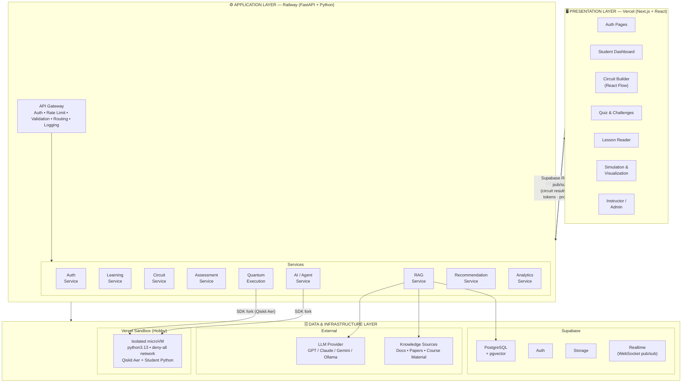
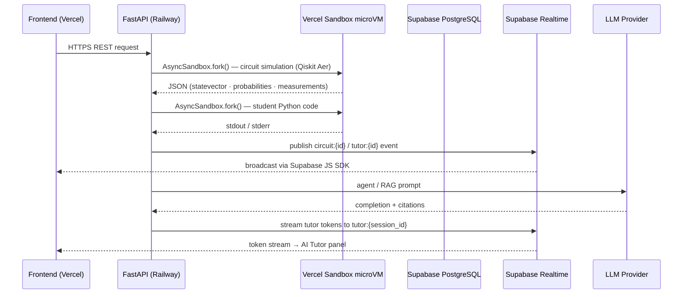
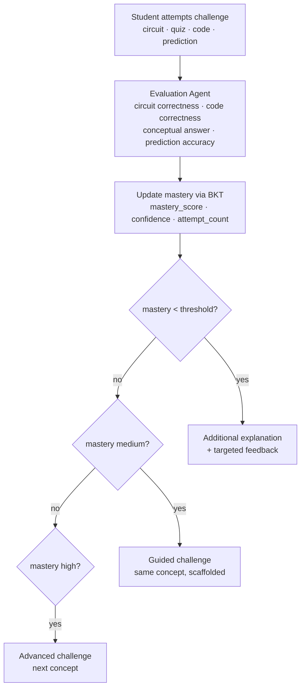
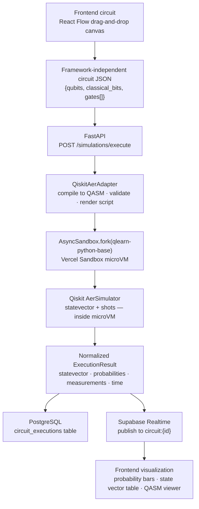
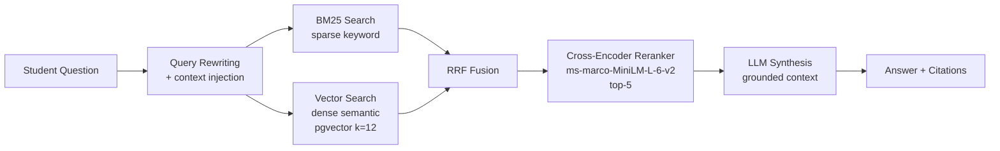

# Q-Learn — Project Documentation

## Overview

**Q-Learn: An Adaptive Multi-Agent AI Platform for Interactive Quantum Computing Education**

Problem Statement: **SIH2614 — AI-Based Interactive Quantum Algorithm Learning Platform** (Smart India Hackathon 2026)

Q-Learn is an AI-powered adaptive learning platform for quantum computing. It creates a closed learning loop:

```
LEARN → UNDERSTAND → BUILD → SIMULATE → OBSERVE → EXPLAIN → PRACTICE → EVALUATE → ADAPT → LEARN NEXT
```

The system combines generative AI, agentic AI, personalized learning, quantum circuit construction, quantum simulation, visualization, RAG, assessment, coding challenges, and learning analytics into a single interactive quantum learning laboratory.

**Core Differentiator — "Explain My Circuit":**
A student constructs a quantum circuit. Q-Learn explains what each gate does, how the quantum state changes, the mathematical transformation, why the circuit produces the observed result, what the measurement probabilities mean, whether the circuit accomplishes the intended objective, what mistakes the student made, and what concept to learn next.

The system connects: **MATHEMATICS ↔ QUANTUM STATE ↔ CIRCUIT ↔ CODE ↔ SIMULATION ↔ MEASUREMENT**

---

## Table of Contents

- [Product Vision](#product-vision)
- [Target Users](#target-users)
- [Curriculum](#curriculum)
- [Architecture](#architecture)
- [Technology Stack](#technology-stack)
- [Repository Structure](#repository-structure)
- [Core Components](#core-components)
- [Agent Architecture](#agent-architecture)
- [Student Knowledge Model](#student-knowledge-model)
- [Adaptive Learning Loop](#adaptive-learning-loop)
- [Quantum Execution Flow](#quantum-execution-flow)
- [RAG Architecture](#rag-architecture)
- [Security](#security)
- [AI Safety](#ai-safety)
- [Development Phases](#development-phases)
- [MVP Scope](#mvp-scope)
- [Project Quality Expectations](#project-quality-expectations)
- [Testing Strategy](#testing-strategy)
- [Evaluation Metrics](#evaluation-metrics)
- [Research Opportunity](#research-opportunity)
- [What NOT to Build](#what-not-to-build)
- [Getting Started](#getting-started)
- [Contributing](#contributing)

---

## Product Vision

Q-Learn behaves like an intelligent quantum-computing mentor.

**Example flow:**
1. Student asks "Teach me quantum entanglement."
2. System determines current knowledge level.
3. Explains the concept at the appropriate level.
4. Shows mathematical intuition.
5. Shows a quantum circuit.
6. Allows the student to construct the circuit.
7. Executes the circuit.
8. Visualizes the resulting state/probability.
9. Asks the student to predict the result.
10. Evaluates the answer.
11. Identifies misconceptions.
12. Gives targeted feedback.
13. Updates the student's skill profile.
14. Recommends the next activity.

The system must be adaptive rather than simply generating static content.

**UX Principle:** The interface should feel like **An interactive quantum learning laboratory** — not "ChatGPT with some quantum buttons."

The student should spend most of their time: **learning → building → experimenting → predicting → executing → understanding → improving.**

---

## Target Users

### Student (Primary)
- Register/login
- Take an initial skill assessment
- Follow personalized learning paths
- Learn quantum concepts
- Ask questions to the AI tutor
- Build circuits visually
- Write quantum code
- Execute simulations
- Visualize quantum states
- Take quizzes
- Solve coding challenges
- Receive AI feedback
- Track progress
- Review mistakes
- Improve mastery

### Instructor
- Create/manage classes
- Monitor students
- View learning progress
- Identify weak concepts
- View common mistakes
- Assign learning activities
- Review student performance
- View class-level analytics

### Administrator
- Manage users, courses, learning content
- Manage knowledge sources
- System configuration
- Platform analytics

---

## Curriculum

Progressive curriculum from fundamentals to advanced algorithms. Instructors can add/remove/reorder modules.

| Level | Topic |
|-------|-------|
| 0 | Quantum intuition |
| 1 | Qubits |
| 2 | Quantum states |
| 3 | Quantum gates |
| 4 | Superposition |
| 5 | Measurement |
| 6 | Entanglement |
| 7 | Quantum circuits |
| 8 | Deutsch-Jozsa |
| 9 | Grover's algorithm |
| 10 | Quantum Fourier Transform |
| 11 | Shor's algorithm |

**Teaching progression per concept:** Concept → Intuition → Mathematics → Circuit → Code → Simulation → Practice

---

## Architecture

### High-Level Architecture



### Low-Level Architecture

Six primary layers:

1. **Frontend Layer** (Next.js) — Persistent VS Code-style IDE shell (6 zones: TitleBar, ActivityBar, WorkspaceArea, RightPanel, BottomPanel, StatusBar). Six modes: Dashboard, Learn, Circuit Builder, Code Editor, Quiz, Settings. State via 7 Zustand stores. Real-time events received via Supabase Realtime channels (Supabase JS SDK) — no direct FastAPI WebSocket connections.

2. **Backend Services** (FastAPI) — Microservices around an API Gateway:
   - **API Gateway**: Auth, Rate Limiting, Request Validation, Routing, Logging, Error Handling
   - **User Service**: Profiles, JWT auth, RBAC, session management
   - **Learning Service**: Courses, modules, lesson delivery, content management, learning paths
   - **AI Agent Service**: Orchestrator, Tutor, Circuit Agent, Quiz Agent, Evaluation Agent, Recommendation Agent, Research Agent
   - **Circuit Service**: Validation, conversion, analysis, explanation
   - **Quantum Execution Service**: Backend abstraction, job management, result processing
   - **Assessment Service**: Quiz generation, answer evaluation, coding challenge feedback
   - **Recommendation Service**: Learning paths, next activity, skill gap analysis
   - **RAG Service**: Document ingestion, vector search, reranking, source attribution
   - **Analytics Service**: Learning analytics, user analytics, class analytics, system metrics
   - **Content Service**: Media storage, versioning, metadata
   - **Notification Service**: In-app notifications, emails, event triggers

3. **Quantum Backend Layer** — Adapter pattern with standard methods (`compile()`, `validate()`, `execute()`, `get_statevector()`, `get_probabilities()`, `get_measurements()`):
   - `QiskitAerAdapter` (MVP) — runs Qiskit Aer inside a Vercel Sandbox microVM via `AsyncSandbox.fork()`; FastAPI never executes Qiskit in-process
   - `PennyLaneAdapter` (Phase 2)
   - `CirqAdapter` (Phase 2)

4. **Code Execution Sandbox** — Vercel Sandbox (managed microVM) for **all compute-heavy execution** — both student code and quantum circuit simulation. Network policy: `deny-all`. Resource limits: 512 MB RAM, 1 vCPU, 30s timeout. Qiskit Aer pre-installed via persistent `qlearn-python-base` snapshot; fork per execution avoids cold-start. FastAPI remains I/O-bound throughout — no CPU work in-process.

5. **External AI & Knowledge Sources** — LLM provider (GPT/Claude/Gemini/Ollama), official SDK documentation, academic papers, trusted educational resources.

6. **Data Storage & Infrastructure** — Supabase (Auth, PostgreSQL + pgvector, Storage, Realtime), Vercel Sandbox (isolated microVM execution), Docker Compose for local development.
   - **Supabase** → Auth, PostgreSQL + pgvector, Storage, Realtime pub/sub (production)
   - **FastAPI** → AI agents (LangGraph + `AsyncPostgresSaver`), RAG, quantum execution, business logic; publishes events to Supabase Realtime channels
   - **Vercel** → Host Next.js frontend; Sandbox for all isolated execution
   - **Docker Compose** → Development environment (PostgreSQL+pgvector, API, Web)

### Data Flow



---

## Technology Stack

### Frontend
- **Next.js** 14+ (App Router)
- **TypeScript**
- **React** 18+
- **Tailwind CSS**
- **React Flow** (@xyflow/react) — drag-and-drop circuit builder
- **Recharts** — analytics charts
- **Three.js** — 3D Bloch sphere visualization (Phase 2+)

### Backend
- **Python** 3.11+
- **FastAPI** — async API framework
- **Pydantic** — data validation
- **SQLAlchemy** (async) — ORM
- **Alembic** — database migrations

### AI / ML
- **LLM Provider** abstraction (OpenAI GPT, Claude, Gemini, or Ollama locally)
- **LangChain** — agent orchestration (LCEL RunnableGraph)
- **LlamaIndex** — document ingestion, chunking, indexing, retrieval
- **pgvector** — vector storage inside PostgreSQL
- **Sentence Transformers** — embeddings
- **Cross-Encoder** (`ms-marco-MiniLM-L-6-v2`) — reranking
- **LangGraph** — multi-agent orchestration

### Quantum
- **Qiskit** + **Qiskit Aer** — quantum simulation (MVP backend)
- **PennyLane** — future adapter
- **Cirq** — future adapter

### Database & Infrastructure
- **Supabase** — Auth, PostgreSQL + pgvector, Storage, Realtime
- **Vercel Sandbox** — Isolated student code execution (Hobby plan, hard quota cap)

### CI/CD
- **GitHub Actions**

### Key Constraints
- **No API keys in frontend** — all LLM/API keys stay in backend
- **Never execute arbitrary shell commands** via AI
- **Quantum execution through controlled backend services only**
- **LLM never directly controls infrastructure**

---

## Repository Structure

```
qlearn/
├── apps/
│   ├── web/                    # Next.js frontend
│   │   ├── src/
│   │   │   ├── app/            # App Router pages
│   │   │   │   ├── auth/       # Login, Register, Forgot Password
│   │   │   │   ├── dashboard/  # Student/Instructor dashboards
│   │   │   │   ├── learn/      # Learning interface
│   │   │   │   ├── circuit/    # Circuit builder
│   │   │   │   ├── simulate/   # Simulation & visualization
│   │   │   │   ├── quiz/       # Quizzes & challenges
│   │   │   │   ├── instructor/ # Instructor dashboard
│   │   │   │   └── admin/      # Admin panel
│   │   │   ├── components/     # React components
│   │   │   │   ├── circuit/    # Circuit builder components
│   │   │   │   │   ├── nodes/  # Custom gate nodes
│   │   │   │   │   └── edges/  # Circuit edges
│   │   │   │   ├── visualization/ # Bloch sphere, charts
│   │   │   │   ├── tutor/      # AI tutor chat interface
│   │   │   │   └── ui/         # Base UI components
│   │   │   ├── hooks/          # Custom React hooks
│   │   │   ├── lib/            # Utilities, API client
│   │   │   ├── stores/         # State management (Zustand)
│   │   │   └── types/          # TypeScript type definitions
│   │   ├── public/
│   │   ├── next.config.js
│   │   ├── package.json
│   │   └── tsconfig.json
│   │
│   └── api/                    # FastAPI backend
│       ├── app/
│       │   ├── __init__.py
│       │   ├── main.py         # App entry, lifespan, middleware
│       │   ├── config.py       # Settings from env vars
│       │   ├── database.py     # Async SQLAlchemy engine + session
│       │   ├── dependencies.py # Shared DI (auth, db)
│       │   ├── core/           # Cross-cutting concerns
│       │   │   ├── limiter.py  # Rate limiting (slowapi)
│       │   │   ├── scheduler.py
│       │   │   └── security.py # JWT, hashing
│       │   ├── routers/        # API route modules
│       │   │   ├── auth.py
│       │   │   ├── users.py
│       │   │   ├── courses.py
│       │   │   ├── modules.py
│       │   │   ├── lessons.py
│       │   │   ├── circuits.py
│       │   │   ├── execution.py
│       │   │   ├── quiz.py
│       │   │   ├── tutor.py
│       │   │   ├── rag.py
│       │   │   ├── recommendation.py
│       │   │   ├── analytics.py
│       │   │   ├── instructor.py
│       │   │   └── admin.py
│       │   ├── schemas/        # Pydantic models (request/response)
│       │   │   ├── auth.py
│       │   │   ├── user.py
│       │   │   ├── circuit.py
│       │   │   ├── quiz.py
│       │   │   └── ...
│       │   ├── services/       # Business logic layer
│       │   │   ├── auth_service.py
│       │   │   ├── learning_service.py
│       │   │   ├── circuit_service.py
│       │   │   ├── quantum_execution_service.py
│       │   │   ├── assessment_service.py
│       │   │   ├── rag_service.py
│       │   │   ├── recommendation_service.py
│       │   │   └── analytics_service.py
│       │   ├── agents/         # AI agent definitions
│       │   │   ├── orchestrator.py
│       │   │   ├── tutor_agent.py
│       │   │   ├── circuit_agent.py
│       │   │   ├── quiz_agent.py
│       │   │   ├── evaluation_agent.py
│       │   │   ├── recommendation_agent.py
│       │   │   └── research_agent.py
│       │   ├── quantum/        # Quantum backend layer
│       │   │   ├── __init__.py
│       │   │   ├── base.py     # QuantumBackend abstract class
│       │   │   ├── qiskit_adapter.py
│       │   │   ├── pennylane_adapter.py  # Phase 2
│       │   │   └── cirq_adapter.py         # Phase 2
│       │   ├── rag/            # RAG pipeline
│       │   │   ├── ingestion.py
│       │   │   ├── retriever.py
│       │   │   ├── reranker.py
│       │   │   └── prompts.py
│       │   ├── models/         # SQLAlchemy ORM models
│       │   │   ├── user.py
│       │   │   ├── course.py
│       │   │   ├── progress.py
│       │   │   ├── circuit.py
│       │   │   ├── quiz.py
│       │   │   └── ...
│       │   ├── utils/          # Helpers
│       │   └── main.py
│       ├── requirements.txt
│       ├── pyproject.toml
│       ├── alembic.ini
│       └── Dockerfile
│
├── services/
│   ├── ai/                   # AI orchestration microservice (Phase 2)
│   ├── quantum/              # Quantum execution microservice (Phase 2)
│   └── sandbox/              # Code execution sandbox (Phase 2)
│
├── packages/
│   ├── schemas/              # Shared JSON schema definitions
│   ├── quantum-core/         # Framework-independent circuit representation
│   └── ui/                   # Shared UI components
│
├── infra/
│   ├── docker/
│   │   ├── postgres/         # PostgreSQL init scripts
│   │   ├── redis/            # Phase 2 — deferred
│   │   ├── sandbox/          # Docker sandbox for code execution
│   │   └── nginx/
│   ├── database/             # Migration scripts, seed data
│   └── monitoring/           # Prometheus, Grafana config
│
├── .env.example
├── .gitignore
├── docker-compose.yml         # Development stack (Docker Compose)
├── docker-compose.prod.yml    # Production stack
├── turbo.json                 # Turborepo config
├── README.md
└── Project.md                 # This file
```

> **Supabase** handles Auth, PostgreSQL+pgvector, Storage, and Realtime in production. The `infra/` directory contains development Docker Compose configuration.

---

## Core Components

### 1. Quantum Backend Abstraction

```python
class QuantumBackend(ABC):
    """Abstract interface for all quantum simulators."""

    @abstractmethod
    def compile(self, circuit: CircuitSpec) -> CompiledCircuit: ...

    @abstractmethod
    def validate(self, circuit: CircuitSpec) -> ValidationResult: ...

    @abstractmethod
    def execute(self, circuit: CompiledCircuit, shots: int = 1024) -> ExecutionResult: ...

    @abstractmethod
    def get_statevector(self, circuit: CompiledCircuit) -> StateVector: ...

    @abstractmethod
    def get_probabilities(self, circuit: CompiledCircuit) -> ProbabilityDist: ...

    @abstractmethod
    def get_measurements(self, circuit: CompiledCircuit, shots: int) -> Measurements: ...
```

**Initial implementation:** `QiskitAerAdapter`
**Future:** `PennyLaneAdapter`, `CirqAdapter`, `RealHardwareAdapter`

### 2. Framework-Independent Circuit Representation

```json
{
  "qubits": 2,
  "classical_bits": 2,
  "gates": [
    {"type": "H", "targets": [0]},
    {"type": "CX", "control": 0, "target": 1},
    {"type": "M", "targets": [0, 1], "classical": [0, 1]}
  ]
}
```

**Supported gates:** I, X, Y, Z, H, S, T, RX, RY, RZ, CX/CNOT, CZ, SWAP, Measurement
**Extensible:** New gates added without frontend changes.

### 3. Circuit Builder (React Flow)

- Drag-and-drop gate nodes onto qubit wires
- Custom node types for each gate
- Visual feedback: state updates in real-time
- Export to framework-independent JSON
- Import from OpenQASM

### 4. Visualization System

- **Circuit diagram** — visual representation of gates on wires
- **Measurement probabilities** — bar chart (e.g., `00 — 50%`, `11 — 50%`)
- **State vector** — table of amplitudes (e.g., `|00⟩ = 0.707`)
- **Bloch sphere** — 3D visualization (Phase 2)
- **State transition** — gate-by-gate transformation

### 5. RAG Pipeline

```
User Question → Query Understanding → Retriever → Vector Search/Hybrid Search → Reranker → Relevant Documents → LLM → Grounded Answer → Citations
```

**Knowledge base contents:**
- Official Qiskit documentation
- Official PennyLane documentation
- Official Cirq documentation
- Academic papers
- Instructor-created course material
- Quantum computing textbooks (where licensing permits)

**Pipeline config:**
- Chunk size: 800 tokens, overlap: 120
- Similarity top_k: 8-16, rerank to top 3-5
- Cross-Encoder reranker: `ms-marco-MiniLM-L-6-v2`
- Hybrid search: BM25 + dense vector (RRF fusion)
- Source attribution on every answer

---

## Agent Architecture

Do NOT implement one giant AI agent. Use specialized agents coordinated by an orchestrator.

### Learning Orchestrator Agent (Central Coordinator)
- Understand user intent and learning context
- Determine student level
- Select the correct specialized agent
- Maintain session context
- Trigger assessments and recommendations
- Coordinate multi-step learning workflows

### Tutor Agent
- Explain quantum concepts with intuition, mathematics, examples, and circuits
- Adapt explanation difficulty
- Answer student questions
- Detect conceptual confusion
- Teaching progression: Concept → Intuition → Mathematics → Circuit → Code → Simulation → Practice

### Circuit Agent
- Understand circuit requirements and generate representations
- Validate circuits, detect incorrect gate placement
- Detect incorrect control/target relationships
- Analyze circuit intent and convert representations
- Explain circuits step by step

### Quiz Agent
- Generate dynamic questions at multiple difficulty levels
- Conceptual, circuit, and prediction questions
- Generate assessment feedback
- Adapt to student weaknesses

### Evaluation Agent
- Evaluate answers, circuits, and quantum code
- Detect misconceptions and common mistakes
- Estimate mastery
- Provide targeted feedback

### Recommendation Agent
- Analyze student mastery and identify weak concepts
- Recommend next lesson/challenge
- Personalize learning paths

### Research Agent
- Retrieve reliable quantum-computing information
- Search trusted technical documentation
- Support RAG workflows with citations
- Avoid unsupported claims

---

## Student Knowledge Model

The platform maintains a student skill profile using Bayesian Knowledge Tracing (BKT):

**Per-skill parameters:**
```
Qubits: 91%
Quantum Gates: 87%
Superposition: 82%
Measurement: 71%
Entanglement: 46%
Grover: 22%
```

**Stored per skill:**
- `mastery_score` — current probability of knowing the skill
- `confidence` — student's self-reported confidence
- `attempt_count` — total attempts
- `last_attempt` — timestamp
- `recent_performance` — last N results
- `common_errors` — frequently made mistakes
- `completed_concepts` — mastered topics
- `recommended_concepts` — suggested next steps

**BKT Parameters per skill:**
- `p(L0)` — prior knowledge (initial probability)
- `p(T)` — learning rate (probability of learning per attempt)
- `p(G)` — guess probability
- `p(S)` — slip probability

---

## Adaptive Learning Loop

Every meaningful student activity updates the learner model.



**Thresholds are configurable.**

---

## Quantum Execution Flow



**Critical rules:**
- AI never directly executes arbitrary shell commands
- Quantum execution happens only through controlled backend services
- AI-generated quantum code is validated before execution
- The quantum simulator is the source of truth for execution results
- FastAPI never runs Qiskit in-process — all CPU work is inside the Vercel Sandbox microVM

**Code Execution Sandbox** (for student-submitted Python):
- Vercel Sandbox managed microVM — same infrastructure as quantum execution
- Network policy: `deny-all` — no internet access from microVM
- Resource limits: 512 MB RAM, 1 vCPU, 30s timeout
- Qiskit Aer pre-installed via `qlearn-python-base` snapshot
- Never executes inside the main API process

---

## RAG Architecture

### Pipeline



### Document Ingestion

- Load documents (PDFs, markdown, text)
- Parse with LlamaIndex
- Recursive chunking (800 tokens, 120 overlap)
- Generate embeddings (sentence-transformers)
- Store in pgvector with metadata

### Metadata per chunk:
- title, URL, source_type, author
- publication_date (where applicable)
- document_version, chunk_information

### Retrieval Strategy
- Hybrid retrieval: dense (embeddings) + sparse (BM25)
- Reciprocal Rank Fusion (RRF) to combine rankings
- Cross-Encoder reranker to trim top-k to best matches
- Metadata filtering (course, level, topic)

### Source Attribution
- Every retrieved source maintains metadata
- Answers cite external sources
- LLM distinguishes explanation from retrieved fact
- Hallucination guardrails: if no relevant chunks found, explicitly state so

---

## Security

| Requirement | Implementation |
|-------------|----------------|
| Authentication | JWT with refresh tokens |
| Authorization | Role-Based Access Control (student/instructor/admin) |
| Input validation | Pydantic schemas on all endpoints |
| Rate limiting | slowapi (100 req/min default; Redis backend deferred to Phase 2) |
| Secrets management | Environment variables only, never in code |
| No API keys in frontend | All LLM/API calls proxied through backend |
| Sandboxed code execution | Vercel Sandbox microVM — deny-all network, 512 MB RAM, 30s timeout |
| Resource limits | CPU, Memory, Time limits for simulations |
| Timeouts | All operations have configurable timeouts |
| Prompt injection protection | Input sanitization, system prompt boundaries |
| RAG source validation | Curated knowledge base, no scraping of copyrighted material |
| Logging | Structured logs without sensitive data |
| SQL injection prevention | Parameterized queries via SQLAlchemy |
| CORS | Configured for known origins only |
| CSRF protection | Standard middleware |

**Never allow the LLM to directly control infrastructure.**

---

## AI Safety and Reliability

- **Grounded retrieval preferred** for factual/technical questions
- Clearly distinguish explanation from retrieved fact
- Cite external sources where applicable
- **Avoid hallucinated quantum formulas** — validate generated circuits before execution
- AI-generated quantum code validated before execution
- AI assists the quantum engine, not replaces deterministic computation
- The quantum simulator is the **source of truth** for execution results
- Do not use an LLM to calculate something the quantum/math engine can calculate reliably

---

## Development Phases

### Phase 0 — Foundation (Week 1)
- [ ] Monorepo scaffold (Turborepo)
- [ ] Next.js frontend app structure
- [ ] FastAPI backend app structure
- [ ] Shared packages (schemas, quantum-core)
- [ ] Supabase project setup (Auth, PostgreSQL, pgvector, Storage, Realtime)
- [ ] Docker Compose: PostgreSQL+pgvector, API, Web (development — no Redis in Phase 0)
- [ ] GitHub Actions CI/CD
- [ ] Database schema creation (Alembic migrations)
- [ ] Supabase Auth integration (register, login, JWT, RBAC)
- [ ] Vercel Sandbox base snapshot (`qlearn-python-base`) with Qiskit Aer
- [ ] `QiskitAerAdapter` via `AsyncSandbox.fork()` — quantum execution through Vercel Sandbox
- [ ] Supabase Realtime publish pattern — FastAPI publishes events; frontend subscribes via JS SDK
- [ ] LangGraph `AsyncPostgresSaver` checkpointer — agent state in PostgreSQL
- [ ] Basic project documentation

### Phase 1 — MVP Vertical Slice (Week 2-3)
- [ ] Student dashboard with progress
- [ ] Quantum curriculum (12 levels with seed data)
- [ ] Lesson system (content delivery)
- [ ] AI Tutor (RAG-powered, grounded answers)
- [ ] Basic RAG pipeline (ingestion, search, retrieval)
- [ ] Visual circuit builder (React Flow + custom nodes)
- [ ] Qiskit Aer execution (compile, validate, simulate)
- [ ] Measurement probability visualization
- [ ] Basic state vector display
- [ ] Quiz generation (dynamic questions)
- [ ] Skill tracking (BKT-based mastery)
- [ ] User journey: login → lesson → circuit → execute → quiz → evaluation → progress
- [ ] Payment integration (Razorpay subscriptions, feature-gated Pro) — see [`docs/payment-system-design.md`](docs/payment-system-design.md)
- [ ] Pricing page + upgrade modal
- [ ] Billing settings (manage / cancel subscription)

### Phase 2 — Agentic Intelligence (Week 4-6)
- [ ] LangGraph multi-agent system
- [ ] Learning Orchestrator Agent
- [ ] Circuit Agent with validation and explanation
- [ ] Evaluation Agent
- [ ] Recommendation Agent with personalized paths
- [ ] Research Agent with citations
- [ ] Tutor Agent with adaptive difficulty
- [ ] Coding challenges with auto-evaluation (uses existing Vercel Sandbox from Phase 0)
- [ ] Coding challenges with auto-evaluation
- [ ] Circuit debugging and feedback
- [ ] Student knowledge graph
- [ ] PennyLane adapter
- [ ] Cirq adapter
- [ ] Instructor dashboard
- [ ] Advanced analytics

### Phase 3 — Advanced Features (Week 7+)
- [ ] Real quantum hardware integration (IBM Quantum)
- [ ] Advanced quantum algorithms (full implementations)
- [ ] Collaborative circuit building
- [ ] Classroom assignments
- [ ] 3D Bloch sphere visualization
- [ ] Research mode
- [ ] Sophisticated learner modeling
- [ ] Learning analytics and experimentation
- [ ] Plugin system (multi-SDK support)

---

## MVP Scope (Must-Have for Launch)

1. ✅ Authentication (register/login, JWT, RBAC)
2. ✅ Student dashboard (progress overview)
3. ✅ Quantum curriculum (at least 3-4 levels with content)
4. ✅ Lesson system (lesson delivery)
5. ✅ AI Tutor (RAG-based, grounded answers)
6. ✅ Basic RAG (document ingestion, vector search)
7. ✅ Visual circuit builder (drag-and-drop, H, X, CX, Measurement gates)
8. ✅ Qiskit Aer execution (simulate circuits)
9. ✅ Measurement visualization (probability bar chart)
10. ✅ Basic state visualization (state vector table)
11. ✅ Quiz generation (conceptual questions)
12. ✅ Basic skill tracking (mastery scores)
13. ✅ Freemium + Pro subscription (Razorpay) — AI Tutor + execution gated behind Pro

**Do NOT initially build:** Every quantum algorithm, real quantum hardware, all 3 frameworks simultaneously, complex social features, mobile apps, excessive admin functionality.

---

## Project Quality Expectations

This is a **startup product** (originally a final-year engineering project, now in production-quality startup mode). Code must be:

- **Modular** — clear service boundaries, no monolithic files
- **Typed** — TypeScript on frontend, Python type hints on backend
- **Testable** — unit, integration, and E2E tests
- **Documented** — docstrings, README, architecture docs
- **Maintainable** — clear abstractions, no hardcoded logic
- **Observable** — structured logging, agent tracing
- **Secure** — RBAC, input validation, sandboxed execution
- **Easy to extend** — adapter patterns, configurable thresholds

### Code Rules
- Do not build a giant monolithic file
- Do not hardcode business logic everywhere
- Do not put AI prompts throughout random files — centralize agent definitions/prompts/configuration
- Use clear service boundaries
- Prefer incremental changes over rewrites
- Plan before coding (understand → inspect → identify → plan → implement → test → review → document)

---

## Testing Strategy

### Unit Tests
- Circuit validation logic
- Learning calculations (BKT updates)
- Skill updates and mastery scoring
- Recommendation logic
- API service endpoints (mocked dependencies)

### Integration Tests
- API + PostgreSQL database
- AI service + RAG pipeline
- Quantum service + backend adapter
- Circuit → simulation → result flow
- Auth → protected routes

### End-to-End Tests
**Student journey:** login → lesson → circuit → execute → quiz → evaluation → progress
**AI evaluation:** factual correctness, citation correctness, circuit correctness, response quality, adaptation quality

### Evaluation Metrics
| Category | Metrics |
|----------|---------|
| **Platform** | API latency, simulation latency, system reliability |
| **AI** | Answer correctness, groundedness, citation accuracy, hallucination rate |
| **Learning** | Pre-test vs post-test improvement, quiz accuracy, concept mastery improvement, challenge completion, learning progression |
| **Personalization** | Compare static vs adaptive learning paths (academic evaluation component) |

---

## Research Opportunity

**Research Question:** "Does adaptive AI-guided quantum learning improve student understanding compared with static quantum-learning content?"

**Methodology:**
1. Pre-test assessment
2. Learning intervention (adaptive vs static group)
3. Post-test comparison
4. Statistical analysis of improvement

This makes the project stronger academically and provides measurable evaluation metrics.

---

## What NOT to Build (MVP)

Avoid turning Q-Learn into:
- ❌ Generic ChatGPT clone
- ❌ Generic LMS
- ❌ Generic coding platform
- ❌ Generic job portal
- ❌ Generic chatbot
- ❌ Basic Qiskit visualizer
- ❌ Simple PDF RAG chatbot

**Quantum education must remain the center of the product.**

---

### Getting Started

**Production Stack:** Supabase + FastAPI (Railway) + Vercel (frontend + Sandbox)

**Prerequisites:**
- Supabase account (project created)
- Vercel account (Hobby plan)
- Node.js 20+
- Python 3.11+
- pnpm
- Docker & Docker Compose v2.0+ (development only)

### Quick Start (Development)

```bash
# Clone the repository
git clone <repo-url>
cd qlearn

# Copy environment template
cp .env.example .env

# Start all services (Docker Compose for dev)
docker compose up --build

# Frontend runs on http://localhost:3000
# API runs on http://localhost:8000
# API docs at http://localhost:8000/docs
```

### Deployment

| Service | Platform |
|---------|----------|
| Frontend (Next.js) | Vercel |
| Backend (FastAPI) | Railway (Free tier) |
| Database + Auth | Supabase |
| Student Code Execution | Vercel Sandbox (Hobby plan) |
| CI/CD | GitHub Actions |

> **Architecture is portable.** FastAPI/worker services run in Docker containers and can be deployed to Railway, Fly.io, any VPS, or cloud provider without redesigning Q-Learn. If Railway becomes insufficient, move the service — not the architecture.

### Database Schema
Supabase manages the database layer. Core entities are stored in PostgreSQL with pgvector for embeddings:

- `users` / `profiles` / `roles` — Managed via Supabase Auth
- `courses` / `modules` / `lessons` / `concepts`
- `student_progress` / `skill_mastery`
- `circuits` / `circuit_executions`
- `quiz_questions` / `quiz_attempts`
- `coding_challenges` / `challenge_attempts`
- `agent_sessions` / `messages`
- `knowledge_documents` / `document_chunks` / `embeddings` (pgvector)
- `classes` / `class_members` / `assignments`
- `analytics_events`

**Avoid premature over-normalization.** Exact schema designed during implementation.

---

## Contributing

### Development Philosophy
Before implementing any feature:
1. Understand the requirement
2. Inspect the repository
3. Identify dependencies
4. Create an implementation plan
5. Identify affected modules
6. Consider edge cases
7. Consider security
8. Consider testing
9. Implement
10. Test
11. Review
12. Document

**Do not start coding immediately after receiving a feature request. Planning comes first.**

### Agent Design Principle
Each agent should have:
- Clear input and output
- Defined responsibility
- Tools it is allowed to use
- Context requirements
- Error handling

Agents should NOT directly manipulate the database unless explicitly required. Prefer service/tool interfaces.

---

## References

- [SIH 2026 Problem Statement SIH2614](https://www.sih.gov.in/)
- [Qiskit Documentation](https://qiskit.org/documentation/)
- [Qiskit Aer](https://qiskit.org/ecosystem/aer/)
- [FastAPI Documentation](https://fastapi.tiangolo.com/)
- [LangChain Documentation](https://langchain.com/docs)
- [LlamaIndex Documentation](https://docs.llamaindex.ai/)
- [React Flow Documentation](https://reactflow.dev/)
- [pgvector Documentation](https://pgvector.org/)
- [Bayesian Knowledge Tracing](https://en.wikipedia.org/wiki/Bayesian_knowledge_tracing)

---

## License

Q-Learn is a startup product. Originally developed for Smart India Hackathon 2026 (Problem Statement SIH2614), now operating in startup mode with a commercial freemium + subscription model.

---

## Claude Code Operating Rules

When implementing features for this project:

1. **First plan internally** covering: what changes, why, which files/modules affected, data/API changes, AI/agent implications, testing strategy, potential risks
2. **Then implement** — do not blindly modify files
3. **Do not rewrite working code** without reason
4. **Prefer incremental changes** over rewrites
5. **Read the entire Project.md** before any major change
6. **Inspect the repository** before implementing
7. **Wait for approval** before making major architectural changes

**The first objective is understanding and planning, not coding. Treat Q-Learn as a long-term production-quality startup product.**
