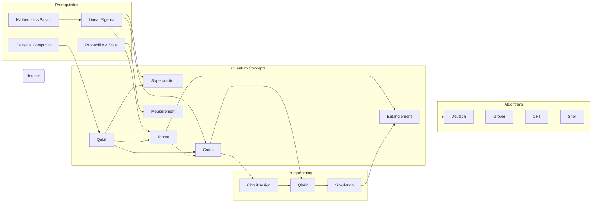

# Executive Summary

The **Q-Learn** quantum curriculum is a **20-level learning path** (Levels 0–19) designed to take a student from *zero background* to quantum computing expertise.  It is organized in six major phases: **Foundations → Quantum Basics → Circuits & Programming → Quantum Information → Algorithms → Advanced/Research**.  Each level has clearly defined learning objectives, interactive labs/projects, and mastery assessments, ensuring a **concept-driven, hands-on progression**.  Early levels build prerequisite skills (classical computing, math, probability), while later levels introduce quantum concepts (qubits, gates, entanglement), programming (Qiskit), and core algorithms (Deutsch-Jozsa, Grover, Shor, etc.).  Foundations in linear algebra and probability support understanding of quantum states and measurements, and successive levels build on these.  By Level 19, learners engage in advanced topics or capstone research projects (quantum error correction, quantum machine learning, QAOA, hardware, etc.), cementing their expertise.  

Key design principles include **adaptive mastery learning** and the **“learn→build→simulate→observe→explain→practice” loop**, which Q-Learn’s platform supports.  At each level students alternate conceptual instruction with circuit-building and code simulation, then receive AI-guided explanations and practice problems.  Prerequisite maps ensure readiness for each new topic, and a **Bayesian Knowledge Tracing (BKT)** engine tracks mastery of each concept, allowing targeted remediation if needed.  Estimated time per level ranges typically from a few hours (early levels) up to ~10–15 hours (complex levels), for roughly 150–200 total hours.  Mastery is gauged through quizzes and circuit challenges (e.g. building specific gates or algorithms), often requiring ~80–90% success for “level complete.”  Achievement badges mark milestones (e.g. *Quantum Explorer*, *Circuit Builder*, *Algorithm Engineer*, etc.) as students advance through grouped levels.  

Below we outline **Levels 0–19** in detail: each includes the Level title, **6–12 learning objectives**, key modules/topics, hands-on labs/projects (≥2 per level), prerequisite rationale, estimated time range, suggested assessments/mastery criteria, and recommended resources.  An accompanying summary table compares all 20 levels by core focus, prerequisites, and milestone badges.  We also provide mermaid diagrams of the overall progression and a mastery graph to visualize topic dependencies.  This comprehensive outline should guide product and curriculum teams in implementing an interactive, concept-rich quantum learning experience.

## Curriculum Progression (Mermaid Diagram)

```mermaid
flowchart LR
    subgraph Foundations
      L0[Level 0: Computing Fundamentals] 
      L1[Level 1: Math for QC]
      L2[Level 2: Probability & Stats]
      L3[Level 3: Linear Algebra]
      L4[Level 4: Introduction to Quantum]
    end
    subgraph Basics
      L5[Level 5: Qubits & States]
      L6[Level 6: Single-Qubit Gates]
      L7[Level 7: Multi-Qubit Gates]
      L8[Level 8: Measurement & Interference]
    end
    subgraph Circuits
      L9[Level 9: Multi-Qubit & Entanglement]
      L10[Level 10: Circuit Design]
      L11[Level 11: Qiskit Programming]
    end
    subgraph Info
      L12[Level 12: Quantum Information Theory]
      L13[Level 13: Entanglement & Communication]
      L14[Level 14: Noise & QEC Basics]
    end
    subgraph Algorithms
      L15[Level 15: Quantum Algorithms I]
      L16[Level 16: Grover's Algorithm]
      L17[Level 17: QFT & Phase Estimation]
    end
    subgraph Advanced
      L18[Level 18: Shor's Algorithm]
      L19[Level 19: Advanced/Capstone]
    end

    %% Prerequisite flows
    L0 --> L1 --> L2 --> L3 --> L4 --> L5
    L5 --> L6 --> L7 --> L8 --> L9 --> L10 --> L11
    L11 --> L12 --> L13 --> L14 --> L15 --> L16 --> L17 --> L18 --> L19
```

## Mastery Concept Graph

The above **Mastery Graph** (conceptually) shows how foundational math and computer concepts lead into quantum topics (qubits, superposition, gates), which in turn underpin multi-qubit ideas (tensor products, entanglement).  Programming tools (Qiskit, circuit simulation) mediate turning these concepts into runnable circuits.  Finally, these feed into quantum algorithms (Deutsch–Jozsa, Grover, QFT, Shor).  Mastery at each node is required before moving to dependents.

<!--  For each level, lists of objectives, etc. -->

## 🟢 Level 0 — *Computing Fundamentals*

**Focus:** Classical information and computation basics.  
**Objective:** Prepare students with no CS background by covering binary logic, bit operations, and classical algorithms.  

- **Learning Objectives:** Learn what computation and information mean; master binary numbers and bit representations; understand basic logic gates (AND, OR, NOT); design simple classical circuits; grasp CPU/memory concepts; know examples of classical algorithms.
- **Key Topics:** Bits and binary arithmetic; logic gates and Boolean algebra; truth tables; simple combinational circuits; algorithmic thinking; data vs. instructions.
- **Hands-On Labs/Projects:** 
  - *Binary Arithmetic Lab:* Write code or use an applet to add/subtract binary numbers, convert to/from decimal.
  - *Logic Gate Simulator:* Build virtual logic circuits (e.g. an adder or multiplexor) using an interactive simulator.
  - *Boolean Puzzle Game:* Apply logic reasoning to solve gate-based puzzles (e.g. light-bulb circuits).
- **Prerequisites:** None (basic arithmetic assumed). This level **enables** Level 1 (math background) by ensuring students know the idea of *bits* and *classical logic*.
- **Estimated Time:** ~8–12 hours (introductory self-study).
- **Assessments & Mastery:** End-of-level quiz on binary and logic; mini-project (build a working logic circuit in a simulator). Mastery = 80% on quiz + correct circuit function.
- **Recommended Resources:** Standard digital logic tutorials; Khan Academy on binary/logic; *Nielsen & Chuang* Sec. 1.1 (for context on bits vs qubits); Qiskit **Classical Computation** tutorials.

## Level 1 — *Mathematics for Quantum Computing*

**Focus:** Mathematical foundations (arithmetic, algebra, basic complex math) needed for quantum theory.  
**Objectives:** Solidify arithmetic (fractions, exponents), algebra (functions, equations), and introduce complex numbers and vectors.  

- **Learning Objectives:** Compute with fractions, exponents, roots; solve simple algebraic equations and understand functions; add/multiply complex numbers; express vectors and compute dot products; interpret sine/cosine for later quantum phases.
- **Key Topics:** Arithmetic rules; linear vs. quadratic equations; function graphs; complex plane, magnitude and argument; Euler’s formula; 2D vectors, magnitude, dot product.
- **Hands-On Labs/Projects:** 
  - *Complex Number Explorer:* Use an interactive plot to add/multiply complex numbers and visualize on the complex plane.
  - *Vector Playground:* Plot 2D vectors, compute dot products and angles between them.
  - *Function Graphing:* Visualize simple functions (polynomials, trig) to understand behavior.
- **Prerequisites:** Basic arithmetic. This level is **required** before tackling probability (L2) and linear algebra (L3), as these use algebra and complex arithmetic.
- **Estimated Time:** ~6–10 hours.
- **Assessments & Mastery:** Problem set on algebra and complex numbers; interactive quiz on Euler’s formula and vector operations. Mastery: >85% correct.
- **Recommended Resources:** Khan Academy algebra; MIT Opencourseware linear algebra basics; Wikipedia *Complex number* and *Euler’s formula* for definitions.

## Level 2 — *Probability & Statistics*

**Focus:** Probability theory fundamentals to understand quantum measurement and randomness.  
**Objectives:** Learn probability concepts crucial for interpreting quantum outcomes.  

- **Learning Objectives:** Define probability, sample spaces, events; compute compound and conditional probabilities; understand discrete distributions, expected value, variance; introduce probability amplitudes (as a teaser).
- **Key Topics:** Random experiments; probability distributions (coin flips, dice); conditional probability and Bayes’ rule; expectation and variance; concept of amplitude *squared* as probability.
- **Hands-On Labs/Projects:** 
  - *Coin/Dice Simulator:* Simulate flipping coins or rolling dice many times, compare empirical vs. theoretical distribution.
  - *Probability Tree Construction:* Visual tool to build conditional probability trees (e.g. disease/test probabilities).
  - *Amplitude Quiz:* Simple thought experiments linking “amplitude” (complex) vs. probability (real).
- **Prerequisites:** Algebra (from L1). Enables quantum state probability interpretation (L5) and later algorithm success probabilities.
- **Estimated Time:** ~6–9 hours.
- **Assessments & Mastery:** Short exercises on Bayes’ theorem and expectation; simulation report. Mastery: 80% on conceptual quiz + correct simulation results.
- **Resources:** Probability tutorials (Khan Academy); *Stanford Encyclopedia of Philosophy* mention of probabilities in quantum context; introductory QM books on probability.

## Level 3 — *Linear Algebra Foundations*

**Focus:** Basics of vectors and matrices (real-valued) as preliminary to quantum states/gates.  
**Objectives:** Introduce linear algebra concepts underpinning quantum state vectors and operators.  

- **Learning Objectives:** Understand scalars, vectors, matrices; perform matrix addition/multiplication; work with identity, inverse matrices; compute eigenvalues/vectors (conceptually); learn tensor (Kronecker) product concept; grasp 2×2 matrices (preview quantum gates).
- **Key Topics:** Vector arithmetic; dot product and norms; matrix operations; identity and inverse; basics of eigen-decomposition; introduction to tensor product (matrix expanded for multi-dim).
- **Hands-On Labs/Projects:** 
  - *Matrix Calculator:* Tool to multiply 2×2 or 3×3 matrices and vectors, visualize transformations.
  - *Eigenvector Demo:* Simple 2×2 matrix with eigenvectors, illustrate geometric meaning.
  - *Tensor Visualizer:* Compose two 2-dimensional vectors to see 4-dimensional state (e.g. via heatmaps).
- **Prerequisites:** Algebra (L1). Required for understanding quantum gates (matrices) and multi-qubit states (tensor).
- **Estimated Time:** ~8–12 hours.
- **Assessments & Mastery:** Problem set on matrix-vector multiplication and eigenvalues; quiz on tensor product. Mastery: 85% on homework + correct use of tensor in a lab.
- **Resources:** Gilbert Strang’s *Linear Algebra* lectures; Qiskit textbook chapters on linear algebra; Khan Academy linear algebra.

## Level 4 — *Introduction to Quantum Computing*

**Focus:** Big-picture introduction to quantum computing concepts (qualitative).  
**Objectives:** Explain *why* quantum computing matters and introduce the qubit concept without heavy math.  

- **Learning Objectives:** Contrast bits vs qubits; define a qubit and superposition qualitatively; describe measurement collapse; explain quantum advantage (e.g. in factoring/search); survey potential applications (crypto, simulation, optimization); discuss historical context of QC.
- **Key Topics:** Qubit vs classical bit; Schrödinger’s notion of superposition; measurement postulate; qubit notation $|0⟩$ and $|1⟩$; basic advantages (parallelism, interference); overview of key algorithms (Deutsch, Grover, Shor).
- **Hands-On Labs/Projects:** 
  - *First Qubit Circuit:* Use a simple UI (or Qiskit) to create a single-qubit circuit: start in $|0⟩$, apply Hadamard, measure repeatedly, and observe ~50/50 outcomes.
  - *Superposition Simulator:* Visual tool showing a qubit’s state vector on the Bloch sphere and how gates move it.
  - *Quantum vs Classical Game:* Interactive quiz/game illustrating how many queries a classical vs. quantum algorithm needs (e.g. Deutsch’s problem).
- **Prerequisites:** Basic computing & algebra (L0–L1). This level is essential before studying actual qubit states in Level 5.  It sets context: *quantum systems can hold vast “hidden” information but yield classical outcomes*.
- **Estimated Time:** ~6–8 hours.
- **Assessments & Mastery:** Concept quiz (identify superposition vs classical states); reflection essay on “why QC can be powerful”. Mastery: >80% on quiz.
- **Resources:** **IBM Quantum Learning** introductory modules; Nielsen & Chuang Ch.1; Khan Academy video on “What is a qubit?”; SEP on Quantum Computing.

## 🔵 Level 5 — *Qubits & Quantum States*

**Focus:** Formalizing qubit state representation and intuition (Bloch sphere).  
**Objectives:** Teach how to mathematically and visually represent single-qubit states.  

- **Learning Objectives:** Write qubit in ket notation ($|\psi⟩ = α|0⟩+β|1⟩$); ensure amplitudes are normalized; compute measurement probabilities $|α|^2$, $|β|^2$; explain global vs relative phase; use Bloch sphere to visualize states; relate angles (θ,φ) to state.
- **Key Topics:** Complex amplitudes, normalization, global/relative phase; measurement probabilities; Bloch sphere representation and coordinates; basis states; state vectors.
- **Hands-On Labs/Projects:** 
  - *Bloch Sphere Explorer:* Interactive Bloch sphere where learners set θ,φ and see resulting $|ψ⟩$, amplitudes, and probability table.
  - *State Vector Calculations:* Given $|\psi⟩$, calculate and interpret probabilities (e.g. $1/\sqrt2(|0⟩+|1⟩)$ gives 50/50).
  - *“Explain My State” AI Challenge:* Student picks a circuit (e.g. prepare $|ψ⟩$) and the system (AI tutor) explains the resulting state in terms of amplitudes and probabilities.
- **Prerequisites:** Intro QC (L4) to motivate. Also Level 3 (linear algebra) and Level 1 (complex numbers) for understanding amplitudes. This level is **prerequisite** for gates (L6) and algorithms (L15+), because quantum computation manipulates these states.
- **Estimated Time:** ~6–9 hours.
- **Assessments & Mastery:** Quiz on normalization and phase; design a specific state via a circuit and explain it (using the system’s “explain” feature). Mastery: correctly predict measurement probabilities and use Bloch sphere coordinates.
- **Resources:** Wikipedia **Bloch sphere** page; Qiskit Textbook (Ch.2) on states; Nielsen & Chuang Sec. 2.2.

## 🟣 Level 6 — *Single-Qubit Gates*

**Focus:** Understanding and using basic single-qubit gates (unitary rotations).  
**Objectives:** Learn how common quantum gates transform qubit states.  

- **Learning Objectives:** Know the Pauli gates (X, Y, Z), Hadamard (H), Phase (S, T) and rotation gates (Rx, Ry, Rz); interpret each gate’s matrix; visualize gates as Bloch rotations; compute gate action on basis states (e.g. X|0⟩=|1⟩); understand gate commutation relations (e.g. H Z H = X).
- **Key Topics:** Gate matrices for X, Y, Z, H, S, T (and inverses S†, T†); Bloch-sphere rotations about axes; unitary property (gate† * gate = I); gate inversion; composite rotations.
- **Hands-On Labs/Projects:** 
  - *Gate Application Lab:* Build a circuit applying a chosen gate to |0⟩ and predict the output state (then verify by simulation).
  - *Rotation Visualizer:* Pick angles θ to apply Rz(θ)/Ry(θ) and watch state move on Bloch sphere.
  - *Gate Composition Challenge:* Build circuits using H and Z to perform an X flip (since HZH = X).
- **Prerequisites:** Level 5 (states) for how gates change amplitudes. Prepares for multi-qubit gates (L7) and all algorithms. 
- **Estimated Time:** ~6–9 hours.
- **Assessments & Mastery:** Hands-on circuit tasks (e.g. “create |1⟩ from |0⟩ using H and Z”); quizzes on matrix multiplication (unitary) and gate equivalences. Mastery: solve circuit puzzles and >80% quiz.
- **Resources:** Nielsen & Chuang Ch.4; Qiskit tutorials on single-qubit gates; SEP on quantum gates.

## 🟠 Level 7 — *Multi-Qubit Gates*

**Focus:** Gates acting on ≥2 qubits; entangling operations.  
**Objectives:** Introduce controlled and multi-qubit operations essential for entanglement and universal computation.  

- **Learning Objectives:** Define tensor products of states and matrices; understand two-qubit basis (|00⟩,|01⟩,…); learn CNOT and CZ gates (their truth tables and matrices); implement SWAP and multi-controlled gates; explain how any multi-qubit gate can be built from single-qubit + CNOT.
- **Key Topics:** Tensor product of state vectors/matrices; CNOT (control-target), CZ, SWAP gates; Toffoli (CCNOT) introduction; gate universality (Barenco et al., 1995); reversibility of unitary gates.
- **Hands-On Labs/Projects:** 
  - *Bell State Construction:* Using H and CNOT, create the four Bell states; measure to confirm correlations.
  - *Controlled-Gate Lab:* Build and test controlled-Z and Toffoli circuits.
  - *Multi-Register Simulator:* Explore simple 3-qubit circuits (e.g. GHZ state creation) and observe outcomes.
- **Prerequisites:** Single-qubit gates (L6) and tensor (L3). This level is necessary before Level 8 (interference) and all algorithms that use entanglement (L15+).
- **Estimated Time:** ~6–9 hours.
- **Assessments & Mastery:** Tasks: “create an entangled Bell state and verify it (use simulation histograms)”; quiz on tensor product calculation. Mastery: correct Bell state circuits and quiz ≥80%.
- **Resources:** Nielsen & Chuang Sec. 4.5; *Bell states* on Wikipedia; Qiskit docs on CNOT and multi-qubit gates; SEP on universality.

## 🔴 Level 8 — *Measurement & Quantum Phenomena*

**Focus:** Key quantum phenomena: measurement, interference, and no-cloning.  
**Objectives:** Teach how measurement collapses states and how interference arises from phases.  

- **Learning Objectives:** Understand the quantum measurement postulate (projective measurement in a basis); practice changing measurement basis; grasp constructive vs. destructive interference of amplitudes; explain the no-cloning theorem (cannot copy unknown qubits); discuss thought experiments like the double-slit in qubit terms; learn a basic teleportation protocol concept.
- **Key Topics:** Projective measurement (computational basis and others); probability amplitudes interference; global vs relative phase (interference effect); no-cloning theorem; concept of teleportation and no-communication.
- **Hands-On Labs/Projects:** 
  - *Interference Demo:* Build a simple two-path circuit (e.g. two sequential Hadamards vs. identity) to show how amplitudes add/cancel.
  - *No-Cloning Thought Lab:* Try (with simulation) to copy an arbitrary qubit and observe impossible (discuss why).
  - *Quantum Teleportation Project:* Guided project building the 3-qubit teleportation circuit, analyzing how the sender’s qubit state is recovered by the receiver (understanding entanglement and classical feed-forward).
- **Prerequisites:** Levels 5–7. This level **primes** for algorithms like Deutsch (which rely on interference) and teaches physical constraints (no-cloning important for quantum security).
- **Estimated Time:** ~8–10 hours.
- **Assessments & Mastery:** Quiz on measurement outcomes and interference patterns; teleportation mini-project report. Mastery: correctly predict interference results and explain teleportation steps.
- **Resources:** Wikipedia *Measurement in quantum mechanics*; SEP on measurement collapse; Wikipedia *No-cloning theorem*.

## Level 9 — *Multi-Qubit Systems & Entanglement*

**Focus:** Composite systems: multiple qubits and entangled states.  
**Objectives:** Develop intuition for multi-qubit state spaces and entanglement correlations.  

- **Learning Objectives:** Work with 2–3 qubit states (tensor space grows exponentially); enumerate computational basis for n qubits; define and recognize entangled vs. separable states; create and analyze Bell states (maximally entangled); understand correlation on measurement (Bell state example: measuring one qubit affects the other).
- **Key Topics:** Tensor product state spaces; separability vs entanglement; Bell states and GHZ as examples; multi-qubit amplitude notation; correlation experiments (outcome probabilities for entangled pairs).
- **Hands-On Labs/Projects:** 
  - *Bell Correlation Lab:* Generate Bell pairs and measure both qubits in varying bases to see correlations (histogram comparison).
  - *GHZ State Circuit:* Build the 3-qubit GHZ entangled state and verify its properties (all bits the same).
  - *Entanglement Qualifier:* Given a 2-qubit state, determine if it’s entangled (e.g. compute partial trace or look at correlation).
- **Prerequisites:** Multi-qubit gates and measurement (L7–L8). This underlies advanced algorithms (Deutsch-Jozsa, teleportation) which use entanglement and correlation.
- **Estimated Time:** ~6–8 hours.
- **Assessments & Mastery:** Design circuits for all 4 Bell states; quiz on tensor basis and entanglement criteria. Mastery: produce correct Bell state circuits and demonstrate understanding of outcome correlations.
- **Resources:** Nielsen & Chuang Ch.2.3; *Bell state* reference; Qiskit Grover tutorial (introduces multi-qubit state spaces).

## Level 10 — *Quantum Circuit Design*

**Focus:** Principles of building and optimizing quantum circuits.  
**Objectives:** Teach how to assemble complex circuits and manage resources on quantum hardware.  

- **Learning Objectives:** Understand circuit composition, depth, and gate count; practice reversing and uncomputing steps; use ancilla (helper) qubits for intermediate storage; basics of circuit optimization (gate cancellation, reuse of qubits); concept of reversibility in QC (all unitary).
- **Key Topics:** Circuit depth vs width; ancilla usage and uncomputing; gate decomposition (e.g. multi-qubit into single+CNOT); circuit identity (U followed by U† cancels); resource constraints (quantum hardware has limited qubits/gates).
- **Hands-On Labs/Projects:** 
  - *Circuit Minimization Challenge:* Given a composed circuit, find an equivalent with fewer gates or lower depth.
  - *Ancilla Exercise:* Use an extra qubit to implement a function (e.g. compute XOR of three inputs onto an ancilla, then uncompute).
  - *Reversible Logic:* Convert a simple classical boolean function (e.g. AND) into a reversible quantum circuit (Toffoli-based).
- **Prerequisites:** Understanding of gates/circuits (L6–L9). This level is needed before programming in Qiskit (L11) and for creating efficient algorithms.
- **Estimated Time:** ~5–7 hours.
- **Assessments & Mastery:** Peer review of circuit designs (students swap and optimize each other’s circuits); quiz on depth vs width trade-offs. Mastery: produce an optimized circuit meeting specified resource limits.
- **Resources:** *Nielsen & Chuang* Sec. 4.2 (reversible computation); Qiskit tutorials on circuit optimization; research papers on NISQ compilation (for advanced reading).

## Level 11 — *Quantum Programming with Qiskit*

**Focus:** Practical programming of quantum circuits in Python/Qiskit.  
**Objectives:** Familiarize students with coding quantum circuits and running simulations.  

- **Learning Objectives:** Python basics (if needed), especially lists and functions; use Qiskit’s `QuantumCircuit` to create qubits/bits; apply gates in code (e.g. `qc.h(0)`, `qc.cx(0,1)`); add measurements; run on simulators (statevector or Aer); collect statistics (shots) and plot histograms.
- **Key Topics:** Qiskit API: `QuantumCircuit`, `AerSimulator`, statevector, measurement; executing circuits and retrieving results; noise models (briefly mention).  Circuit visualization (text and graphical).
- **Hands-On Labs/Projects:** 
  - *First Qiskit Program:* Code the classic coin-flip circuit (H then measure) and print the circuit and results.
  - *Circuit to Code:* Given a drawn circuit diagram, implement it in Qiskit and run to verify output distribution.
  - *Noise Experiment:* (Optional) Add a bit-flip noise channel and compare ideal vs noisy result for a small circuit.
- **Prerequisites:** Python fundamentals and all prior quantum concept levels. Qiskit programming is essential for all subsequent projects and labs (levels 12+).
- **Estimated Time:** ~8–12 hours.
- **Assessments & Mastery:** Programming assignments (create specified circuits, interpret output); unit tests that verify correct final states. Mastery: code that compiles and runs with correct expected output (e.g. correct probability distribution for a given circuit).
- **Resources:** **Qiskit Documentation** (API reference); IBM Quantum Learning modules on Qiskit; IBM Q Experience tutorials; *Nielsen & Chuang* (for theoretical background).

## Level 12 — *Quantum Information Theory*

**Focus:** Formalism of quantum information beyond pure states (density, entropy).  
**Objectives:** Introduce mixed states, density matrices, and entropy to understand real-world quantum systems.  

- **Learning Objectives:** Define pure vs mixed state; represent states with density matrices; compute partial trace and reduced density; discuss decoherence; compute quantum entropy (von Neumann entropy) as measure of information; understand fidelity (basic idea) for comparing states.
- **Key Topics:** Density operator definition (ρ = |ψ⟩⟨ψ| or mixture); Bloch sphere interior points (mixed states); partial trace (dropping a qubit); purity measure; entanglement entropy; introduction to qubit channels.
- **Hands-On Labs/Projects:** 
  - *Mixed State Simulation:* Create circuits that entangle qubits and then trace out a subsystem (using Qiskit statevector + partial trace) to see mixed states.
  - *Entropy Calculator:* Given a density matrix, compute its von Neumann entropy with a script.
  - *Decoherence Demo:* Apply random gates or noise to a state and observe loss of purity over time.
- **Prerequisites:** Multi-qubit concepts (L9) and linear algebra (L3). This builds groundwork for error correction (L14) and understanding NISQ limitations.
- **Estimated Time:** ~8–10 hours.
- **Assessments & Mastery:** Quiz on density matrix properties; lab report on partial trace exercise. Mastery: correctly compute and interpret a density matrix and its entropy.
- **Resources:** *Nielsen & Chuang* Ch.8 (density matrices); Qiskit tutorials on density matrices and fidelity; relevant SEP sections on mixed states (or textbooks).

## Level 13 — *Entanglement & Quantum Communication*

**Focus:** Applications of entanglement in communication protocols.  
**Objectives:** Explore how entanglement enables teleportation, superdense coding, and secure communication.  

- **Learning Objectives:** Understand **quantum teleportation** protocol steps (creating entanglement, Bell measurement, classical message); learn **superdense coding** (sending two bits via one qubit); intro to **QKD** (BB84 or entanglement-based ideas); appreciate that entanglement can transfer or encode information in non-classical ways (no faster-than-light information).
- **Key Topics:** Bell state sharing and its use; classical vs quantum channels; no-signalling theorem; simple QKD idea (detecting eavesdropping via measurement disturbance).
- **Hands-On Labs/Projects:** 
  - *Teleportation Circuit:* Build and simulate the 3-qubit teleportation circuit; verify that the state of qubit A is reproduced on qubit C.
  - *Superdense Coding Lab:* Create shared entangled pair; encode two classical bits into one qubit; measure and decode.
  - *QKD Simulator:* (Software exercise) Simulate a basic QKD key exchange (Alice/Bob measure random bases, compare subsets).
- **Prerequisites:** Entanglement (L9) and circuits (L10). Prepares for secure communications chapter, and demonstrates core power of entanglement.
- **Estimated Time:** ~6–8 hours.
- **Assessments & Mastery:** Project presentations (explain and show teleportation/superdense circuits). Mastery: correct implementation of teleportation/superdense circuits with successful state transfer.
- **Resources:** Nielsen & Chuang Ch.2.5 (teleportation); Wikipedia *Quantum teleportation*; IBM Qiskit tutorials on teleportation/superdense coding.

## Level 14 — *Noise, Decoherence & QEC Basics*

**Focus:** Real-world quantum errors and simple error correction concepts.  
**Objectives:** Learn why quantum computers are fragile and how basic error-correction works.  

- **Learning Objectives:** Describe sources of noise (bit-flip, phase-flip, decoherence); model noise channels (e.g. bit-flip channel); learn simple error-correcting codes (3-qubit repetition code for bit-flip, Shor code idea); understand syndrome measurement (measuring ancilla to detect error without collapsing data).
- **Key Topics:** Quantum noise models; fidelity vs error rate; basics of **quantum error correction (QEC)**; concept of redundancy and syndrome extraction; error thresholds (NISQ era).
- **Hands-On Labs/Projects:** 
  - *Noise Simulation:* Introduce bit-flip or phase-flip errors in a circuit (Qiskit noise backend) and observe its effect on outcomes.
  - *Repetition Code Circuit:* Implement the 3-qubit bit-flip code that encodes α|0⟩ + β|1⟩ → α|000⟩ + β|111⟩, apply one bit-flip error, measure the syndrome, and correct it.
  - *Error Correction Quiz:* Given a small error syndrome scenario, decide the correction operation needed.
- **Prerequisites:** Level 12 (density/noise) and 11 (programming). This is critical before tackling advanced algorithm fidelity and longer computations in L18–L19.
- **Estimated Time:** ~8–10 hours.
- **Assessments & Mastery:** Hands-on coding: “protect a qubit using 3-qubit repetition code and demonstrate error recovery.” Mastery: successful recovery of state after single-bit error.
- **Resources:** *Nielsen & Chuang* Ch.10 (QEC); Qiskit tutorials on error correction; introductory papers (Shor 1995 code).

## 🔴 Level 15 — *Quantum Algorithms I*

**Focus:** Foundational quantum algorithms and oracles (Deutsch, DJ, BV, Simon).  
**Objectives:** Introduce the algorithmic method of quantum computing via oracles and superposition.  

- **Learning Objectives:** For each algorithm (Deutsch, Deutsch-Jozsa, Bernstein–Vazirani, Simon’s), understand the *problem*, its classical solution complexity, and the quantum circuit solution. Learn the role of oracles and interference to encode global function properties in one measurement. Appreciate speed-ups: e.g. Deutsch–Jozsa solves n-bit “constant vs balanced” in 1 query (classically needs >1).
- **Key Topics:** Oracle definition; algorithm structure (prepare superposition, apply oracle, inverse transform, measure); examples of phase kickback; comparison of classical vs quantum query complexity; introduction to Hidden Subgroup Problem (Simon’s).
- **Hands-On Labs/Projects:** 
  - *Deutsch–Jozsa Implementation:* Code the DJ algorithm for small n, simulate both constant and balanced cases, verify correct classification in one run.
  - *Bernstein-Vazirani Demo:* Given an unknown bitstring, use BV circuit to discover it with one shot.
  - *Simon's Algorithm Exercise:* (Conceptual) Study how interference reveals the period of f(x)=f(x⊕s). Possibly simulate small 2-qubit example.
- **Prerequisites:** Linear algebra (L3), gates (L6–L7), entanglement (L9), programming (L11). This level establishes “quantum thinking”: algorithms often determine a **global property** of a function in one measurement, using interference.
- **Estimated Time:** ~8–12 hours.
- **Assessments & Mastery:** Coding tasks for each algorithm with provided oracles; questions on why classical would fail. Mastery: working implementations and explanations of the quantum advantage for each case.
- **Resources:** Original papers (Deutsch 1985); Qiskit tutorials on DJ and Simon; quantum computing lecture notes (explaining oracles and phase kickback).

## 🔵 Level 16 — *Grover’s Search Algorithm*

**Focus:** Amplitude amplification for unstructured search.  
**Objectives:** Master the theory and implementation of Grover’s algorithm and its optimality.  

- **Learning Objectives:** Formulate the search problem and oracle; implement phase oracle for a target state; understand the diffusion (inversion-about-average) operator; iterate Grover steps to amplify the target amplitude; calculate optimal number of iterations (~π/4√N); analyze success probability. Know that Grover provides a **quadratic speed-up** (O(√N) vs O(N) classically).
- **Key Topics:** Oracle construction for marking states; diffusion transform (Hadamards + conditional phase); geometric interpretation on Bloch circle; complexity and limitations; examples (searching one marked item).
- **Hands-On Labs/Projects:** 
  - *Grover Circuit Builder:* Given N=4 or 8, build Grover’s algorithm with a chosen target, run it, and visualize amplitude changes after each iteration.
  - *Amplitude Visualization:* Plot amplitudes on the Bloch-sphere (or vector) representation across iterations for simple cases.
  - *Custom Oracle Challenge:* Design a Grover search for a non-trivial oracle (e.g. target defined by some function).
- **Prerequisites:** Quantum circuits and gates (L6–L10), understanding of probability (L2). Grover requires applying what’s learned on interference and oracles to an “amplitude amplification” task.
- **Estimated Time:** ~8–10 hours.
- **Assessments & Mastery:** Successful implementation of Grover for small N; calculation question on number of iterations. Mastery: correct high-probability success on simulation.
- **Resources:** Grover’s original paper (1996); Qiskit textbook/tutorial on Grover; SEP on Grover (notes quadratic speed-up).

## 🟣 Level 17 — *Quantum Fourier Transform (QFT) & Phase Estimation*

**Focus:** The QFT subroutine and its use in phase/period finding.  
**Objectives:** Understand the QFT circuit and how it enables phase estimation.  

- **Learning Objectives:** Learn the mathematics of the Discrete Fourier Transform (DFT); implement its quantum analog (QFT) efficiently (O(n²) gates); use controlled phase rotations and Hadamards; implement inverse QFT; understand **Quantum Phase Estimation (QPE)** circuit (controlled-U and QFT) to find eigenphases; see that QFT is a core subroutine (used in Shor).
- **Key Topics:** QFT circuit construction; bit-reversal and swapping output; sample transforms on small registers; phase estimation outline (input eigenstate and unitary, measure phase); estimation accuracy and bits of precision.
- **Hands-On Labs/Projects:** 
  - *QFT Circuit:* Build and test a QFT on 3 qubits (e.g. transform basis states to phases) and verify with classical DFT.
  - *Phase Estimation Demo:* Given a simple unitary (e.g. Rz(θ)), use QPE to estimate θ; simulate the circuit and read out the estimated bits.
  - *Inverse QFT Practice:* Show that applying QFT and then inverse QFT returns original state.
- **Prerequisites:** Linear algebra (L3), amplitude/gates (L6–L7), Grover (L16). QFT/QPE prepares students for Shor’s period finding (next) and more advanced algorithms.
- **Estimated Time:** ~8–12 hours.
- **Assessments & Mastery:** Code QFT and QPE in Qiskit for small cases; ask to derive certain QFT transformation. Mastery: QFT correctly implemented (states transformed); QPE returns correct phase.
- **Resources:** IBM Quantum Learning *QFT Module*; Nielsen & Chuang Ch.5 (QFT); Qiskit tutorial on phase estimation.

## 🟠 Level 18 — *Shor’s Factoring Algorithm*

**Focus:** Prime factorization via period finding and the full Shor circuit.  
**Objectives:** Integrate all learned concepts into implementing Shor’s algorithm for small integers.  

- **Learning Objectives:** Understand factoring as period-finding: given N, find period r of a^x mod N; use QPE (L17) on the modular exponentiation unitary; apply classical post-processing (continued fractions) to extract factors from r; appreciate that Shor’s algorithm achieves **exponential speed-up** over known classical factoring.
- **Key Topics:** Modular arithmetic basics; constructing modular multiplication circuits (abstractly); combining superposition, QFT, and measurement; continued fraction expansion; limitations (requires co-prime a, even period).
- **Hands-On Labs/Projects:** 
  - *Shor Demo for N=15:* Using Qiskit’s built-in Shor or manual circuit, factor 15 into 3×5, examining intermediate states.
  - *Period Finding Visualization:* For small N, visualize how probability peaks at correct period after QFT.
  - *Classical Step:* Given a measured phase value, run the continued fraction algorithm to compute r and factors.
- **Prerequisites:** All previous (especially L12, L14, L17). Shor is the pinnacle of basic QC: it embodies QFT, phase estimation, and classical cooperation. 
- **Estimated Time:** ~10–15 hours.
- **Assessments & Mastery:** Final project: implement Shor’s algorithm for a small N and document each stage (quantum & classical). Mastery: correct factors found with QPE measurement (for N=15 or similar).
- **Resources:** Shor’s original paper; *IBM Q Experience* Shor demo; Nielsen & Chuang Ch.5 (period finding and factoring).

## ⚫ Level 19 — *Advanced Topics & Capstone*

**Focus:** Capstone projects and specialized tracks, not a “textbook” level.  
**Objectives:** Allow learners to pursue interests and demonstrate mastery through projects or research.  

- **Learning Objectives:** At this point students should integrate their knowledge. Options include: **(A)** Advanced error correction (surface codes, fault tolerance); **(B)** Variational algorithms (VQE, QAOA) for chemistry/optimization; **(C)** Quantum machine learning (quantum circuits as variational classifiers); **(D)** Quantum simulation (Hamiltonian simulation, many-body physics); **(E)** Real hardware experimentation (running circuits on IBM Q devices and analyzing noise).
- **Key Topics:** Depends on track. For example: error correction codes (Shor’s 9-qubit, surface code idea); VQE/QAOA circuits and classical-quantum loops; QML concepts (parameterized circuits, quantum kernels); limitations of NISQ vs path to fault-tolerance; overview of quantum hardware stack (superconducting, trapped ions).
- **Hands-On Labs/Projects:** 
  - *Capstone Project:* Student selects a real-world problem (e.g. optimize a small molecule energy via VQE, or solve MaxCut with QAOA, or classify data with a quantum circuit). They research, implement, and present results.
  - *Hardware Experiment:* If resources permit, run a chosen circuit on a real quantum device and analyze results vs. simulator.
  - *Collaborative Workshop:* Students propose improvements or tests (e.g. debug a noisy circuit, or simulate an alternative algorithm).
- **Prerequisites:** Essentially all prior levels. This stage leverages everything learned. Level 19 **culminates** the curriculum; each student should have mastered most earlier topics by now.
- **Estimated Time:** *Self-paced capstone* (~10+ hours, potentially weeks). 
- **Assessments & Mastery:** Evaluation is project-based (rubric including correctness, innovation, understanding). Mastery: Successful completion of a capstone (passing rubric and presentation) signifies “Quantum Engineer” level.
- **Resources:** Recent research papers; Qiskit tutorials on VQE/QAOA; IBM Quantum Experience for hardware; community projects (e.g. QHack projects).

---

## Milestones and Level Comparison

| Level(s) | Core Focus                          | Prerequisites                | Milestone Badge         |
|----------|-------------------------------------|------------------------------|-------------------------|
| **L0–2** | Classical computing fundamentals, math & probability | None (basic arithmetic)      | **Explorer**            |
| **L3–5** | Linear algebra; intro to quantum states (qubits)   | Algebra, logic (L0–L2)       | **Enthusiast**         |
| **L6–8** | Quantum gates (single & controlled); measurement & interference | Qubits & states (L4–L5)      | **Circuit Builder**     |
| **L9–11**| Multi-qubit systems; circuit design; Qiskit programming | Basic circuits (L6–L8), multiqubit (L7–L8) | **Quantum Programmer** |
| **L12–14**| Quantum information theory; entanglement apps; QEC intro | Circuits/Qiskit (L10–L11), multi-qubit (L9–L10) | **Quantum Scientist**  |
| **L15–17**| Quantum algorithms I; Grover; QFT/QPE     | All prior (especially algebra, entanglement) | **Algorithm Engineer**  |
| **L18–19**| Shor’s algorithm; advanced topics and capstone | Full quantum concepts (L12–L17)   | **Quantum Engineer**    |

Each range above corresponds to a badge awarded after completing those levels.  The “Prerequisites” column shows which earlier content a level group builds on.  For example, **Algorithm Engineer** (L15–17) requires mastery of gates, circuits, and quantum information from L0–14.  By charting prerequisites and grouping, Q-Learn can guide when a student is ready to proceed or needs review, keeping learning adaptive.

## Time Allocation Chart

A rough **time allocation** by category of levels might look like:

- **Foundations (L0–4):** ~30% of total hours (math and classical prep)  
- **Quantum Basics (L5–8):** ~20% (states, gates, measurement)  
- **Circuits & Qiskit (L9–11):** ~15% (multi-qubit, design, programming)  
- **Quantum Info (L12–14):** ~15% (density, entanglement apps, noise)  
- **Algorithms (L15–17):** ~15% (key quantum algorithms)  
- **Advanced/Capstone (L18–19):** ~5% (Shor and projects)

This reflects a heavier investment early on to build solid foundations, and significant time on algorithms, with remaining effort on advanced topics. (A pie or bar chart of this split can help learners see the commitment ahead.)

Each level’s time estimate (in hours) is given above; in total the curriculum is on the order of **150–200 hours** of student engagement, balancing theory and practice.

---

In summary, this **20-level Q-Learn curriculum** takes learners from basics (binary logic and algebra) through qubit physics and quantum programming, culminating in cutting-edge topics.  Each level explicitly builds on previous ones (see table), and the progression relies on **active learning** (labs, coding, AI tutoring) rather than passive reading.  Core quantum principles (superposition, entanglement, interference) are grounded in both intuitive diagrams (Bloch sphere, circuit visualizations) and rigorous math.  Milestone badges and adaptive mastery tracking keep students motivated and on track.  This structure ensures that by the end, learners have a comprehensive understanding of quantum computing and the practical skills to continue in research or industry.  

**Sources:** Authoritative texts and official docs were used to inform this outline (e.g. Nielsen & Chuang, Qiskit materials, SEP entries).  Where direct references are not cited (e.g. general math fundamentals), standard pedagogy was applied. The structure also aligns with Q-Learn’s existing design principles (concept→circuit→practice, AI tutors, etc.). 

