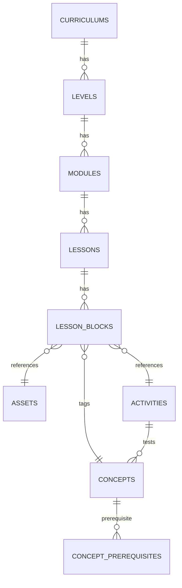

# Executive Summary

Q-Learn’s curriculum will be stored in a **block-based CMS** built on PostgreSQL and Supabase Storage. We design a normalized schema: **Curriculums → Levels → Submodules (Modules) → Lessons → Lesson_Blocks**. Each lesson is a sequence of content or activity blocks (text, images, code, circuit, video, quiz, etc.) stored as JSONB. Large assets (images, videos) go in Supabase Storage with references in the database (an `assets` table). The Next.js frontend fetches this structured data via a curriculum API and renders each block with a **component registry** (e.g. `<TextBlock>`, `<ImageBlock>`, `<CircuitBlock>`, etc.). Content is versioned, localizable, and tied to a concept/prerequisite graph for adaptive learning (Bayesian Knowledge Tracing). 

Below we detail the data model, block templates, asset strategy, frontend rendering, API examples, and security/execution flows. Two sample lesson JSON payloads (one simple and one circuit-based) and SQL DDL snippets illustrate the design. The architecture follows modern Postgres/JSONB patterns and Next.js best practices for static/dynamic rendering (ISR/SSR).



## Curriculum Data Model

We use PostgreSQL tables with JSONB fields to store flexible content. Key tables:

- **curriculums**: id, slug, title, description, version, status.
- **levels**: id, curriculum_id, level_number, title, slug, description, objectives.
- **modules (submodules)**: id, level_id, title, slug, description, position.
- **lessons**: id, module_id, title, slug, content_order (optional), difficulty, estimated_time, status.
- **lesson_blocks**: id, lesson_id, block_type, position, content JSONB, **is_activity** flag.
- **assets**: id, path, type (image/video/etc), mime, alt_text, caption, created_at.
- **concepts**: id, slug, name, description.
- **lesson_concepts**: maps lessons to concepts taught.
- **activity_concepts**: maps quiz/challenge to concepts tested (with weight).
- **concept_prereqs**: concept_id, prereq_concept_id, min_mastery.
- **versions** or `status` fields handle draft vs published.

The `lesson_blocks.content` JSONB stores type-specific data (e.g. text, image references, code snippet). Blocks are ordered by their `position`. A block can be marked as **is_activity** to indicate assessment (e.g. quiz, circuit challenge), which updates mastery models (BKT) on completion. 

Example schema snippets (Postgres):

```sql
CREATE TABLE curriculums (
  id UUID PRIMARY KEY,
  slug TEXT UNIQUE,
  title TEXT,
  description TEXT,
  version INT DEFAULT 1,
  status TEXT CHECK (status IN ('draft','published')) DEFAULT 'draft'
);

CREATE TABLE levels (
  id UUID PRIMARY KEY,
  curriculum_id UUID REFERENCES curriculums(id),
  level_number INT,
  title TEXT,
  slug TEXT UNIQUE,
  description TEXT,
  learning_objectives TEXT
);

CREATE TABLE modules (
  id UUID PRIMARY KEY,
  level_id UUID REFERENCES levels(id),
  title TEXT,
  slug TEXT,
  description TEXT,
  position INT
);

CREATE TABLE lessons (
  id UUID PRIMARY KEY,
  module_id UUID REFERENCES modules(id),
  title TEXT,
  slug TEXT,
  description TEXT,
  difficulty TEXT,
  estimated_minutes INT,
  position INT,
  status TEXT DEFAULT 'draft'
);

CREATE TABLE lesson_blocks (
  id UUID PRIMARY KEY,
  lesson_id UUID REFERENCES lessons(id),
  block_type TEXT,
  position INT,
  content JSONB,       -- type-specific content (see examples below)
  is_activity BOOLEAN DEFAULT FALSE
);
```

JSONB allows flexible storage of each block’s content (text, code, circuit, etc.) without schema migrations. Separate tables (`assets`, `concepts`, `activity_concepts`, etc.) normalize reusable items.

## Submodules & Levels

Each of the 20 levels is split into numbered submodules (e.g. 1.1, 1.2…). We model these as **modules**. For example, *Level 5: “Qubits & States”* might have modules 5.1 “What is a Qubit?”, 5.2 “State Vectors”, 5.3 “Superposition”, etc. 

- **Level Table:** columns `level_number INT`, `title`, `description`, `learning_objectives`. 
- **Module Table:** foreign key to levels, fields `title`, `position`. The slug combines level and module (e.g., “5-2-superposition”). 

This hierarchical structure lets us manage order and prerequisites. The curriculum API can return `/level/5` and list all submodules, or `/lesson/{id}` for details.

## Lesson Blocks (Content Types)

A **Lesson** is an ordered list of **Blocks**. We categorize blocks by type:

- **TextBlock:** Markdown/HTML content.
- **ImageBlock:** references an image asset by `asset_id`.
- **EquationBlock:** LaTeX or MathML content.
- **CodeBlock:** code snippet (language, code text, optional runnable flag).
- **CircuitBlock:** structured JSON defining a quantum circuit.
- **VideoBlock:** YouTube/Vimeo ID with start/end.
- **SimulationBlock:** config for an interactive sim (parameters, code).
- **QuizBlock:** questions (MCQ, code input) with answers.
- **ChallengeBlock:** open-ended activity or project.

Each block’s `content` JSONB payload stores fields. For example:

```json
// Text block example
{
  "type": "text",
  "content": {
    "markdown": "A **qubit** is the basic unit of quantum information..."
  }
}
```

```json
// Image block example
{
  "type": "image",
  "content": {
    "asset_id": "asset_qubit_bloch_sphere",
    "alt": "Bloch sphere visualization",
    "caption": "A single qubit state on the Bloch sphere."
  }
}
```

```json
// Code block example
{
  "type": "code",
  "content": {
    "language": "python",
    "code": "from qiskit import QuantumCircuit\nqc = QuantumCircuit(1); qc.h(0); qc.measure_all()",
    "runnable": true,
    "filename": "circuit.py"
  }
}
```

```json
// Circuit block example
{
  "type": "circuit",
  "content": {
    "qubits": 2,
    "clbits": 2,
    "operations": [
      {"gate": "h", "qubits": [0]},
      {"gate": "cx", "control": 0, "target": 1},
      {"gate": "measure", "qubits": [0,1], "clbits": [0,1]}
    ]
  }
}
```

```json
// Video block example
{
  "type": "video",
  "content": {
    "provider": "youtube",
    "video_id": "dQw4w9WgXcQ",
    "start": 15,
    "end": 75
  }
}
```

```json
// Quiz block example
{
  "type": "quiz",
  "content": {
    "questions": [
      {"q": "What is the probability of measuring |0> after an H gate on |0>?", "type": "mcq", "options": ["0%", "50%", "100%"], "answer": "50%"}
    ]
  }
}
```

All block types and their schemas are documented in the CMS. Frontend components will expect exactly these JSON shapes.

## Example Lesson Payloads

### Example 1: Basic Text+Image+Quiz Lesson

Endpoint `GET /lessons/{id}` returns:

```json
{
  "lesson": {
    "id": "lesson-5-1-1",
    "module_id": "module-5-1",
    "title": "What is a Qubit?",
    "slug": "5-1-what-is-a-qubit",
    "blocks": [
      {"position":1, "block_type":"text", "content": {"markdown":"A **qubit** is the basic unit of quantum information..."}},
      {"position":2, "block_type":"image", "content": {"asset_id":"asset_qubit_sphere", "alt":"Bloch sphere", "caption":"Bloch sphere of a qubit."}},
      {"position":3, "block_type":"text", "content": {"markdown":"Mathematically, a qubit state is a complex vector..."}},
      {"position":4, "block_type":"quiz", "is_activity":true, "content": {
        "questions": [
          {"q":"What are the basis states of a qubit?", "type":"mcq", "options":["|0>,|1>","|+>,|->","|00>,|11>"], "answer":"|0>,|1>"}
        ]
      }}
    ]
  }
}
```

### Example 2: Circuit + Code + Simulation Lesson

```json
{
  "lesson": {
    "id": "lesson-7-2-3",
    "module_id": "module-7-2",
    "title": "Bell State Preparation",
    "slug": "7-2-bell-state",
    "blocks": [
      {"position":1, "block_type":"text", "content": {"markdown":"Let's create an entangled Bell state."}},
      {"position":2, "block_type":"circuit", "content": {
        "qubits":2, "clbits":2,
        "operations":[
          {"gate":"h","qubits":[0]},
          {"gate":"cx","control":0,"target":1}
        ]
      }},
      {"position":3, "block_type":"code", "content": {
        "language":"python",
        "code":"from qiskit import QuantumCircuit\nqc = QuantumCircuit(2,2)\nqc.h(0); qc.cx(0,1); qc.measure([0,1],[0,1])\nprint(qc)",
        "runnable":true
      }},
      {"position":4, "block_type":"simulation", "content": {
        "script":"run_qiskit", "inputs": {"circuit_id": "lesson-7-2-3-block2"}
      }},
      {"position":5, "block_type":"quiz", "is_activity":true, "content": {
        "questions":[
          {"q":"What is the expected outcome after measuring this Bell state?", "type":"mcq", "options":["00 or 11","01 or 10","All equally likely"], "answer":"00 or 11"}
        ]
      }}
    ]
  }
}
```

In the above, the **CircuitBlock** defines the quantum circuit and the **SimulationBlock** might reference a prewritten simulation script (“run_qiskit”) and pass the circuit. The frontend can parse these to display and run them.

## API Design

The backend (FastAPI) exposes REST endpoints. Example shapes:

- **GET /api/v1/curriculums/{slug}** – returns curriculum with nested levels (no blocks).
- **GET /api/v1/levels/{id}** – returns level with modules and each module’s lessons (titles only).
- **GET /api/v1/lessons/{id}** – returns full lesson with ordered blocks (as shown above).
- **GET /api/v1/levels/{level_id}/modules/{module_id}** – filter by level/module slug.
- **GET /api/v1/assets/{asset_id}** – returns asset metadata and signed URL (if needed).

```json
// Example: GET /api/v1/levels/5/modules/5-2
{
  "id": "module-5-2",
  "title": "State Vectors",
  "lessons": [
    {"id":"lesson-5-2-1","title":"State as Vector","slug":"5-2-1-vector"},
    {"id":"lesson-5-2-2","title":"Normalization","slug":"5-2-2-normalize"}
  ]
}
```

All payloads are JSON. The frontend calls these APIs, caches results (via SWR or React Query), and may use Next.js ISR for public content with low churn.

## Frontend Rendering

The Next.js app defines a **Block Registry**: a mapping from `block_type` to React component. For example:

```js
const BlockRegistry = {
  text: TextBlock,
  image: ImageBlock,
  code: CodeBlock,
  circuit: CircuitBlock,
  video: VideoBlock,
  simulation: SimulationBlock,
  quiz: QuizBlock,
  challenge: ChallengeBlock
};
```

The lesson page iterates:

```jsx
{lesson.blocks.map((blk) => {
  const Component = BlockRegistry[blk.block_type];
  return <Component key={blk.id} content={blk.content} />;
})}
```

Each component renders its JSON data. For instance, `<TextBlock>` may use `dangerouslySetInnerHTML` on Markdown, `<ImageBlock>` fetches the asset URL, `<CodeBlock>` shows syntax-highlighted code with an “Execute” button if `runnable: true`, `<CircuitBlock>` draws a circuit diagram (e.g. with ASCII or SVG), and `<QuizBlock>` renders questions with inputs.

**SSR/ISR:** Public lessons can be statically generated at build-time or ISR (Incremental Static Regeneration) for performance. Authenticated or in-progress content may be server-rendered or loaded on demand. Dynamic imports can lazy-load heavy components (video players, editors) to speed initial load.

**Caching:** Use HTTP caching or Next.js data cache for curriculum (since it changes infrequently), and RLS/Authentication ensures only published content is fetched by students.

## Asset Strategy

All media assets (images, videos) live in Supabase Storage. We create structured paths, e.g.:

```
supabase storage bucket: /curriculum/<curriculum_slug>/<level>/<module>/<filename>
```

For example: `/curriculum/quantum-computing/l05-qubits/l05-01-intro/qubit-sphere.svg`. The `assets` table stores metadata and the `storage_path`. Frontend retrieves images via signed URLs (or makes them public via RLS policy). 

**Asset table schema example:**

```sql
CREATE TABLE assets (
  id UUID PRIMARY KEY,
  storage_path TEXT UNIQUE,
  type TEXT,     -- e.g. 'image', 'video'
  mime TEXT,
  width INT,
  height INT,
  duration INT,
  alt_text TEXT,
  caption TEXT,
  uploaded_at TIMESTAMP DEFAULT now()
);
```

The `lesson_blocks.content.asset_id` references this table.

## Adaptive/BKT Integration

We tag content with concepts for adaptive learning. For example, blocks covering “superposition” have `concepts` that link to a **concepts** table. We then maintain a table `activity_concepts(activity_id, concept_id, weight)` so that completing an activity updates the student’s mastery of that concept (Bayesian Knowledge Tracing).

A **concept_prerequisites** table defines the learning graph:

```sql
CREATE TABLE concept_prereqs (
  concept_id UUID REFERENCES concepts(id),
  prereq_concept_id UUID REFERENCES concepts(id),
  min_mastery FLOAT
);
```

The system uses this to suggest next lessons or remedial content based on mastery scores.

## Versioning, Localization, Permissions

- **Versioning:** Each lesson/module can have a `status` (draft/published) and a `version` number. A new publish increments version. Could also use a history table or `updated_at` timestamp. This allows rollback.
- **Localization:** Add a `locale` column (e.g. 'en', 'es') on lessons/blocks if multi-language is needed. Alternatively, maintain separate curriculum IDs per language. Blocks’ `content` can include translated text.
- **Permissions:** Use row-level security (RLS) in Postgres via Supabase for authors vs students. Only admins can edit curriculum tables. The API enforces auth. Assets in Supabase Storage can be private with controlled access.

## Authoring & CMS Workflow

Authors use an admin interface (or direct table inserts) to create content. The workflow:

1. Create Curriculum → Level → Modules → Lessons.
2. Add `lesson_blocks` via a form or JSON editor. The UI can let authors drag/drop blocks to reorder.
3. Upload images/videos to Supabase; the UI writes `assets` entries and references them by `asset_id`.
4. Preview in the frontend.
5. Publish: mark `status='published'`, bump version.

We can support import/export as JSON. For example, exporting a lesson yields the JSON payload shown earlier, which could be imported elsewhere via a backend script.

## Security and Execution

- **Asset Security:** Assets can be private; the API generates short-lived signed URLs. Use RLS policies to restrict who can list/download.
- **Code Execution:** `runnable: true` code blocks call a sandboxed execution environment. Q-Learn’s architecture uses a separate **QuantumBackend** (e.g. a FastAPI microservice running Qiskit Aer). The frontend sends the code/circuit JSON to the backend (via an API or WebSocket). The backend validates input (e.g. only known safe operations), runs Qiskit, and returns results (statevector, counts, histograms). Raw code should not run on the client for security.
- **Circuit Validation:** Circuit JSON is validated against a schema (e.g. allowed gates, max qubits). The backend uses it to build a `QuantumCircuit` (Qiskit) and simulate. No user can inject arbitrary code server-side.

## SQL Table DDL Snippets

```sql
-- Concept tables for BKT
CREATE TABLE concepts (
  id UUID PRIMARY KEY,
  slug TEXT UNIQUE,
  name TEXT,
  description TEXT
);
CREATE TABLE activity_concepts (
  activity_id UUID REFERENCES lesson_blocks(id),
  concept_id UUID REFERENCES concepts(id),
  weight FLOAT
);
CREATE TABLE concept_prereqs (
  concept_id UUID REFERENCES concepts(id),
  prereq_concept_id UUID REFERENCES concepts(id),
  min_mastery FLOAT
);

-- Asset table
CREATE TABLE assets (
  id UUID PRIMARY KEY,
  storage_path TEXT UNIQUE NOT NULL,
  type TEXT,
  mime TEXT,
  width INT,
  height INT,
  duration INT,
  alt_text TEXT,
  caption TEXT,
  created_at TIMESTAMP DEFAULT now()
);
```

These tables support adaptive prerequisites and asset management. All `id` fields can be UUIDs for safety and merging.

## Data Flow Summary

1. **Curriculum Authoring:** Content authors enter curriculum via a CMS or scripts. Data is inserted/updated in PostgreSQL (levels, modules, lessons, lesson_blocks, assets).
2. **Storage:** Media files uploaded to Supabase Storage; metadata recorded in `assets` table.
3. **API Serving:** Next.js calls FastAPI which reads the curriculum tables. It joins levels→modules→lessons→blocks, returning nested JSON.
4. **Rendering:** React components render blocks from JSON. Code blocks can trigger execution (via API) to the Qiskit backend.
5. **Mastery Tracking:** Quiz/challenge activities on the frontend send responses to the analytics service, which updates the BKT model using `activity_concepts` weights.
6. **Iteration:** Based on mastery and prerequisites, the system recommends next lessons.

This block-based, JSON-driven approach keeps content modular and extensible. We can add new block types or new levels without schema changes. The use of JSONB and Supabase aligns with best practices for modern curriculum platforms and matches Q-Learn’s existing architecture (Postgres + Supabase storage).

