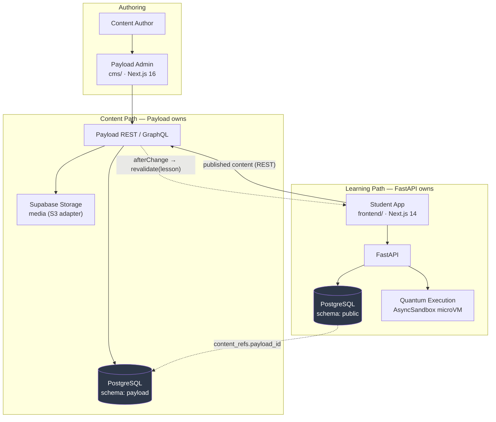
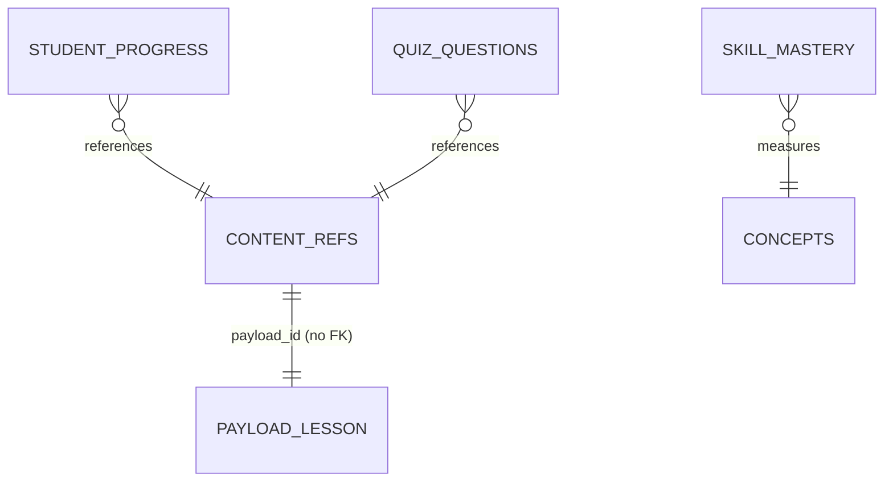
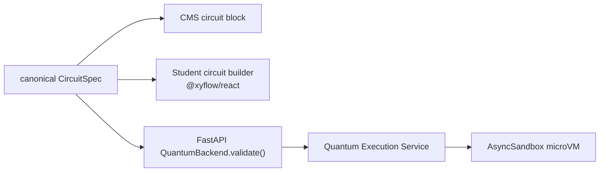

# Curriculum Store Architecture — Payload CMS

**Status:** Accepted · supersedes the hand-rolled FastAPI block-CMS design previously in this file
**Decision:** Payload CMS in a dedicated Next.js 16 application, backed by the existing Supabase PostgreSQL in an isolated `payload` schema
**Related:** `Q-Learn-quantum-curriculum.md` (curriculum content) · `q-learn-scaling-architecture.md` (scaling) · `../database.md` · `../../Architecture.md`

> **History.** An earlier revision of this document specified a block CMS built by hand inside FastAPI — bespoke `curriculums/levels/modules/lessons/lesson_blocks` tables, bespoke JSONB payloads, a bespoke authoring workflow. None of it was implemented, so reversing it costs nothing. The *content model* it described survives almost unchanged; what changed is that Payload now provides the storage, authoring UI, versioning, localisation and access control instead of us building and maintaining them. The filename retains its original spelling so existing cross-references (notably from `q-learn-scaling-architecture.md`) keep resolving.

---

## Executive Summary

Q-Learn's curriculum is stored and authored in **Payload CMS**, running as a standalone Next.js 16 application at `cms/`. Payload owns authored content; FastAPI owns learner state. The two meet at a single, explicit, backend-owned boundary table — `content_refs` — and nowhere else.

The content model is `Curriculum → Level → Module → Lesson → blocks[]`, where each lesson is an ordered sequence of blocks drawn from a **closed, typed registry** of ten block types. Blocks are stored as a single JSONB column (`blocksAsJSON`), which preserves the JSONB block model this document originally specified while letting Payload supply the editor.

Media lives in Supabase Storage through Payload's S3-compatible adapter. Published content is read directly by the student frontend over Payload's REST API; user-specific operations continue to flow through FastAPI. Publishing triggers per-lesson revalidation in the student app.



---

## Why Payload rather than a hand-rolled CMS

| Requirement | Hand-rolled | Payload |
|---|---|---|
| Block editor for authors | Build and maintain | Native `blocks` field |
| Draft / publish | `status` column + workflow code | `versions.drafts` |
| Content versioning | History table | Built in, `maxPerDoc` |
| Localisation | `locale` column everywhere | Field-level `localized` |
| Media management | Upload endpoints + `assets` table | Upload collections + storage adapters |
| Access control | Bespoke, on top of RLS-bypassing service role | Payload access functions |
| Typed content contract | Hand-written Pydantic + TS, kept in sync manually | Generated TypeScript types |

The trade is a third application to run. That is accepted; see *Consequences*.

---

## Repository layout

Q-Learn is **not** a pnpm workspace. `frontend/pnpm-workspace.yaml` contains only `allowBuilds` settings — it has no `packages:` key — and there is no root `package.json`, `turbo.json`, or root lockfile. `frontend/` is a standalone pnpm project.

The CMS is therefore added as a **second standalone project**, which is a zero-structural-change integration:

```
Q-Learn/
├── backend/     FastAPI                      (unchanged)
├── frontend/    Next.js 14 · React 18        (unchanged — never upgraded for the CMS)
├── cms/         Next.js 16 · React 19 · Payload   ← new, self-contained
└── docs/
```

Two independent `package.json` + lockfile pairs. **No root workspace and no Turborepo**: a workspace would hoist two incompatible Next majors into one virtual store, which is precisely the conflict to avoid, and buys nothing while no code is shared.

---

## Version matrix

Verified against the npm registry, not from memory. Pin exactly; never install `latest`.

| Package | Pin | Constraint |
|---|---|---|
| `payload` | `3.90.2` | `engines.node: ^18.20.2 \|\| >=20.9.0` |
| `@payloadcms/next` | `3.90.2` | peer `next` — see range below |
| `@payloadcms/db-postgres` | `3.90.2` | peer `payload: 3.90.2` |
| `@payloadcms/storage-s3` | `3.90.2` | |
| `next` (cms only) | latest published `16.3.x` (pin exactly once resolved) | `engines.node: >=20.9.0`, peer `react: ^19` |
| `react` / `react-dom` (cms only) | `^19` | |
| Node | `>=20.9.0` | |

> ⚠️ The `@payloadcms/next` peer range is **disjoint**:
> `>=15.2.9 <15.3.0 || >=15.3.9 <15.4.0 || >=15.4.11 <15.5.0 || >=16.3.3 <17.0.0`
> Next `15.5.x` and `16.0.0–16.3.2` are **not supported**. An unpinned upgrade can silently land outside the supported set.

`frontend/` stays on Next 14.2.0 / React 18 / TypeScript 5 and is unaffected by all of the above.

---

## Database

One database. Payload is confined to its own schema:

```ts
// cms/src/payload.config.ts
db: postgresAdapter({
  schemaName: 'payload',
  blocksAsJSON: true,
  pool: { connectionString: process.env.PAYLOAD_DATABASE_URL },
})
```

```
PostgreSQL (Supabase)
├── public                 ← FastAPI, Alembic-managed
│   ├── users, user_profiles
│   ├── courses, modules, lessons, concepts     (legacy curriculum — deprecated in time)
│   ├── student_progress, skill_mastery
│   ├── circuits, circuit_executions
│   ├── quiz_questions, quiz_attempts
│   ├── knowledge_* (pgvector)
│   └── content_refs                            ← the integration boundary
│
└── payload                ← Payload, Payload-migration-managed
    ├── curriculums, levels, modules, lessons
    ├── media, cms_users
    └── *_v (versions), payload_migrations, payload_preferences
```

**Migration ownership is absolute:** Alembic never touches `payload`; Payload migrations never touch `public`. Two tools, two schemas, no overlap.

No second database is created. `q-learn-scaling-architecture.md` ranks the Supabase PgBouncer connection ceiling as bottleneck #4, and one database keeps that budget in one place — though note Payload adds a **second connection pool** against it, which must be measured.

All credentials come from the environment. Never hardcode `DATABASE_URL`, `PAYLOAD_DATABASE_URL`, `PAYLOAD_SECRET`, `SUPABASE_SERVICE_KEY`, or the `S3_*` keys.

---

## Content ownership

This boundary is the point of the whole design. Nothing is owned twice.

**Payload owns** — curriculums, levels, modules, lessons, lesson blocks, quiz *definitions*, circuit *content*, simulation *configuration*, media, draft/published state.

**FastAPI owns** — users, learning progress, skill mastery, quiz *attempts*, circuit *execution*, AI tutoring, recommendations, analytics, agent sessions, quantum execution.

Payload owns what a lesson **is**. FastAPI owns what a learner **did**.

---

## `content_refs` — the integration boundary

Learner state is currently foreign-keyed directly to content rows:

```
student_progress.lesson_id  → FK lessons.id  ON DELETE CASCADE
quiz_questions.lesson_id    → FK lessons.id  ON DELETE SET NULL
```

Once lessons live in Payload those FKs cannot follow. Cross-schema foreign keys into `payload` would weld FastAPI's migrations to Payload's generated schema; dropping integrity entirely would scatter unvalidated opaque IDs through the backend. Neither is acceptable.

Instead, a backend-owned table in `public` provides a stable, Alembic-managed identity for each piece of referenced content:

```sql
CREATE TABLE content_refs (
  id          UUID PRIMARY KEY,           -- stable, backend-owned, never changes
  payload_id  TEXT NOT NULL,              -- the Payload document id
  kind        TEXT NOT NULL,              -- 'curriculum' | 'level' | 'module' | 'lesson'
  created_at  TIMESTAMPTZ NOT NULL DEFAULT now(),
  UNIQUE (kind, payload_id)
);
```

Learner-state tables keep real referential integrity, now pointing at the boundary:

```
student_progress.lesson_id  → FK content_refs.id
quiz_questions.lesson_id    → FK content_refs.id
```



`payload_id` is `TEXT` because Payload's adapter `idType` may be `serial` or `uuid`; `TEXT` was chosen so the Payload `idType` decision (Open item 2) does not block the boundary — it accommodates both.

`content_refs` is a **boundary, not a second content store**. It holds identity only — no titles, no bodies, no ordering. Payload remains the source of truth for everything authored.

**Legacy backfill.** Migration `d4e5f6a7b8c9` creates one `kind='lesson'` row per existing legacy lesson, reusing the lesson's UUID as `content_refs.id` so no learner-state row or API lesson id changes. Until the Payload import runs, `payload_id` holds the sentinel `legacy:<uuid>`; the import replaces it via `ContentRefService.bind_payload_id`, which never rebinds a ref that already holds a real Payload id.

`skill_mastery.concept_id → concepts.id` is unchanged; concepts stay in FastAPI for v1, because the BKT engine traverses them and they are not authored content.

Resolution logic lives in `backend/app/services/content_ref_service.py`, following the existing `Router → Service → Repository` pattern rather than introducing a new abstraction.

---

## Content model

```
Curriculum
  └── Level          (0–19, the 20-level path in Q-Learn-quantum-curriculum.md)
       └── Module    (submodules, e.g. 5.2 "State Vectors")
            └── Lesson
                 └── blocks[]
```

This is never collapsed to `Course → Lesson`.

### Collections

| Collection | Key fields |
|---|---|
| `curriculums` | title, slug, description, status |
| `levels` | curriculum (rel), levelNumber, title, slug, description, objectives[], estimatedHours, badge, order |
| `modules` | level (rel), title, slug, description, order |
| `lessons` | module (rel), title, slug, description, objectives[], estimatedTime, difficulty, order, **blocks[]** |
| `media` | upload collection → Supabase Storage |
| `cmsUsers` | Payload admin auth (isolated) |

Draft/publish comes from `versions: { drafts: true }` on every content collection — not a hand-maintained `status` column. Localisation, where needed, uses field-level `localized: true` rather than a `locale` column.

---

## Block registry

Lessons use a **closed, typed registry**. Adding a block type is a deliberate change to the CMS config *and* the frontend renderer, made together.

```
HEADING   TEXT   MARKDOWN   MATH   IMAGE
CODE      CALLOUT   CIRCUIT   QUIZ   SIMULATION
```

```ts
type LessonBlock =
  | HeadingBlock | TextBlock | MarkdownBlock | MathBlock | ImageBlock
  | CodeBlock | CalloutBlock | CircuitBlock | QuizBlock | SimulationBlock
```

Each block is a Payload `Block` with validated, typed fields.

**`{ type: string, data: any }` is explicitly not the content contract.** Arbitrary JSON blocks are a non-goal.

### Storage: `blocksAsJSON: true`

Payload's Postgres adapter defaults to generating **one table per block type**. With `blocksAsJSON: true` it instead stores a lesson's blocks as a single `jsonb` column.

We choose JSONB because it preserves the block model this document originally specified, keeps the shape legible to migration and validation scripts outside Payload, and matches the actual read pattern — *fetch every block for one lesson, in order*. Nested content remains queryable via `jsonb_path_exists`.

Accepted cost: no per-block foreign keys. Content integrity is enforced by Payload's field validation rather than by the database.

---

## Circuit block

**There is exactly one circuit representation in Q-Learn.** The canonical spec already exists and already agrees across the stack:

```ts
// frontend/src/types/index.ts  ·  backend/app/schemas/circuit.py
CircuitSpec { qubits: number; classical_bits: number; gates: GateSpec[] }
GateSpec    { type: string; targets: number[]; control?: number; params?: object; classical?: number[] }
```

The Circuit block stores **exactly this payload**, byte-identical to what `QuantumExecutionService` already accepts.



No CMS-specific circuit JSON is introduced. The existing builder is not rewritten; if a visual editor lands in the CMS it reuses the minimum extracted logic from `frontend/src/lib/circuit-spec.ts`, and only then is a shared package justified.

> **Known drift to reconcile:** the backend `GateSpec` carries `params`, the frontend one does not. Fix when the spec is shared.

---

## Quiz block

The quiz domain **already exists** in `public.quiz_questions` / `quiz_attempts`. To avoid a second assessment domain:

- **Payload authors** the definition — question text, type, options, correct answer, explanation, difficulty, metadata.
- `quiz_questions` becomes a **projection** synced from Payload, not a parallel authoring surface.
- **FastAPI owns** attempts, submission, evaluation, scoring, progress and mastery — unchanged.

---

## Simulation block

Stores **configuration only**. The CMS never executes Qiskit — a platform invariant, not a preference.

```
Student → frontend → FastAPI → QuantumExecutionService → AsyncSandbox
```

---

## Media

Supabase Storage via `@payloadcms/storage-s3` against Supabase's S3-compatible endpoint. `Development.md` already lists Storage as part of the Supabase footprint, so this reuses planned infrastructure rather than introducing a second object store.

```ts
s3Storage({
  collections: { media: true },
  bucket: process.env.S3_BUCKET,
  config: {
    endpoint: process.env.S3_ENDPOINT,
    region: process.env.S3_REGION,
    forcePathStyle: true,
    credentials: { accessKeyId: process.env.S3_ACCESS_KEY_ID, secretAccessKey: process.env.S3_SECRET_ACCESS_KEY },
  },
})
```

No Supabase Storage bucket exists today — this is greenfield, and `forcePathStyle` compatibility must be verified against the live endpoint before the media design is committed.

---

## Authentication

| Surface | Mechanism |
|---|---|
| Students | **Supabase Auth — unchanged.** Not replaced, not proxied |
| Payload admin | Isolated `cmsUsers` collection in the `payload` schema |

Q-Learn already has RBAC — `users.role ∈ student | instructor | admin`, enforced by `require_instructor` / `require_admin` in `backend/app/dependencies.py`. Payload roles map conceptually onto `instructor` (author) and `admin` (publish), but the two auth systems are **not wired together in v1**: doing so would couple the CMS to Supabase JWT verification for no phase-one benefit.

---

## Content delivery

```
published curriculum      frontend ──HTTP──► Payload REST
learner behaviour         frontend ────────► FastAPI ──► Supabase
```

| Operation | Served by |
|---|---|
| `GET` published lesson | Payload |
| `GET` progress | FastAPI |
| `POST` quiz attempt | FastAPI |
| `POST` circuit execution | FastAPI |
| `POST` AI tutor request | FastAPI |

CMS content is **not** proxied through FastAPI by default — that would add a hop and make FastAPI a hard dependency of every lesson view. Payload's Local API is in-process only, so cross-application access is over HTTP.

The existing `backend/app/services/learning_service.py` is **not deleted**. It keeps serving `/api/v1/courses` from the legacy tables until the frontend switch, and afterwards remains available as an integration/access layer — never as a second content source of truth.

### Cache invalidation

A Payload `afterChange` hook calls the student app's revalidation endpoint, keyed per lesson. This is the on-publish invalidation that `q-learn-scaling-architecture.md` Phase 2 asks to design in from day one rather than retrofit after authors have adopted broken timing.

---

## Frontend rendering

The student app maps block types to components through a registry — the same pattern the original design specified, now driven by Payload's response shape:

```ts
const BlockRegistry = {
  heading: HeadingBlock, text: TextBlock, markdown: MarkdownBlock,
  math: MathBlock, image: ImageBlock, code: CodeBlock,
  callout: CalloutBlock, circuit: CircuitBlock,
  quiz: QuizBlock, simulation: SimulationBlock,
} as const;
```

```tsx
{lesson.blocks.map((blk) => {
  const Component = BlockRegistry[blk.blockType];
  return Component ? <Component key={blk.id} {...blk} /> : null;  // unknown types degrade, never crash
})}
```

Today `frontend/src/components/learn/LessonContent.tsx` renders a lesson as one Markdown string, with a ` ```circuit ` fence parsed into `<CircuitPreview>`. That is a proto-block-system; the registry formalises it. `CircuitBlock` reuses the existing `CircuitPreview` component rather than reimplementing rendering.

**Security requirement:** `TextBlock`/`MarkdownBlock` render author-supplied Markdown/HTML. Any HTML passed to `dangerouslySetInnerHTML` **must** first be run through a strict allowlist sanitizer (e.g. DOMPurify), so a compromised curriculum-author account cannot publish stored XSS that executes in students' browsers. Sanitize on render (and ideally also on save).

---

## Migration

Live curriculum data is small — **1 course, 2 modules, 4 lessons**, all `lesson_type: "text"` with Markdown bodies. This is a script, not a project.

```
legacy tables → export JSON → import to Payload → validate → frontend reads Payload (flag) → monitor → deprecate → drop
```

1. Stand up the CMS.
2. Define collections and blocks.
3. Migrate existing course/module/lesson content. Migration `d4e5f6a7b8c9` already created one `content_refs` row per legacy lesson — reusing the lesson's UUID as `content_refs.id` with a `legacy:<uuid>` placeholder `payload_id`, backfilling `student_progress.lesson_id` and `quiz_questions.lesson_id`, and re-pointing both foreign-key constraints at `content_refs.id`. This step binds each of those rows to its new Payload id via `ContentRefService.bind_payload_id`.
4. Validate migrated content against the source.
5. Integrate the student frontend behind a flag.
6. Switch production reads.
7. Monitor.
8. Deprecate the legacy curriculum tables.
9. Remove them in a later migration.

**Non-destructive throughout.** `courses / modules / lessons` keep serving `/api/v1/courses` until step 6, which is the only rollback-sensitive moment and sits behind a flag. Steps 8–9 wait on evidence from step 7, not a calendar. Existing curriculum tables are never dropped as part of the initial integration.

---

## Security

- **Schema isolation** — Payload's role is scoped so it cannot write `public`; FastAPI's migrations never touch `payload`.
- **RLS** — enabled repo-wide with no policies; the backend bypasses via `service_role`, so authorization correctness lives in the FastAPI service layer. Payload enforces its own access control independently. This concern scales with blast radius and warrants a parallel security review.
- **Media** — private by default, served via signed URLs.
- **Code execution** — unchanged. Student code and Qiskit run only in `AsyncSandbox` microVMs. The CMS executes nothing.
- **Circuit validation** — authored circuits pass `QuantumBackend.validate()` before `compile()` and `execute()`, exactly as student-built circuits do. Content authored in the CMS is not trusted input to the quantum backend.
- **Secrets** — environment only, never committed.

---

## Consequences

**Accepted costs**

- A third application to run, deploy and patch, on a Next.js major the rest of the repo does not use.
- Content reads become a network call to a second service, which is what makes the revalidation story load-bearing rather than optional.
- A second connection pool against the Supabase pooler ceiling.
- Rich authoring affordances — the circuit editor above all — need custom Payload admin components. A supported path, but real work.

**Accepted in return**

- Authoring, draft/publish, versioning, media, access control and localisation are configured rather than built and maintained.
- The student application is permanently insulated from the CMS's framework choices, in both directions.
- No second database, no second circuit schema, no second quiz domain.

---

## Open items

1. **Infrastructure validation (Phase 0).** Four assumptions remain unverified against live infrastructure: `schemaName` isolation on Supabase, the S3 endpoint's `forcePathStyle` behaviour, `blocksAsJSON` round-tripping of nested `CircuitSpec`, and Payload/Drizzle against the PgBouncer transaction pooler. These gate implementation.
2. **Payload `idType`** — confirm `serial` vs `uuid` before fixing the `content_refs.payload_id` column type.
3. **RAG ingestion** — decide whether the tutor pipeline ingests curriculum content from Payload and by what path. `knowledge_embeddings`' ivfflat `lists=100` needs re-tuning as the corpus grows, and publishing from Payload is what will grow it.
4. **`GateSpec.params` drift** between frontend and backend.
