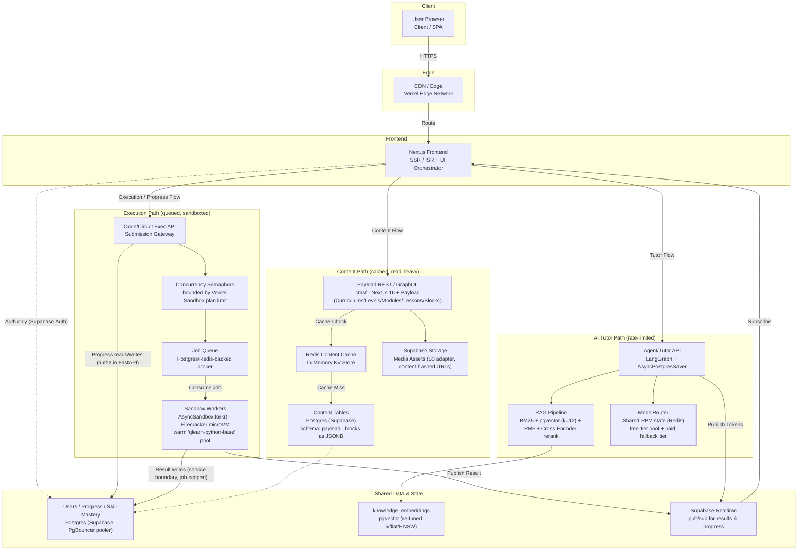

# Q-Learn Scaling Architecture: Block-Based CMS + Platform at 100,000-User Scale

This document evaluates the block-based CMS (`cirrculum-store-architecture.md`) together with the rest of the Q-Learn platform against a 100,000-registered-user target, and defines the target decoupled architecture. It complements `cirrculum-store-architecture.md` (content model) and `Q-Learn-quantum-curriculum.md` (curriculum content) as the canonical scaling reference.

> **Updated for the Payload CMS decision.** `cirrculum-store-architecture.md` now specifies **Payload CMS** in a standalone Next.js 16 application at `cms/`, backed by the existing Supabase Postgres in an isolated `payload` schema — not a block CMS hand-rolled inside FastAPI. The scaling analysis below is substantially unchanged, because the *shape* of the content path (cacheable, read-heavy, CDN-fronted, invalidated on publish) is the same either way. What changed is **who serves it**: Payload's REST API rather than a FastAPI Content API, which removes the "build a content service" work from the roadmap and replaces it with "operate a second application." Content-path items are annotated accordingly.

**Assumption used throughout:** 100k registered users → ~10-15k DAU (12%) → ~800-1,200 peak concurrent users (8% of DAU) → ~150-375 concurrent LLM tutor calls and ~50-150 concurrent circuit executions at peak. These are planning assumptions, not measurements, and should be replaced with real numbers once instrumentation exists (see Phase 1 below).

## Current State (verified in codebase)

- **CMS**: decided but not yet implemented. `cirrculum-store-architecture.md` specifies Payload CMS at `cms/`; no `cms/` directory, Payload dependency, or block renderer exists yet in the repo. Live schema remains `backend/alembic/versions/80be607aeeb4_seed_curriculum.py` (flat `courses/modules/lessons`), and the live content volume is tiny — 1 course, 2 modules, 4 lessons, all `lesson_type: "text"`. Four infrastructure assumptions behind the Payload decision (`schemaName` isolation, Supabase S3 storage, `blocksAsJSON` round-tripping, Drizzle against the PgBouncer pooler) are **unvalidated** pending a Phase 0 spike.
- **Workspace**: not a monorepo. `frontend/pnpm-workspace.yaml` carries only `allowBuilds` settings and has no `packages:` key; there is no root `package.json`, `turbo.json`, or root lockfile. `cms/` is therefore added as a second standalone pnpm project, which keeps Next 14 (frontend) and Next 16 (cms) dependency trees fully independent.
- **Database**: Supabase Postgres via PgBouncer transaction pooler in prod (`backend/app/database.py`), correctly configured (NullPool + disabled prepared statements). No read replica. RLS enabled with no policies — backend bypasses via `service_role` key, so all authorization correctness lives in the FastAPI service layer.
- **Caching**: none. No Redis anywhere; explicitly deferred by project docs ("added when profiling shows a bottleneck").
- **API**: FastAPI async throughout. `slowapi` + `rate_limit_per_minute` config exist but are **not wired in** — no rate limiting enforced today. No background job queue; LLM calls and Qiskit sandbox forks run inline inside request handlers.
- **Qiskit execution**: `AsyncSandbox.fork()` per circuit run, on **Vercel Sandbox's Hobby plan** — an unquantified but real concurrency ceiling, with no application-level semaphore/queue in front of it.
- **AI/LLM**: `ModelRouter` in `app/agents/llm.py` uses a free-tier-only pool (~225-265 RPM total across ~10 models) tracked via an **in-process** `threading.Lock` + `deque` — correct only for a single API replica.
- **Realtime**: Supabase Realtime pub/sub, already used for circuit-result delivery (a pattern that naturally extends to a future execution queue).
- **Deployment**: Railway (API, claimed stateless/horizontally-scalable — architecturally plausible but load-untested), Vercel (frontend + sandbox), Supabase (DB) — no plan-tier limits quantified anywhere.

## Industry Pattern Comparison (LeetCode / GeeksforGeeks-style decoupled architecture)

Research into how coding-education/judge platforms scale confirms the direction already emerging from Q-Learn's own codebase, rather than requiring a different one:

- **Decoupled content vs. execution paths.** LeetCode-style platforms run independent services — a Problem/Content service, a User service, and a separate Execution service — rather than one monolith. Q-Learn's Router→Service→Repository FastAPI structure already separates these logically; the missing piece is that **content reads and code-execution requests should be treated as fully independent scaling domains** (cached/CDN'd vs. queued/sandboxed), not routed through the same inline request-handling path. ([Design a Coding Platform Like LeetCode](https://www.hellointerview.com/learn/system-design/problem-breakdowns/leetcode), [System Design for a Competitive Coding Platform](https://myappstore.org.in/blog/anup-sharma/system-design-for-a-competitive-coding-platform-leetcode-hackerrank-codeforces-style/))
- **Async queue in front of execution, not inline.** The universal pattern: the API durably writes submission metadata, pushes a job onto a message broker (Kafka/SQS/RabbitMQ/Redis-backed queue), and immediately returns "accepted" rather than blocking the request. Autoscaling worker fleets consume the queue and drive sandbox lifecycle. This raises the queue's priority from "build once justified" to "design in now, activate as load requires." ([Scaling a LeetCode Code Execution Architecture](https://www.technetexperts.com/scalable-code-execution-architecture/), [Online Judge System Design](https://intervu.dev/blog/online-judge-leetcode-system-design/))
- **MicroVM isolation, warm pools.** Production judges increasingly use Firecracker microVMs (or gVisor) instead of plain Docker for hardware-level isolation, and keep warm worker pools per runtime to avoid cold-start latency. **Q-Learn's `AsyncSandbox.fork()` from a warm `qlearn-python-base` snapshot is already this exact pattern** (Vercel Sandbox is Firecracker-based) — a genuine architectural strength already in place, not a gap. The gap is only the missing queue/backpressure layer in front of it, and the unverified concurrency ceiling on the Hobby plan. ([System Design: LeetCode — Code Sandbox, Container Isolation](https://crackingwalnuts.com/post/leetcode-system-design))
- **Headless content API + Redis + CDN for content.** Decoupled/headless CMS architectures universally put a cache (Redis object cache) between the content API and the content DB, and a CDN/edge layer in front of the whole content path, so content reads never touch the database or app servers on the hot path. This confirms the CDN/ISR recommendation for the block-based CMS. **Note (revised by the Payload decision):** the generic headless-CMS pattern assumes you own the content API; Payload + Next.js edge ISR already absorbs this read traffic, so a Redis content cache is **not** part of the initial CMS design — it is a *measure-first* item (see Phase 2 and the Bottleneck table). ([Headless CMS Architecture Guide](https://www.gitnexa.com/blogs/headless-cms-architecture-guide), [What Is a Decoupled CMS](https://pantheon.io/learning-center/headless/decoupled-cms))

**Net effect:** this research upgrades the **execution job queue's design** from "react to data" to "build proactively" — the queue abstraction should exist from the start even if autoscaling is added later, because it is the one component every comparable production system treats as core, not optional, infrastructure. The **Redis content cache is deliberately *not* upgraded**: under Payload + Next.js edge ISR the same read traffic is absorbed at the edge, so it stays a *measure-first* item (instrument Payload read latency in Phase 1, add Redis only if the edge layer proves insufficient). This keeps the recommendation consistent with Phase 2 and the Bottleneck table below. The shared-state Redis for the `ModelRouter` RPM counter is a separate concern and remains a hard prerequisite.

## Target Architecture Diagram

The diagram below separates the **content path** (cacheable, CDN-fronted), the **execution path** (queued, sandboxed), and the **AI tutor path** (rate-limited router with paid fallback), matching how LeetCode/GeeksforGeeks-style platforms decouple these domains.

**Authorization boundary.** Because RLS is enabled with no policies and the backend reaches Postgres via the `service_role` key, the database enforces no per-user access — every authorization decision lives in the application. Two direct-to-`UsersDB` paths therefore carry explicit rules: (1) the browser's only direct link to `UsersDB` is **Supabase Auth**; all learner-progress reads and writes go through **FastAPI**, which checks the caller owns the row before touching it — the frontend never writes progress directly. (2) **Sandbox workers** write results through an authenticated service boundary and may only write rows for the `(user_id, job_id)` they were dispatched for, so a worker cannot write across users. These checks are the load-bearing control; the RLS-bypass hardening is tracked separately below.

### Legend

| Subsystem | Role | Status |
|---|---|---|
| CDN / Edge | Caches static assets and routes traffic to Next.js | Existing (Vercel) |
| Payload REST / GraphQL | Serves curriculum/lesson/block content; also the authoring admin | Decided (`cms/`), not yet implemented |
| Redis Content Cache | Absorbs read traffic before it reaches Postgres | Not implemented — **reassess**: Payload + CDN/ISR may absorb this, see Phase 2 |
| Content DB | Payload-generated tables in the `payload` schema; lesson blocks as a JSONB column | Not yet created; legacy flat schema still live |
| Supabase Storage | Media assets (images/video/diagrams) via Payload's S3 adapter | Design proposed, not implemented; no bucket exists yet |
| Exec API / Concurrency Semaphore | Accepts circuit/code submissions, bounds in-flight forks | Semaphore not implemented (Phase 0 item) |
| Job Queue | Decouples submission from execution | Not implemented — recommended proactively |
| Sandbox Workers | Runs student code in isolated Firecracker microVMs | Implemented (`AsyncSandbox.fork()`), lacks queue in front |
| Agent/Tutor API | Orchestrates LangGraph tutor sessions | Implemented |
| RAG Pipeline | Retrieves + reranks knowledge context | Implemented, unbenchmarked latency |
| ModelRouter | Routes LLM calls across free-tier pool + fallbacks | Implemented, RPM counter is single-replica only |
| Users/Progress DB | Core relational data | Implemented |
| Supabase Realtime | Delivers async results/progress to frontend | Implemented |

## Bottleneck Ranking ("will break first" under growth toward 100k users)

1. **Vercel Sandbox Hobby-plan concurrency cap** — external hard cap, zero backpressure today. Highest-confidence first failure.
2. **Free-tier LLM RPM exhaustion** at peak concurrent tutor sessions — the ~225-265 RPM budget is uncomfortably tight against the ~150-375 concurrent-session estimate even before double-counting.
3. **Multi-replica RPM-counter bug** — the in-process counter breaks correctness the moment Railway scales past 1 replica (the natural fix for load triggers this bug).
4. **Supabase PgBouncer connection ceiling** — depends on unknown plan tier; could bind sooner than expected.
5. **Unenforced rate limiting** — amplifies 1-3, easier to trigger than organic load would cause.
6. **Inline LLM/sandbox execution holding API workers** — a tail-latency bottleneck that builds gradually with concurrency.
7. **RAG two-pass + rerank latency** — a UX-quality issue (slow tutor turns), not an outage risk.
8. **Uncached curriculum/lesson reads** — real but cheaply preempted (CDN/ISR); Postgres handles simple indexed reads well regardless. Under Payload these reads leave the FastAPI process entirely, so they no longer compete with API workers — but they do cross a network hop to a second application, which makes publish-time invalidation load-bearing rather than optional.
10. **Payload's connection pool against the pooler ceiling** *(new, Payload-specific)* — Payload/Drizzle opens its own pool alongside FastAPI's, drawing on the same PgBouncer budget as bottleneck #4. Unquantified; folded into that item once measured.
9. **Single Postgres instance / no read replica** — lowest near-term risk once content caching removes most read pressure.

## Phased Roadmap

### Phase 0 — Fix now, no benchmarking needed
- Wire up `slowapi` using the existing (currently unused) `rate_limit_per_minute` config.
- Look up the actual Vercel Sandbox Hobby-plan concurrency limit (dashboard/docs check).
- Add an application-level semaphore/queue in front of `AsyncSandbox.fork()`, sized below that limit, so overload becomes graceful backpressure instead of opaque failures.
  - **Capacity reality check.** Vercel's Hobby plan allows on the order of ~10 concurrent sandboxes — one to two orders of magnitude below the ~50–150 peak concurrent executions this document assumes. The semaphore/queue makes overload *graceful* (jobs wait rather than fail) but does **not** create capacity. Reaching the peak-load target therefore **requires a Vercel plan upgrade** (Pro/Enterprise sandbox concurrency), or the peak assumption must be re-scoped. Until then, model the expected **queue wait** against the ~10s execution P95: at N concurrent slots and an offered load above N, wait time grows with (offered − N)/N × P95, which becomes user-visible well before the assumed peak. Quantify this in Phase 1 and treat the plan tier as a gating cost decision, not a Phase 3 optimization.
- Confirm the Supabase plan tier's pooler connection ceiling against current + planned Railway replica count.

### Phase 1 — Instrument before deciding anything else
- Add latency/error instrumentation: API P95 by route, RAG stage latencies (retrieval/rerank/generation separately), sandbox queue-wait + execution time, LLM RPM consumption by provider.
- Load-test the "stateless horizontal scaling" claim with synthetic concurrency matching the estimates above, specifically checking for RPM-counter divergence across replicas.
- Target SLOs to validate against: API P95 ≤300ms (non-LLM/exec routes), tutor turn P95 ≤4-6s (time-to-first-token ≤1-2s if streaming), circuit execution P95 ≤10s (well under the 30s hard timeout), uptime target 99.5%.

### Phase 2 — Build proactively (cheap now, expensive to retrofit)
- Move the `ModelRouter` RPM counter to shared state (Redis or equivalent) **before** running a second Railway replica — a hard prerequisite, not a reaction.
- Design on-demand ISR revalidation into the CMS build from day one — retrofitting invalidation after authors adopt broken timing is disruptive. Under Payload this is a `afterChange` hook calling the student app's revalidation endpoint, keyed per lesson, plus content-hash-based media URLs.
- Design the flat-schema → Payload migration as phased/incremental (stand the CMS up alongside the live tables, backfill, cut over behind a flag, deprecate the old path only after validation) — never a big-bang cutover on live data, per this project's "don't rewrite working code without reason" rule. The live content volume (4 lessons) makes this a script rather than a project; the *care* is in the cutover, not the transform.
- Decouple learner state from content rows **before** migrating content: `student_progress.lesson_id` and `quiz_questions.lesson_id` are currently hard FKs into `lessons`, which cannot follow content into the `payload` schema. The accepted design routes them through a backend-owned `content_refs` boundary table rather than cross-schema FKs or bare opaque IDs. This is a hard prerequisite, not a parallel task.
- **(Revised by the Payload decision)** A Redis content cache between the content API and content DB was previously called core architecture here, on the industry pattern that headless platforms put a cache in front of the content DB. Payload changes the calculus: the student app is Next.js and can cache published content at the edge via ISR with per-lesson invalidation, which absorbs the same read traffic without a Redis dependency the project has explicitly deferred. **Recommendation downgraded from "build proactively" to "measure first"** — instrument Payload read latency in Phase 1 and add Redis only if the edge layer proves insufficient. The shared-state Redis for the `ModelRouter` RPM counter (above) is unaffected and remains a hard prerequisite.
- **(Industry-pattern upgrade)** Route sandbox execution requests through an explicit queue abstraction from the start (even lightweight, backed by Postgres or Redis), so the call path is already "submit job → queue → worker consumes → Realtime delivers result." This doesn't require full autoscaling workers on day one, but retrofitting the abstraction later is far more disruptive.

### Phase 3 — React to profiling data (build only once justified)
- Redis-backed RAG result caching, only if Phase 1 shows RAG latency/repeat-query volume actually matters.
- Autoscaling the sandbox-execution worker pool (scaling worker replicas on queue depth, matching the LeetCode-style pattern) once Phase 1 confirms real concurrency demands it.
- A paid LLM tier as first fallback ahead of free-tier exhaustion — the *need* is already high-confidence, but *sizing* should wait for real Phase 1 numbers.
- Postgres read replica only if Phase 1 shows the primary saturated by reads that caching didn't absorb.

## Database/CMS-Specific Notes

- **Superseded by `blocksAsJSON`.** This note previously called for an index on `lesson_blocks(lesson_id, order_index)`. Payload stores a lesson's blocks as a single JSONB column on the lesson row rather than as a separate `lesson_blocks` table, so that index has nothing to index — the read pattern it targeted (fetch-all-blocks-per-lesson) is satisfied by fetching the lesson row itself. Add a JSONB GIN index on the blocks column only if a future query needs to filter *inside* block content; Payload queries nested block paths via `jsonb_path_exists`, which benefits from one.
- Payload owns its own schema and its own migration tool. Alembic must never touch the `payload` schema and Payload migrations must never touch `public`; the two schemas share a database but not a migration history. Scope Payload's database role so this is enforced rather than merely intended.
- Index `content_refs(kind, payload_id)` — unique, and the lookup path for every resolution from learner state to content.
- `knowledge_embeddings` ivfflat `lists=100` needs re-tuning as the corpus grows with curriculum content — instrument this table's query latency specifically so degradation isn't silent.
- RLS-bypass-via-service-role is a security-hardening concern that scales with blast radius (more users = worse impact of one authorization bug), independent of performance — flag as a parallel security review, not a performance blocker.

## Open Items to Verify

1. Confirm the Vercel Sandbox Hobby-plan concurrency number and current Supabase plan tier's connection limits directly from account dashboards — the two facts this whole assessment most depends on that aren't in any doc. **This directly gates the peak-load target:** if Hobby caps concurrency near ~10 sandboxes against the assumed ~50–150 peak executions, decide explicitly between a **plan upgrade** and a **re-scoped peak assumption**, and record the chosen queue-wait budget against the ~10s P95 (see Phase 0 semaphore note).
2. Once Phase 0/1 items land, re-run the bottleneck ranking against real instrumentation data rather than the estimated concurrency figures used here.
3. Share this roadmap with the team to confirm the phasing (especially Phase 2's "build proactively" calls) matches product priorities before committing engineering time.
4. **Validate the four Payload infrastructure assumptions** before the CMS build: `schemaName` isolation against Supabase, the S3 endpoint's `forcePathStyle` behaviour, `blocksAsJSON` round-tripping of nested `CircuitSpec`, and Payload/Drizzle against the PgBouncer transaction pooler (including whether prepared statements must be disabled, as `backend/app/database.py` already does). These gate the CMS build, and the last one feeds directly into bottleneck #4.
5. **Quantify Payload's connection footprint** against the Supabase plan tier alongside item 1 — two applications now draw on one pooler budget.
