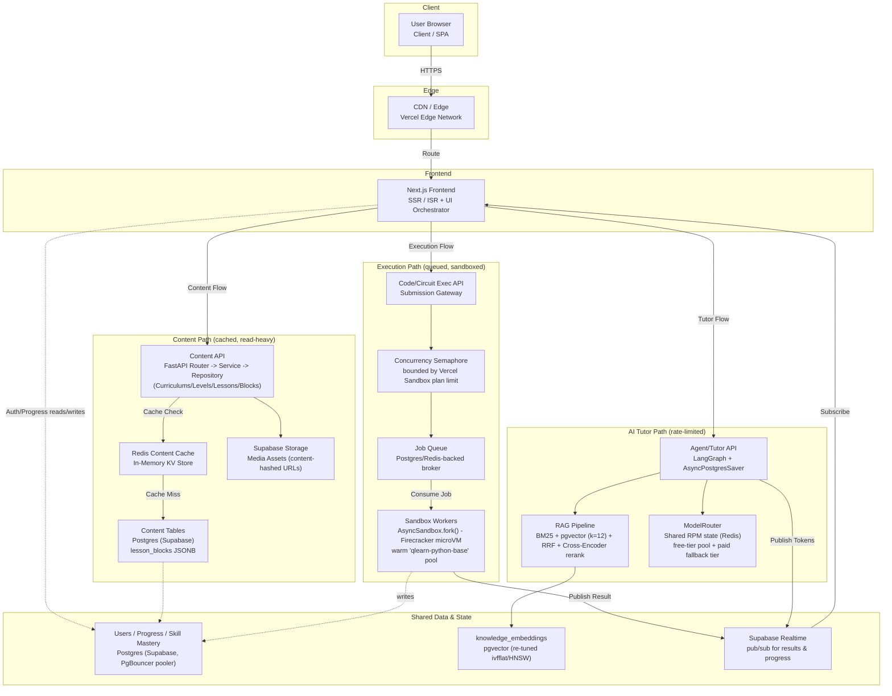

# Q-Learn Scaling Architecture: Block-Based CMS + Platform at 100,000-User Scale

This document evaluates the proposed block-based CMS (`cirrculum-store-architecture.md`) together with the rest of the Q-Learn platform against a 100,000-registered-user target, and defines the target decoupled architecture. It complements `cirrculum-store-architecture.md` (content model) and `Q-Learn-quantum-curriculum.md` (curriculum content) as the canonical scaling reference.

**Assumption used throughout:** 100k registered users → ~10-15k DAU (12%) → ~750-1,500 peak concurrent users (8% of DAU) → ~150-375 concurrent LLM tutor calls and ~50-150 concurrent circuit executions at peak. These are planning assumptions, not measurements, and should be replaced with real numbers once instrumentation exists (see Phase 1 below).

## Current State (verified in codebase)

- **CMS**: design-doc only (`cirrculum-store-architecture.md`); zero implementation (no `lesson_blocks`, `BlockRegistry`, etc. found anywhere in `backend/` or `frontend/`). Live schema: `backend/alembic/versions/80be607aeeb4_seed_curriculum.py` (flat `courses/modules/lessons`).
- **Database**: Supabase Postgres via PgBouncer transaction pooler in prod (`backend/app/database.py`), correctly configured (NullPool + disabled prepared statements). No read replica. RLS enabled with no policies — backend bypasses via `service_role` key, so all authorization correctness lives in the FastAPI service layer.
- **Caching**: none. No Redis anywhere; explicitly deferred by project docs ("added when profiling shows a bottleneck").
- **API**: FastAPI async throughout. `slowapi` + `rate_limit_per_minute` config exist but are **not wired in** — no rate limiting enforced today. No background job queue; LLM calls and Qiskit sandbox forks run inline inside request handlers.
- **Qiskit execution**: `AsyncSandbox.fork()` per circuit run, on **Vercel Sandbox's Hobby plan** — an unquantified but real concurrency ceiling, with no application-level semaphore/queue in front of it.
- **AI/LLM**: `ModelRouter` in `app/agents/llm.py` uses a free-tier-only pool (~225-265 RPM total across ~10 models) tracked via an **in-process** `threading.Lock` + `deque` — correct only for a single API replica.
- **Realtime**: Supabase Realtime pub/sub, already used for circuit-result delivery (a pattern that naturally extends to a future execution queue).
- **Deployment**: Railway (API, claimed stateless/horizontally-scalable — architecturally plausible but load-untested), Vercel (frontend + sandbox), Supabase (DB) — no plan-tier limits quantified anywhere.

## Industry Pattern Comparison (LeetCode / GeeksforGeeks-style decoupled architecture)

Research into how coding-education/judge platforms scale confirms the direction already emerging from Q-Learn's own codebase, rather than requiring a different one:

- **Decoupled content vs. execution paths.** LeetCode-style platforms run independent services — a Problem/Content service, a User service, and a separate Execution service — rather than one monolith. Q-Learn's Router→Service→Repository FastAPI structure already separates these logically; the missing piece is that **content reads and code-execution requests should be treated as fully independent scaling domains** (cached/CDN'd vs. queued/sandboxed), not routed through the same inline request-handling path. ([Design a Coding Platform Like LeetCode](https://www.hellointerview.com/learn/system-design/problem-breakdowns/leetcode), [System Design for a Competitive Coding Platform](https://myappstore.org.in/blog/anup-sharma/system-design-for-a-competitive-coding-platform-leetcode-hackerrank-codeforces-style/))
- **Async queue in front of execution, not inline.** The universal pattern: the API durably writes submission metadata, pushes a job onto a message broker (Kafka/SQS/RabbitMQ/Redis-backed queue), and immediately returns "accepted" rather than blocking the request. Autoscaling worker fleets consume the queue and drive sandbox lifecycle. This raises the queue's priority from "build once justified" to "design in now, activate as load requires." ([Scaling a LeetCode Code Execution Architecture](https://www.technetexperts.com/scalable-code-execution-architecture/), [Online Judge System Design](https://intervu.dev/blog/online-judge-leetcode-system-design/))
- **MicroVM isolation, warm pools.** Production judges increasingly use Firecracker microVMs (or gVisor) instead of plain Docker for hardware-level isolation, and keep warm worker pools per runtime to avoid cold-start latency. **Q-Learn's `AsyncSandbox.fork()` from a warm `qlearn-python-base` snapshot is already this exact pattern** (Vercel Sandbox is Firecracker-based) — a genuine architectural strength already in place, not a gap. The gap is only the missing queue/backpressure layer in front of it, and the unverified concurrency ceiling on the Hobby plan. ([System Design: LeetCode — Code Sandbox, Container Isolation](https://crackingwalnuts.com/post/leetcode-system-design))
- **Headless content API + Redis + CDN for content.** Decoupled/headless CMS architectures universally put a cache (Redis object cache) between the content API and the content DB, and a CDN/edge layer in front of the whole content path, so content reads never touch the database or app servers on the hot path. This confirms the CDN/ISR recommendation for the block-based CMS, and suggests that once the CMS is implemented, **a Redis content cache in front of the Content DB should be considered part of the CMS's initial design**, not a reactive add-on. ([Headless CMS Architecture Guide](https://www.gitnexa.com/blogs/headless-cms-architecture-guide), [What Is a Decoupled CMS](https://pantheon.io/learning-center/headless/decoupled-cms))

**Net effect:** this research upgrades two items from "react to data" to "build proactively": (a) the execution job queue's design (queue abstraction should exist from the start even if autoscaling is added later), and (b) a Redis content cache as a first-class part of the CMS build — because these two are precisely the components every comparable production system treats as core, not optional, infrastructure.

## Target Architecture Diagram

The diagram below separates the **content path** (cacheable, CDN-fronted), the **execution path** (queued, sandboxed), and the **AI tutor path** (rate-limited router with paid fallback), matching how LeetCode/GeeksforGeeks-style platforms decouple these domains.

### Legend

| Subsystem | Role | Status |
|---|---|---|
| CDN / Edge | Caches static assets and routes traffic to Next.js | Existing (Vercel) |
| Content API | Serves curriculum/lesson/block content | CMS not yet implemented |
| Redis Content Cache | Absorbs read traffic before it reaches Postgres | Not implemented — recommended as part of CMS build |
| Content DB | Stores `lesson_blocks` JSONB and related tables | Not yet migrated from flat schema |
| Supabase Storage | Media assets (images/video/diagrams) | Design proposed, not implemented |
| Exec API / Concurrency Semaphore | Accepts circuit/code submissions, bounds in-flight forks | Semaphore not implemented (Phase 0 item) |
| Job Queue | Decouples submission from execution | Not implemented — recommended proactively |
| Sandbox Workers | Runs student code in isolated Firecracker microVMs | Implemented (`AsyncSandbox.fork()`), lacks queue in front |
| Agent/Tutor API | Orchestrates LangGraph tutor sessions | Implemented |
| RAG Pipeline | Retrieves + reranks knowledge context | Implemented, unbenchmarked latency |
| ModelRouter | Routes LLM calls across free-tier pool + fallbacks | Implemented, RPM counter is single-replica only |
| Users/Progress DB | Core relational data | Implemented |
| Supabase Realtime | Delivers async results/progress to frontend | Implemented |

## Bottleneck Ranking ("will break first" under growth toward 100k users)

1. **Vercel Sandbox Hobby-plan concurrency cap** — external hard cap, zero backpressure today. Highest-confidence first failure.
2. **Free-tier LLM RPM exhaustion** at peak concurrent tutor sessions — the ~225-265 RPM budget is uncomfortably tight against the ~150-375 concurrent-session estimate even before double-counting.
3. **Multi-replica RPM-counter bug** — the in-process counter breaks correctness the moment Railway scales past 1 replica (the natural fix for load triggers this bug).
4. **Supabase PgBouncer connection ceiling** — depends on unknown plan tier; could bind sooner than expected.
5. **Unenforced rate limiting** — amplifies 1-3, easier to trigger than organic load would cause.
6. **Inline LLM/sandbox execution holding API workers** — a tail-latency bottleneck that builds gradually with concurrency.
7. **RAG two-pass + rerank latency** — a UX-quality issue (slow tutor turns), not an outage risk.
8. **Uncached curriculum/lesson reads** — real but cheaply preempted (CDN/ISR); Postgres handles simple indexed reads well regardless.
9. **Single Postgres instance / no read replica** — lowest near-term risk once content caching removes most read pressure.

## Phased Roadmap

### Phase 0 — Fix now, no benchmarking needed
- Wire up `slowapi` using the existing (currently unused) `rate_limit_per_minute` config.
- Look up the actual Vercel Sandbox Hobby-plan concurrency limit (dashboard/docs check).
- Add an application-level semaphore/queue in front of `AsyncSandbox.fork()`, sized below that limit, so overload becomes graceful backpressure instead of opaque failures.
- Confirm the Supabase plan tier's pooler connection ceiling against current + planned Railway replica count.

### Phase 1 — Instrument before deciding anything else
- Add latency/error instrumentation: API P95 by route, RAG stage latencies (retrieval/rerank/generation separately), sandbox queue-wait + execution time, LLM RPM consumption by provider.
- Load-test the "stateless horizontal scaling" claim with synthetic concurrency matching the estimates above, specifically checking for RPM-counter divergence across replicas.
- Target SLOs to validate against: API P95 ≤300ms (non-LLM/exec routes), tutor turn P95 ≤4-6s (time-to-first-token ≤1-2s if streaming), circuit execution P95 ≤10s (well under the 30s hard timeout), uptime target 99.5%.

### Phase 2 — Build proactively (cheap now, expensive to retrofit)
- Move the `ModelRouter` RPM counter to shared state (Redis or equivalent) **before** running a second Railway replica — a hard prerequisite, not a reaction.
- Design the CMS's on-demand ISR revalidation (`revalidateTag` per `lesson_id` on author publish) and content-hash-based media URLs into the block-CMS build from day one — retrofitting invalidation after authors adopt broken timing is disruptive.
- Design the flat-schema → block-model migration as phased/incremental (add new tables alongside old, backfill, cut over course-by-course behind a flag, deprecate old path only after validation) — never a big-bang cutover on live data, per this project's "don't rewrite working code without reason" rule.
- **(Industry-pattern upgrade)** Introduce a Redis content cache between the CMS's Content API and Content DB as part of the initial CMS build — every comparable decoupled/headless content platform treats this as core architecture, not a reactive add-on.
- **(Industry-pattern upgrade)** Route sandbox execution requests through an explicit queue abstraction from the start (even lightweight, backed by Postgres or Redis), so the call path is already "submit job → queue → worker consumes → Realtime delivers result." This doesn't require full autoscaling workers on day one, but retrofitting the abstraction later is far more disruptive.

### Phase 3 — React to profiling data (build only once justified)
- Redis-backed RAG result caching, only if Phase 1 shows RAG latency/repeat-query volume actually matters.
- Autoscaling the sandbox-execution worker pool (scaling worker replicas on queue depth, matching the LeetCode-style pattern) once Phase 1 confirms real concurrency demands it.
- A paid LLM tier as first fallback ahead of free-tier exhaustion — the *need* is already high-confidence, but *sizing* should wait for real Phase 1 numbers.
- Postgres read replica only if Phase 1 shows the primary saturated by reads that caching didn't absorb.

## Database/CMS-Specific Notes

- Index `lesson_blocks(lesson_id, order_index)` for the actual read pattern (fetch-all-blocks-per-lesson); add a JSONB GIN index only if a future query needs to filter *inside* block content.
- `knowledge_embeddings` ivfflat `lists=100` needs re-tuning as the corpus grows with curriculum content — instrument this table's query latency specifically so degradation isn't silent.
- RLS-bypass-via-service-role is a security-hardening concern that scales with blast radius (more users = worse impact of one authorization bug), independent of performance — flag as a parallel security review, not a performance blocker.

## Open Items to Verify

1. Confirm the Vercel Sandbox Hobby-plan concurrency number and current Supabase plan tier's connection limits directly from account dashboards — the two facts this whole assessment most depends on that aren't in any doc.
2. Once Phase 0/1 items land, re-run the bottleneck ranking against real instrumentation data rather than the estimated concurrency figures used here.
3. Share this roadmap with the team to confirm the phasing (especially Phase 2's "build proactively" calls) matches product priorities before committing engineering time.
