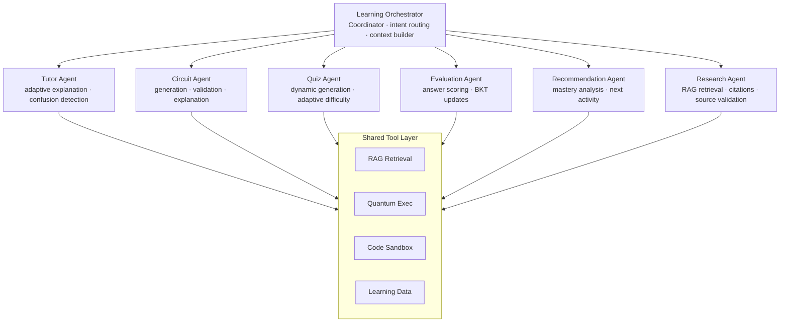
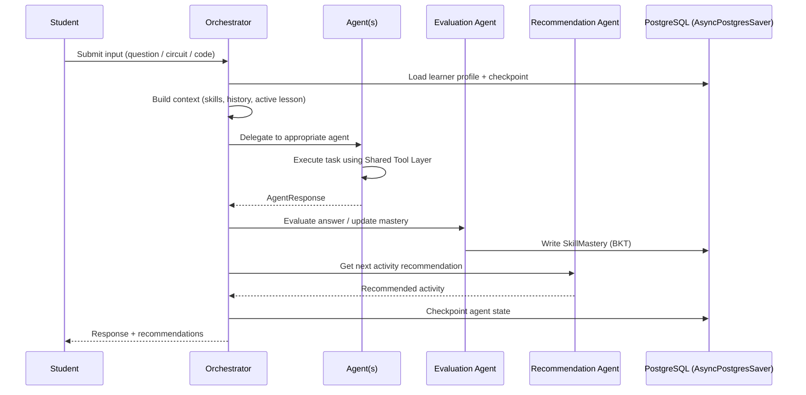

# AI Agent Architecture

> Implementation detail: [`backend/design.md § AI Agent Backend`](../backend/design.md)

---

## Agent Topology



---

## Agent Responsibilities

| Agent | Key Responsibility |
|-------|--------------------|
| **Orchestrator** | Central coordinator, intent understanding, agent selection |
| **Tutor** | Adaptive concept explanation, confusion detection |
| **Circuit** | Circuit generation, validation, explanation, error detection |
| **Quiz** | Dynamic question generation, adaptive difficulty |
| **Evaluation** | Answer/circuit/code evaluation, misconception detection, BKT updates |
| **Recommendation** | Mastery analysis, weak concept identification, next activity |
| **Research** | Reliable information retrieval, citations, source validation |

Teaching progression (Tutor Agent): **Concept → Intuition → Mathematics → Circuit → Code → Simulation → Practice**

---

## Communication Flow



---

## State Persistence

Agent session state is checkpointed using **`AsyncPostgresSaver`** (LangGraph). Checkpoints are stored in Supabase PostgreSQL, not in-memory.

- State survives API restarts
- Works correctly across multiple API replicas (stateless FastAPI)
- Session history is queryable from `agent_sessions` / `agent_messages` tables

```python
from langgraph.checkpoint.postgres.aio import AsyncPostgresSaver
checkpointer = AsyncPostgresSaver.from_conn_string(settings.database_url)
app = workflow.compile(checkpointer=checkpointer)
```
