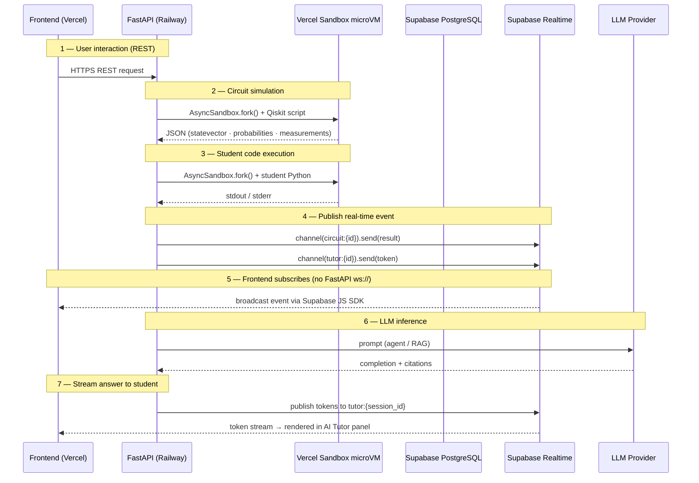

# Data Flow

Seven key flows through the Q-Learn platform.

## Flow Descriptions

| # | Flow | Transport |
|---|------|-----------|
| 1 | Frontend → API Gateway | HTTPS REST |
| 2 | Backend → Vercel Sandbox (circuit simulation) | Vercel Sandbox SDK — `AsyncSandbox.fork()` |
| 3 | Backend → Vercel Sandbox (student code) | Vercel Sandbox SDK — `AsyncSandbox.fork()` |
| 4 | Backend → Supabase Realtime (publish) | Supabase Python client — channel broadcast |
| 5 | Supabase Realtime → Frontend (subscribe) | Supabase JS SDK WebSocket |
| 6 | Backend → LLM Provider | HTTPS via ChatLiteLLM — primary model first, fallbacks on failure |
| 7 | LLM tokens → Frontend | LLM → API → Supabase Realtime → Frontend |
