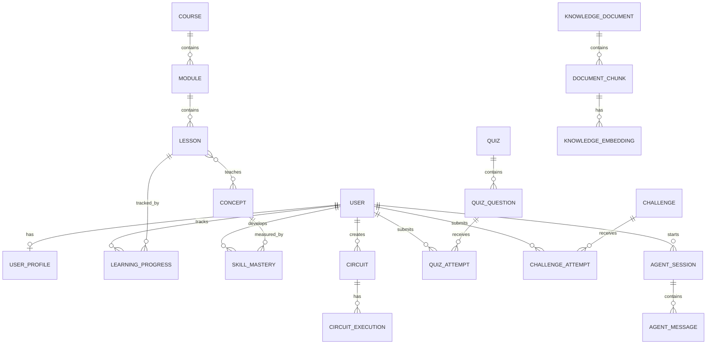
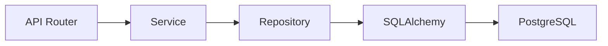

# Database Architecture

**Primary database:** PostgreSQL 16 + pgvector  
**ORM:** SQLAlchemy 2.x (async) · **Migrations:** Alembic · **Driver:** asyncpg

---

## Entity Relationships

---

## Key Tables

| Table | Purpose | Key Fields |
|-------|---------|------------|
| `users` | Authentication | uuid, email (UK), password_hash, role, timestamps |
| `user_profiles` | Extended user info | display_name, skill_level, preferences |
| `courses` | Course container | title, description, status |
| `modules` | Course modules | course_id FK, title, position |
| `lessons` | Individual lessons | module_id FK, title, content, position |
| `concepts` | Quantum concepts | name, description, difficulty |
| `student_progress` | Lesson completion | user_id FK, lesson_id FK, status, completion |
| `skill_mastery` | BKT student model | user_id FK, concept_id FK, mastery_score, confidence |
| `circuits` | Saved circuits | user_id FK, name, circuit_definition JSON, backend |
| `circuit_executions` | Execution results | circuit_id FK, status, probabilities, measurements, statevector, time |
| `quiz_questions` | Quiz questions | quiz_id FK, question_text, type, answer_data |
| `quiz_attempts` | Quiz attempts | user_id FK, question_id FK, answer, is_correct, score |
| `coding_challenges` | Code challenges | title, description, difficulty, expected_result |
| `challenge_attempts` | Challenge attempts | user_id FK, code, result, score |
| `agent_sessions` | Agent conversations | user_id FK, session_type, context JSON |
| `agent_messages` | Agent messages | session_id FK, agent_name, role, content, tool_calls |
| `knowledge_documents` | Source documents | title, source_url, source_type, version |
| `document_chunks` | Chunked content | document_id FK, content, metadata, chunk_index |
| `knowledge_embeddings` | Vector embeddings | chunk_id FK, embedding vector(384), model |

`knowledge_embeddings.embedding` uses `pgvector.sqlalchemy.Vector(384)` with an IVFFlat index.

---

## Migration Strategy

- **Never use `Base.metadata.create_all()`** in production
- All schema changes go through Alembic revisions
- Flow: Model change → `alembic revision --autogenerate` → review → `alembic upgrade head`

---

## Dependency Direction

Business logic belongs in the Service layer — not in routers or ORM models.
