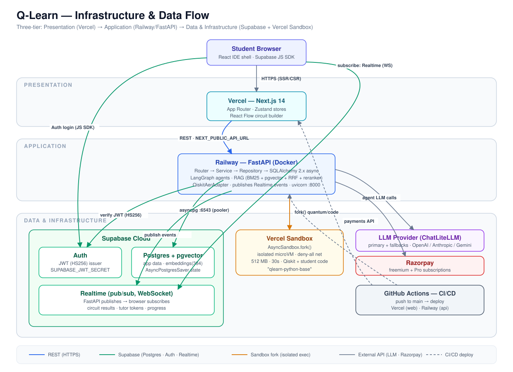

# Infrastructure & Deployment



---

## Production Stack

| Service | Platform | Purpose |
|---------|----------|---------|
| **Supabase** | Supabase Cloud | Auth, PostgreSQL + pgvector, Storage, Realtime pub/sub |
| **FastAPI** | Railway (Free → paid) | API gateway, AI agents, RAG; publishes to Supabase Realtime |
| **Frontend** | Vercel | Deploy & host Next.js application |
| **Vercel Sandbox** | Vercel (Hobby plan) | Isolated microVM for student code **and** quantum circuit simulation |
| **CI/CD** | GitHub Actions | Automated test + deploy pipeline |

### Live endpoints

| Service | URL |
|---------|-----|
| **API (Railway, production)** | `https://q-learn-api-production.up.railway.app` |
| **API health check** | `https://q-learn-api-production.up.railway.app/health` |
| **API docs (Swagger)** | `https://q-learn-api-production.up.railway.app/docs` |

Frontend must point at this via `NEXT_PUBLIC_API_URL` in Vercel.

#### Troubleshooting: `DNS_PROBE_POSSIBLE` / "This site can't be reached"

Some ISP/router DNS resolvers fail to resolve `*.up.railway.app`, so the URL won't load in the browser **even though the API is healthy**. This is a local DNS issue, not a deployment problem. Verify the server is actually up (bypassing local DNS):

```bash
# Local resolver fails, but a public resolver works:
nslookup q-learn-api-production.up.railway.app 1.1.1.1     # → 69.46.46.x

# Server responds fine when you skip the broken resolver:
curl --resolve q-learn-api-production.up.railway.app:443:69.46.46.101 \
  https://q-learn-api-production.up.railway.app/health       # → {"status":"ok",...}
```

**Fix (quickest):** enable Secure DNS in your browser — Brave/Chrome → `Settings → Privacy & security → Use secure DNS → With: Cloudflare (1.1.1.1)`, then reload.

**Fix (system-wide, Windows, elevated PowerShell):**
```powershell
Set-DnsClientServerAddress -InterfaceAlias "Wi-Fi" -ServerAddresses 1.1.1.1,8.8.8.8
Clear-DnsClientCache
```

---

## Development Stack (Docker Compose)

```yaml
services:
  postgres:    # PostgreSQL 16 + pgvector
  api:         # FastAPI backend (uvicorn --reload)
  web:         # Next.js frontend (next dev)
```

All services on localhost — Frontend: `http://localhost:3000` · API: `http://localhost:8000` · Docs: `http://localhost:8000/docs`

---

## Infrastructure Components

| Component | Purpose |
|-----------|---------|
| **Supabase** | Auth, PostgreSQL + pgvector, Storage, Realtime (production) |
| **Vercel Sandbox** | Isolated execution microVM — managed, no self-hosted Docker needed |
| **Docker Compose** | Development environment, one-command setup |
| **Nginx** | Reverse proxy, TLS termination (production) |
| **PgBouncer** | PostgreSQL connection pooling (production) |
| **Prometheus + Grafana** | Monitoring and observability |
| **GitHub Actions** | CI/CD pipeline |

---

## Environment Variables

All configuration via environment variables. See `backend/.env.example` for the full reference.

| Variable | Purpose |
|----------|---------|
| `SUPABASE_URL` | Supabase project URL |
| `SUPABASE_SERVICE_KEY` | Supabase service role key (backend only) |
| `SUPABASE_ANON_KEY` | Supabase anon key (frontend) |
| `SUPABASE_JWT_SECRET` | Project JWT secret — backend verifies Supabase Auth access tokens (HS256) |
| `SECRET_KEY` | App secret (misc. signing) |
| `DATABASE_URL` | PostgreSQL connection string (`postgresql+asyncpg://...`) — see the two-URL model below |
| `LLM_PRIMARY_MODEL` | LiteLLM model string — default `gpt-4o-mini` |
| `LLM_FALLBACK_MODELS` | JSON list of fallback model strings — e.g. `["anthropic/claude-haiku-4-5-20251001","gemini/gemini-1.5-flash"]` |
| `LLM_TEMPERATURE` | Default `0.7` |
| `LLM_MAX_TOKENS` | Default `2048` |
| `OPENAI_API_KEY` / `ANTHROPIC_API_KEY` / `GEMINI_API_KEY` | Set only for providers you use |
| `VERCEL_TOKEN` / `VERCEL_TEAM_ID` | Vercel Sandbox SDK credentials |
| `SANDBOX_BASE_NAME` | Base snapshot name (`qlearn-python-base`) |
| `SANDBOX_TIMEOUT` | microVM timeout in ms (default: `30000`) |
| `CORS_ORIGINS` | Allowed frontend origins (Vercel URL) |

> `REDIS_URL` is **not** required in Phase 0–1. Added when profiling shows a specific caching bottleneck.

**Never hardcode environment-specific configuration.**

### `DATABASE_URL` — two-URL model

Supabase exposes two connection endpoints. Use the right one for the job:

| Use | Endpoint | Port | Example host |
|-----|----------|------|--------------|
| **App runtime** (Railway) | Transaction pooler (IPv4) | `6543` | `aws-0-<region>.pooler.supabase.com`, user `postgres.<ref>` |
| **Migrations** | Direct connection | `5432` | `db.<ref>.supabase.co`, user `postgres` |

- Prefix must be `postgresql+asyncpg://` (this backend uses the asyncpg driver).
- `database.py` auto-detects port `6543` and disables asyncpg prepared statements + server-side pooling (required for pgbouncer transaction mode).
- Direct (`5432`) is IPv6-only unless the IPv4 add-on is enabled — if unreachable, run migrations through the **session-mode** pooler (port `5432` on the pooler host).
- Production URLs are kept in `backend/.env.production` (gitignored) and set as Railway env vars. Local dev keeps `DATABASE_URL` on Docker Postgres.

### Row Level Security

RLS is **enabled on all `public` tables** (no policies). The backend connects with the `service_role` key, which bypasses RLS; this blocks direct PostgREST access via the public anon key. Add policies if any table must be reachable by the anon/authenticated roles directly.

---

## Production Deployment

- **Supabase** manages Auth, PostgreSQL + pgvector, Storage, and Realtime (WebSocket pub/sub)
- **Vercel** hosts the Next.js frontend
- **Docker container** runs the FastAPI backend on Railway (Free → paid as load requires)
- **Vercel Sandbox** handles all isolated execution — student code and quantum circuit simulation
- **Real-time events** flow via Supabase Realtime channels — no FastAPI WebSocket endpoints
- **Horizontal scaling**: FastAPI is stateless (JWT auth, `AsyncPostgresSaver` for agent state) — add Railway replicas freely
- **Monitoring**: Prometheus + Grafana stack
- **CI/CD**: GitHub Actions automated pipeline

> **Architecture is portable.** FastAPI runs in a Docker container and can move to Railway, Fly.io, or any VPS without redesigning Q-Learn.
