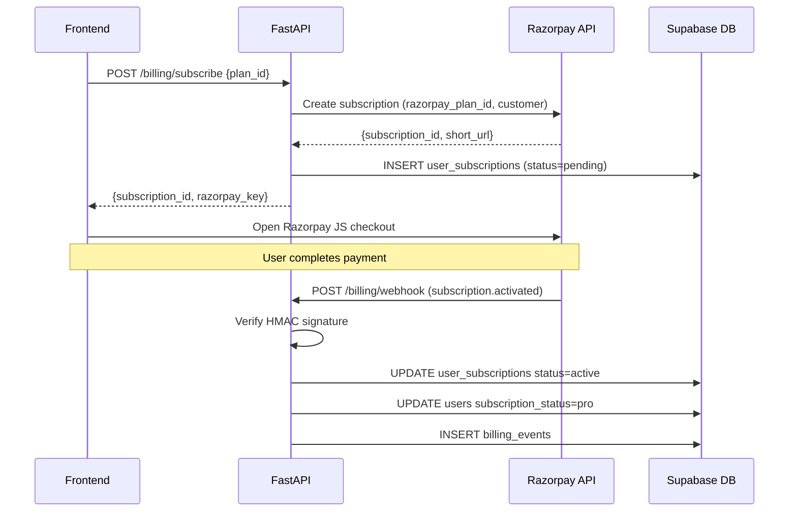

# Q-Learn Payment System — Design Spec

**Date:** 2026-09-15
**Status:** Approved for implementation
**Author:** Brainstormed with Claude Code

---

## Context

Q-Learn is shifting from a college/hackathon project to a startup. The platform needs a monetization layer to sustain LLM API costs (AI Tutor) and Vercel Sandbox costs (circuit execution). The goal is a freemium + subscription model using Razorpay (Indian market, UPI + cards + netbanking).

---

## Monetization Model

**Approach: Feature Gate (free content, paid interactivity)**

The paywall aligns with actual cost drivers:

| Feature | Free | Pro |
|---------|------|-----|
| Full curriculum (all 12 levels) | ✅ | ✅ |
| All lessons, reading content | ✅ | ✅ |
| AI Tutor interactions | ❌ | ✅ |
| Qiskit circuit execution | ❌ | ✅ |
| Adaptive quiz generation | ❌ | ✅ |
| Progress tracking, BKT | ✅ | ✅ |

Rationale: LLM calls and Vercel Sandbox microVM forks are the cost drivers. Locking only those behind Pro keeps Q-Learn generous with knowledge while monetizing the doing — the "learn → build → simulate" loop is where the product's value lives.

---

## Data Model

Three new tables added to Supabase PostgreSQL (via Alembic migration):

### `subscription_plans`
```sql
id              UUID PRIMARY KEY
name            VARCHAR(50)   -- 'free', 'pro_monthly', 'pro_annual'
price_inr       INTEGER       -- price in paise (₹499 = 49900)
razorpay_plan_id VARCHAR(100) -- Razorpay plan ID (null for free)
billing_cycle   VARCHAR(20)   -- 'monthly', 'annual', null
features        JSONB         -- feature flags
is_active       BOOLEAN
created_at      TIMESTAMPTZ
```

### `user_subscriptions`
```sql
id                      UUID PRIMARY KEY
user_id                 UUID REFERENCES users(id)
plan_id                 UUID REFERENCES subscription_plans(id)
razorpay_subscription_id VARCHAR(100)
status                  VARCHAR(20)  -- 'pending', 'active', 'cancelled', 'halted', 'expired'
current_period_start    TIMESTAMPTZ
current_period_end      TIMESTAMPTZ
created_at              TIMESTAMPTZ
updated_at              TIMESTAMPTZ
```

### `billing_events`
```sql
id                UUID PRIMARY KEY
user_id           UUID REFERENCES users(id)
event_type        VARCHAR(50)   -- 'activated', 'charged', 'cancelled', 'halted'
razorpay_event_id VARCHAR(100)  -- idempotency key
payload           JSONB
created_at        TIMESTAMPTZ
```

### `users` table change
One new column added via migration:
```sql
subscription_status  VARCHAR(20) DEFAULT 'free'  -- 'free' | 'pro'
```

This is a **denormalized cache** — single field read for every entitlement check. Source of truth is `user_subscriptions`. Webhooks keep this in sync.

**RBAC is unchanged.** `student / instructor / admin` roles are orthogonal to subscription status.

---

## API Layer

New router: `backend/app/routers/billing.py` → `/api/v1/billing/`

### Endpoints

```
GET  /api/v1/billing/plans           → list active plans (public, no auth)
POST /api/v1/billing/subscribe       → create Razorpay subscription, return checkout data
GET  /api/v1/billing/subscription    → current user's subscription + status
POST /api/v1/billing/webhook         → Razorpay webhook (HMAC verified, no JWT auth)
```

### Checkout Flow



### Webhook Events

| Event | Action |
|-------|--------|
| `subscription.activated` | Set `user_subscriptions.status = active`, `users.subscription_status = pro` |
| `subscription.charged` | Extend `current_period_end`, log billing event |
| `subscription.cancelled` | Schedule downgrade at period end — do NOT cut off immediately |
| `subscription.halted` | Mark halted (payment failed), trigger notification |

Webhook handler verifies Razorpay HMAC signature before processing. Uses `razorpay_event_id` as idempotency key to prevent double-processing.

### Entitlement Dependency

```python
# backend/app/dependencies.py
async def require_pro(current_user = Depends(get_current_user)):
    if current_user.subscription_status != "pro":
        raise PlanRequiredError("This feature requires a Pro subscription")
    return current_user
```

Applied to (in their respective routers):
- `POST /api/v1/simulations/*` — circuit execution
- `POST /api/v1/agents/*` — AI Tutor interactions
- `POST /api/v1/quizzes/generate` — adaptive quiz generation

Not applied to:
- `/api/v1/lessons/*`, `/api/v1/courses/*`, `/api/v1/learning/*` — always free

### New Service

`backend/app/services/billing_service.py`
- `create_subscription(user_id, plan_id) → CheckoutData`
- `handle_webhook(payload, signature) → None`
- `get_subscription(user_id) → SubscriptionDetail`
- `cancel_subscription(user_id) → None`

---

## Frontend

### New Pages / Components

**`/pricing`** — public, no auth required
- Two cards: Free vs Pro (monthly and annual toggle)
- Pro CTA → triggers Razorpay checkout if logged in, redirects to `/register` otherwise
- Highlight the "AI Tutor + Circuit Execution" value props

**Upgrade modal** — triggered inline when free user hits a Pro feature
- API returns `403 PlanRequiredError`
- Modal overlay: feature name, one-line benefit, "Upgrade — ₹X/month" CTA
- Keeps user in context (no page navigation)

**`/settings/billing`** — authenticated only
- Current plan, next billing date
- "Cancel subscription" → calls `DELETE /billing/subscription`, user keeps Pro until period end
- Invoice history from `billing_events`

### State

New Zustand store: `billingStore`
```typescript
{
  subscriptionStatus: 'free' | 'pro'
  currentPlan: Plan | null
  isUpgradeModalOpen: boolean
  triggerFeature: string | null   // which feature triggered the modal
}
```

Persisted to localStorage — UI reflects subscription status without extra API call on every page load. Refreshed on login and after successful checkout.

**Razorpay JS SDK** — loaded lazily only on pages that trigger checkout (pricing page, upgrade modal). Not in the global layout bundle.

---

## New Files

```
backend/app/
├── routers/billing.py
├── services/billing_service.py
├── schemas/billing.py             # CheckoutData, SubscriptionDetail, PlanResponse
└── models/billing.py              # SubscriptionPlan, UserSubscription, BillingEvent

frontend/src/
├── app/pricing/page.tsx
├── app/settings/billing/page.tsx
├── components/billing/
│   ├── PricingCard.tsx
│   ├── UpgradeModal.tsx
│   └── BillingSettings.tsx
└── stores/billingStore.ts

alembic/versions/
└── XXXX_add_billing_tables.py     # migration: 3 new tables + subscription_status column
```

---

## Environment Variables (additions to `.env.example`)

```
RAZORPAY_KEY_ID=rzp_test_...
RAZORPAY_KEY_SECRET=...
RAZORPAY_WEBHOOK_SECRET=...
```

---

## Engineering Rules

1. Webhook handler must verify HMAC signature before any DB write — no exceptions
2. Never cut off Pro access immediately on cancellation — downgrade at `current_period_end`
3. `users.subscription_status` is a cache — always treat `user_subscriptions` as source of truth
4. Use `razorpay_event_id` as idempotency key — webhook may fire more than once
5. Never expose `RAZORPAY_KEY_SECRET` to the frontend — only `RAZORPAY_KEY_ID` goes to the client
6. All billing routes return the standard `StandardResponse[T]` wrapper
7. `require_pro` is a FastAPI `Depends` — not middleware, not a decorator

---

## Verification

1. `GET /api/v1/billing/plans` → returns free + pro_monthly + pro_annual
2. `POST /api/v1/billing/subscribe` with valid plan → returns `subscription_id` and `razorpay_key`
3. Simulate Razorpay `subscription.activated` webhook → `users.subscription_status` flips to `pro`
4. `POST /api/v1/simulations/` as free user → 403 `PlanRequiredError`
5. Same request as pro user → reaches `QiskitAerAdapter`
6. Cancel subscription → status = `cancelled`, user retains Pro until `current_period_end`
7. Upgrade modal renders when free user clicks "Execute Circuit"
