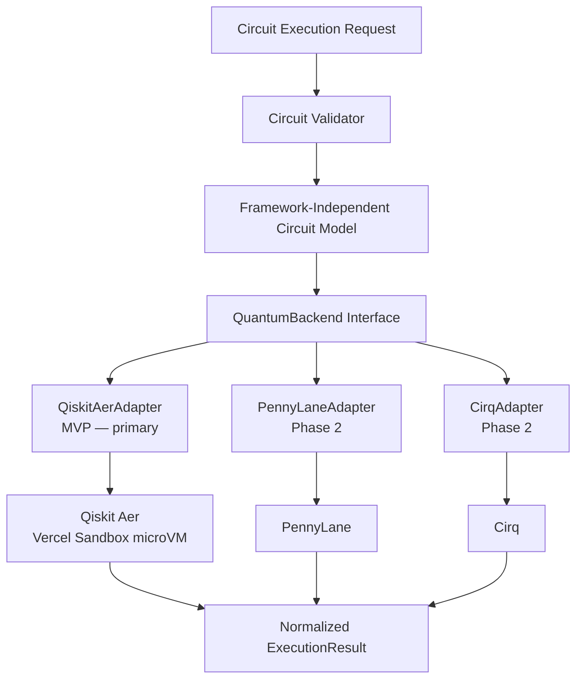
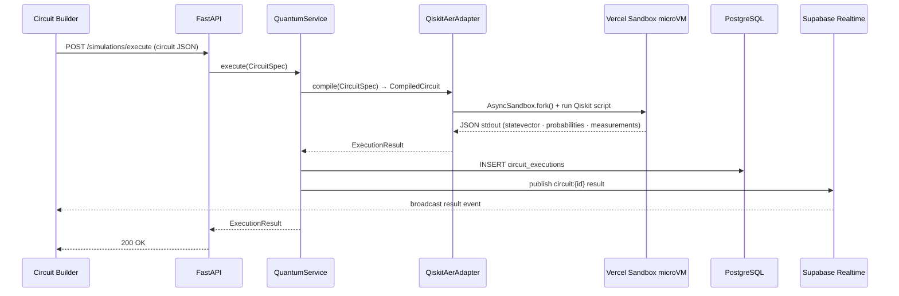

# Quantum Execution Layer

> Implementation detail: [`backend/design.md § Quantum Execution Backend`](../backend/design.md)

---

## Architecture



---

## Backend Contract

```python
validate(circuit)         # → ValidationResult
compile(circuit)          # → CompiledCircuit
execute(circuit, shots)   # → ExecutionResult
get_statevector(circuit)  # → list[complex]
get_probabilities(result) # → dict[str, float]
get_measurements(result)  # → list[str]
```

---

## Execution Sequence

`QiskitAerAdapter.execute()` is **not** run in-process. It serialises the circuit to a self-contained Python script, forks a Vercel Sandbox microVM, runs Qiskit Aer there, and deserialises the JSON result. FastAPI stays I/O-bound. Each fork is an independent Vercel-managed microVM — 10 concurrent circuits = 10 concurrent forks with zero API-process CPU load.



---

## Key Rules

- AI never directly executes arbitrary shell commands
- Quantum execution happens only through controlled backend services
- AI-generated quantum code must be validated before execution
- The quantum simulator is the source of truth for execution results
- LLM never replaces deterministic computation — use the quantum engine for calculations
