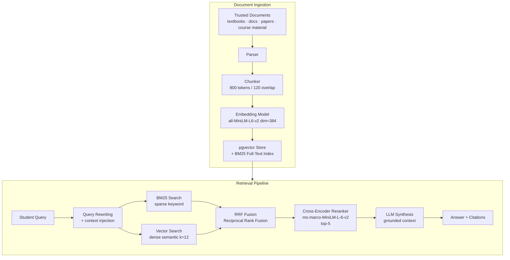

# RAG Pipeline

> Implementation detail: [`backend/design.md § RAG Pipeline Backend`](../backend/design.md)

---

## Architecture

---

## Pipeline Configuration

| Parameter | Value |
|-----------|-------|
| Chunk size | 800 tokens |
| Chunk overlap | 120 tokens |
| Similarity top_k | 12 (configurable 8–16) |
| Rerank top_n | 5 (configurable 3–5) |
| Reranker | Cross-Encoder `ms-marco-MiniLM-L-6-v2` |
| Hybrid fusion | RRF (Reciprocal Rank Fusion) |
| Embedding model | `sentence-transformers/all-MiniLM-L6-v2` dim=384 |
| Vector store | pgvector (PostgreSQL) |

---

## Metadata Per Chunk

- `title`, `source_url`, `source_type`, `author`
- `publication_date` (where applicable)
- `document_version`, `chunk_index`

---

## Source Attribution

- Every answer cites external sources
- LLM explicitly distinguishes explanation from retrieved fact
- Hallucination guardrails: if no relevant chunks found, state so explicitly

---

## Knowledge Base Contents

- Official Qiskit documentation
- Official PennyLane documentation
- Official Cirq documentation
- Academic papers
- Instructor-created course material
- Quantum computing textbooks (where licensing permits)

**Do not scrape copyrighted material irresponsibly.**
