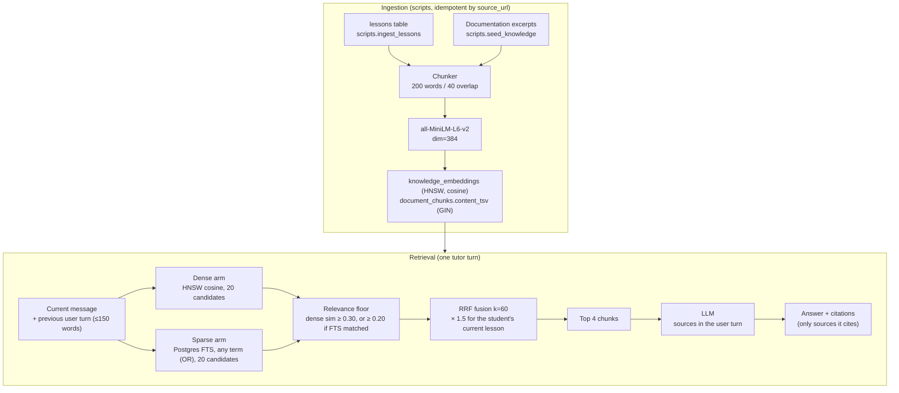

# RAG Pipeline

What the AI Tutor's retrieval actually does today. Code: `backend/app/rag/`
(ingestion, embeddings, retrieval), `backend/app/services/tutor_service.py`
(query building, citations), `backend/app/agents/tutor.py` + `prompts.py`
(prompt layout). The original target design is in
[`backend/design.md § RAG Pipeline Backend`](../backend/design.md#rag-pipeline-backend);
where the two differ, this page is what is built.

---

## Architecture


```mermaid
flowchart TD
    subgraph INGEST["Ingestion (scripts, idempotent by source_url)"]
        LESSONS["lessons table\nscripts.ingest_lessons"]
        DOCS["Documentation excerpts\nscripts.seed_knowledge"]
        CHUNK["Chunker\n200 words / 40 overlap"]
        EMBED["all-MiniLM-L6-v2\ndim=384"]
        STORE["knowledge_embeddings (HNSW, cosine)\ndocument_chunks.content_tsv (GIN)"]
        LESSONS --> CHUNK
        DOCS --> CHUNK
        CHUNK --> EMBED --> STORE
    end

    subgraph RETRIEVE["Retrieval (one tutor turn)"]
        Q["Current message\n+ previous user turn (≤150 words)"]
        VEC["Dense arm\nHNSW cosine, 20 candidates"]
        FTS["Sparse arm\nPostgres FTS, any term (OR), 20 candidates"]
        FLOOR["Relevance floor\ndense sim ≥ 0.30, or ≥ 0.20 if FTS matched"]
        RRF["RRF fusion k=60\n× 1.5 for the student's current lesson"]
        TOP["Top 4 chunks"]
        LLM["LLM\nsources in the user turn"]
        ANS["Answer + citations\n(only sources it cites)"]
        Q --> VEC
        Q --> FTS
        VEC --> FLOOR
        FTS --> FLOOR
        FLOOR --> RRF --> TOP --> LLM --> ANS
    end

    STORE --> RETRIEVE
```

---

## Pipeline Configuration

All values are `Settings` fields in `backend/app/config.py` (env-overridable,
e.g. `RAG_MIN_SCORE_FTS`) unless marked as a constant.

| Parameter | Value | Where |
|-----------|-------|-------|
| Embedding model | `sentence-transformers/all-MiniLM-L6-v2`, dim=384, cosine | `rag/embeddings.py` |
| Chunk size / overlap | 200 / 40 whitespace words (`rag_chunk_words`, `rag_chunk_overlap`) | MiniLM truncates at 256 wordpieces (~200 words); wider chunks were never fully embedded |
| Vector index | pgvector HNSW, `m=16`, `ef_construction=64`, `vector_cosine_ops`; `SET LOCAL hnsw.ef_search = 40` per query | migration `e5f6a7b8c9d0` |
| Full-text index | `document_chunks.content_tsv` generated `to_tsvector('english', content)`, GIN | same migration |
| Candidates per arm | 20 (`rag_candidate_k`) | |
| Sparse query | `plainto_tsquery` terms re-joined with OR, ranked by `ts_rank_cd` | AND would almost never match a multi-sentence query |
| Relevance floor | dense cosine ≥ **0.30** (`rag_min_score`), or ≥ **0.20** (`rag_min_score_fts`) when the FTS arm also matched | calibrated below |
| Fusion | Reciprocal Rank Fusion, k=60 (`RRF_K`) | constant |
| Lesson boost | × 1.5 on chunks whose document's `content_ref_id` is the request's `lesson_id` (`LESSON_BOOST`) | constant |
| Returned chunks | 4 (`rag_top_k`) | |
| Reranker | none yet (see Deferred) | |

The embedding model is loaded at startup in a background task
(`rag_warmup_embeddings`, in a worker thread; boot doesn't wait for it), and its
weights are baked into the Docker image, which then sets `HF_HUB_OFFLINE=1`. Query embedding
runs in a worker thread (`aembed_text`).

---

## Retrieval, step by step

1. **Query text.** The current message, preceded by the previous **user** turn
   of the session, capped at 150 words with the current message kept last
   (`tutor_service._retrieval_text`). A follow-up like "why?" then retrieves
   the topic it refers to. No extra LLM call.
2. **Dense arm.** The top 20 chunks by cosine distance.
3. **Sparse arm.** Up to 20 chunks matching any stemmed query term. The user's
   text is only ever a bound parameter.
4. **Floor.** A candidate is kept only if its dense similarity is ≥ 0.30, or
   ≥ 0.20 when the sparse arm matched it as well. Any-term FTS matches nearly
   every on-topic chunk, and a single shared stem is weak evidence:
   "transformer" stems to "transform" and matches "Quantum Fourier Transform".
   That is why a full-text match lowers the floor but does not skip it.
5. **Fuse.** The surviving dense and sparse rankings are fused with RRF. Chunks
   from the student's current lesson are boosted × 1.5.
6. **Hydrate** the top 4. `RetrievedChunk.score` is the dense cosine
   similarity. If nothing survives the floor, retrieval returns `[]`.

When `lesson_id` resolves to a `lessons` row, its title becomes the prompt's
`concept`. That lookup runs in a savepoint, so a DB error there cannot abort
the retrieval that follows.

---

## Prompt layout and citations

- **System message:** role, level, concept, citation rules and LaTeX rules
  only. No retrieved text.
- **History:** earlier turns. `[n]` markers are stripped from earlier
  answers, because those numbers referred to other sources.
- **Latest user turn:** `<sources>` with numbered chunks (`[1] Title: text`),
  then the optional `<student_circuit>` block, then the question. Both blocks
  are marked as data, not instructions. Any `</sources>` or `</student_circuit>`
  inside chunk or circuit text is escaped (`&lt;/sources&gt;`), so data cannot
  close its block early.
- **No sources:** when retrieval returns nothing, a `<no_sources>` note replaces
  the block. The tutor opens with "This isn't covered in the course material
  yet", answers from general knowledge, and cites nothing.
- **Citations:** after streaming, only the sources the answer actually cites
  (`[n]` markers, in first-cited order) are persisted and published as
  `citations: [{title, url, score}]`. An answer without markers gets `[]`. The
  payload shape is unchanged for web and mobile.

Each turn logs `rag_retrieved` (`n`, `top_score`, `lesson_boost`, `ms`).

---

## Knowledge Base Contents and Ingestion

| Source | Script | Identity (`source_url`) | `source_type` |
|--------|--------|-------------------------|---------------|
| `lessons` table (legacy lessons with a body) | `python -m scripts.ingest_lessons` | `qlearn://lesson/<lesson id>`, plus `content_ref_id = lesson id` | `course` |
| Qiskit documentation excerpts (Quantum Circuit Basics, Measurement) | `python -m scripts.seed_knowledge` | the IBM docs URL | `documentation` |

Both scripts are idempotent. `ingest_document` deletes any document with the
same `source_url`, and its chunks and embeddings cascade, then inserts the new
one in the same transaction. A failed run leaves the old copy in place. The
seed also deletes the three lesson duplicates that earlier versions of the seed
inserted (`https://qlearn.dev/lessons/{superposition,hadamard,entanglement}`);
once they are gone that step is a no-op. `qlearn://` is a stable identity,
not a web URL: clients route by lesson id.

Run both scripts after lesson content changes:

```bash
cd backend
python -m scripts.ingest_lessons   # "Ingested 4 lessons as 4 chunks."
python -m scripts.seed_knowledge   # "Seeded 2 knowledge documents; removed N legacy lesson duplicates."
```

Expected state with today's content: 6 documents (4 lessons + 2 docs), 6
chunks, 6 embeddings, 4 documents with `content_ref_id`, and every chunk at
most 200 words. Re-running both scripts leaves these counts unchanged.

Only trusted material goes in. **Do not scrape copyrighted material
irresponsibly.**

---

## Evaluation

`python -m scripts.rag_eval` runs a golden set through the same `retrieve`
the tutor uses, against `DATABASE_URL`. It is read-only. The set has 18
questions:

- 7 direct questions
- 5 paraphrases
- 2 two-turn follow-ups, with the query built by the tutor's own
  `_retrieval_text`
- 3 out-of-scope questions, which must return 0 chunks
- 1 non-gating "near-domain" question

The script prints hit@1, hit@4, out-of-scope rejects, and each question's top
dense similarity. It exits 1 on any in-scope miss at k or any out-of-scope
leak.

Results on the local corpus above (2026-10-10, floors 0.30 / 0.20):

| Metric | Result |
|--------|--------|
| hit@1 | 14/14 |
| hit@4 | 14/14 |
| Out-of-scope rejected | 3/3 |
| Near-domain ("What is Shor's algorithm?") rejected | 0/1 (not gating) |
| Lowest top dense score, in-scope | 0.243 |
| Highest top dense score, out-of-scope | 0.150 |

**Calibration.** On this set, every expected chunk is also a full-text match,
so `rag_min_score_fts` decides the outcome:

| `rag_min_score_fts` | hit@1 | hit@4 | Out-of-scope rejected |
|---|---|---|---|
| 0.05–0.10 | 13/14 | 14/14 | 3/3 |
| 0.15–0.24 | 14/14 | 14/14 | 3/3 |
| 0.25 | 13/14 | 13/14 | 3/3 |
| 0.28 | 11/14 | 12/14 | 3/3 |

0.20 sits in the middle of the best plateau. It is below the weakest in-scope
hit (0.243, a "histogram" paraphrase of Measurement) and above every
out-of-scope question's best chunk (≤ 0.15). Before this floor existed,
"transformer neural network" leaked through a full-text match at dense
similarity 0.04.

The dense-only floor `rag_min_score` does not change any result between 0.20
and 0.45. It stays at 0.30 to keep out dense-only noise: chunks with no shared
term reach 0.27 on in-scope questions.

**Known limit.** Lessons are stored as Markdown with LaTeX. That markup lowers
dense scores: direct questions reach 0.38–0.49 on lessons and 0.53–0.74 on the
plain-text excerpts. Near-domain questions such as Shor's algorithm score like
the hardest paraphrases (0.27 vs 0.24–0.26), so no floor separates them. The
backstops are the prompt rule ("say the course doesn't cover it") and
cited-only citations.

---

## Deferred

- **Cross-encoder reranker** (`ms-marco-MiniLM-L-6-v2`). Revisit when the
  corpus passes ~200 chunks. It costs about 90 MB of RAM and ~50 ms per query.
- **LLM query rewriting.** Today the query is just the previous user turn plus
  the current message.
- **Ingesting Payload CMS lessons on publish** (CMS hook → internal ingest
  endpoint), once lessons move fully to Payload.
- **Stripping Markdown/LaTeX before embedding**, which may lift lesson dense
  scores. Re-run `rag_eval` and re-calibrate the floors if this changes.
