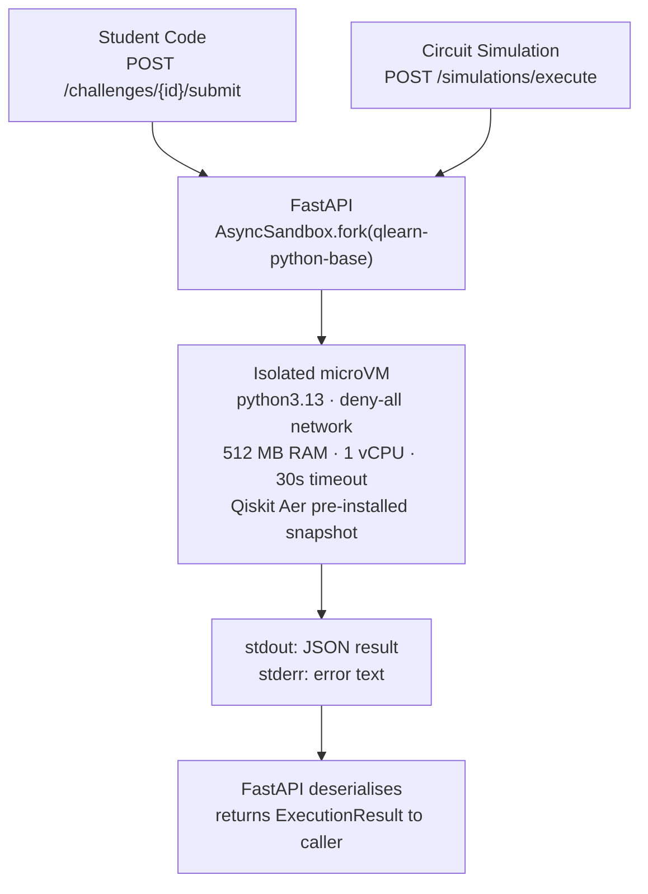

# Code Execution Sandbox

Both **student code** and **quantum circuit simulation** execute inside Vercel Sandbox microVMs. FastAPI never runs Qiskit or student Python in-process.

> Implementation detail: [`backend/design.md § Code Execution Sandbox`](../backend/design.md)

---

## Architecture

---

## Key Rules

- **Never execute student code or Qiskit inside the main API process**
- **Vercel Sandbox microVM** — fully managed, no self-hosted Docker needed
- **Network policy: deny-all** — no internet access from within the microVM
- **Persistent base snapshot** (`qlearn-python-base`) with Qiskit Aer pre-installed; fork per execution avoids cold-start overhead
- **JSON over stdout** — results serialised to stdout; FastAPI parses them
- **Hobby plan quota** — hard cap, no billing risk

---

## Flow: Circuit Simulation

1. `QuantumExecutionService` receives `CircuitSpec`
2. `QiskitAerAdapter` compiles circuit to QASM, renders a self-contained Python script
3. FastAPI calls `AsyncSandbox.fork()` — microVM starts from `qlearn-python-base` snapshot
4. Script runs `AerSimulator`, prints JSON `{statevector, probabilities, measurements, execution_time}` to stdout
5. FastAPI reads stdout, parses into `ExecutionResult`
6. Result stored in `circuit_executions` table; FastAPI publishes to Supabase Realtime channel

## Flow: Student Code

1. Student submits Python code via API
2. API validates code structure (syntax check, no dangerous imports)
3. FastAPI calls `AsyncSandbox.fork()` — same microVM, same snapshot
4. Code executes; stdout/stderr captured
5. Result returned to student
