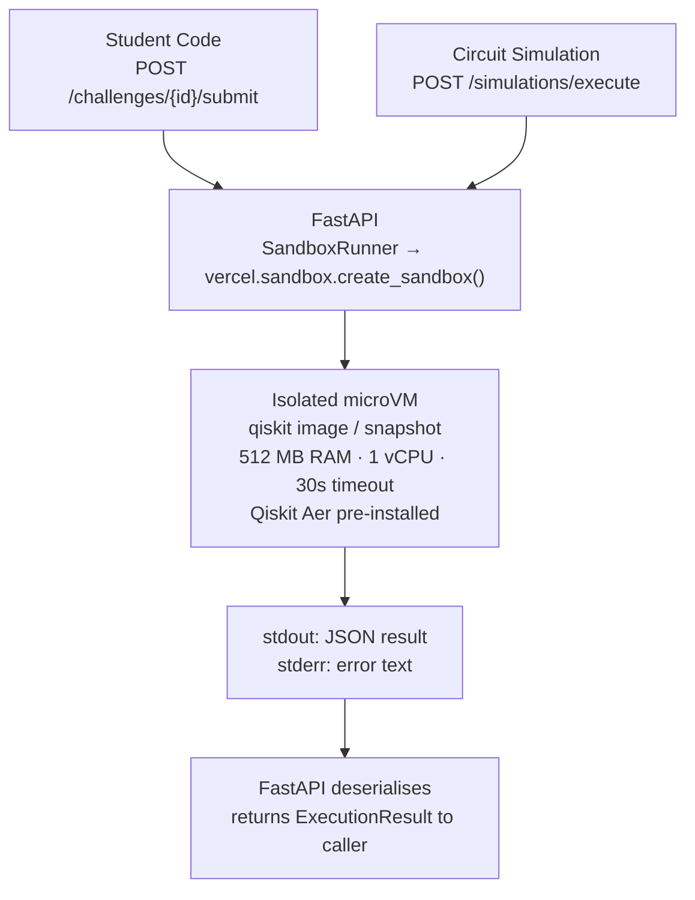

# Code Execution Sandbox

Both **student code** and **quantum circuit simulation** execute inside Vercel Sandbox microVMs. FastAPI never runs Qiskit or student Python in-process.

> Implementation detail: [`backend/design.md § Code Execution Sandbox`](../backend/design.md)

---

## Architecture

```mermaid
flowchart TD
    SC["Student Code\nPOST /challenges/{id}/submit"]
    CS["Circuit Simulation\nPOST /simulations/execute"]
    FORK["FastAPI\nSandboxRunner → vercel.sandbox.create_sandbox()"]
    VM["Isolated microVM\nqiskit image / snapshot\n512 MB RAM · 1 vCPU · 30s timeout\nQiskit Aer pre-installed"]
    OUT["stdout: JSON result\nstderr: error text"]
    PARSE["FastAPI deserialises\nreturns ExecutionResult to caller"]

    SC --> FORK
    CS --> FORK
    FORK --> VM
    VM --> OUT
    OUT --> PARSE
```

---

## Key Rules

- **Never execute student code or Qiskit inside the main API process**
- **Vercel Sandbox microVM** — fully managed, no self-hosted Docker needed
- **Single SDK seam** — all Vercel SDK contact lives in `app/quantum/sandbox_runner.py` (`SandboxRunner`); adapters/services never import the SDK directly
- **Isolation** — microVM boundary + a locked-down runtime image. The Python SDK has no `deny-all` flag; if strict network egress control is required, attach a Secure Compute network via `network_id`. Do **not** rely on a `network_policy` kwarg — it does not exist.
- **Warm runtime** — a Qiskit-ready **snapshot** (`SANDBOX_SNAPSHOT_ID`) or custom **image** (`SANDBOX_IMAGE`) so each `create_sandbox()` avoids per-run `pip install`
- **JSON over stdout** — results serialised to stdout; FastAPI parses them, and a non-zero exit code / empty / unparseable output raises `SandboxExecutionError`
- **Hobby plan quota** — hard cap, no billing risk

---

## Flow: Circuit Simulation

1. `QuantumExecutionService` receives `CircuitSpec`
2. `QiskitAerAdapter` compiles circuit to QASM, renders a self-contained Python script
3. `SandboxRunner.run_python()` calls `vercel.sandbox.create_sandbox()` — microVM starts from the configured snapshot/image
4. Script runs `AerSimulator`, prints JSON `{statevector, probabilities, measurements}` to stdout
5. `QiskitAerAdapter` reads stdout (guarding exit code/stderr), parses into `ExecutionResult`
6. Result stored in `circuit_executions` table; FastAPI publishes to Supabase Realtime channel

## Flow: Student Code

1. Student submits Python code via API
2. API validates code structure (syntax check, no dangerous imports)
3. FastAPI calls `SandboxRunner.run_python()` — same seam, same snapshot/image
4. Code executes; stdout/stderr/exit code captured
5. Result returned to student
