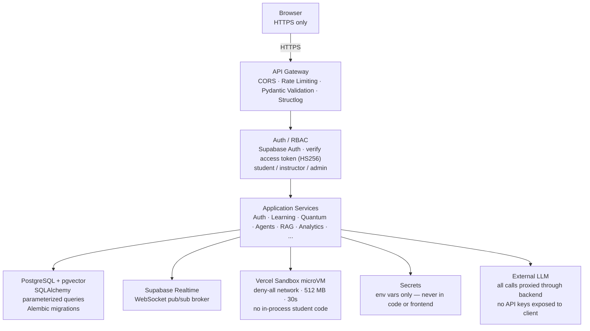

# Security Architecture

---

## Architecture



---

## Security Controls

| Control | Implementation |
|---------|---------------|
| Authentication | Supabase Auth — the client signs in (email/password or Google OAuth) and the backend verifies the Supabase access token (HS256, `SUPABASE_JWT_SECRET`); no credentials or refresh tokens stored by the API |
| Authorization | Role-Based Access Control — student / instructor / admin |
| Input validation | Pydantic schemas on all endpoints |
| Rate limiting | slowapi (100 req/min default; Redis backend deferred to Phase 2) |
| Secrets management | Environment variables only — never in code or committed to git |
| No API keys in frontend | All LLM/API calls proxied through backend |
| Sandboxed code execution | Vercel Sandbox microVM — deny-all network, 512 MB RAM, 30s timeout |
| Resource limits | CPU, Memory, Time limits enforced at microVM level |
| Timeouts | All operations have configurable timeouts |
| Prompt injection protection | Input sanitization, system prompt boundaries |
| RAG source validation | Curated knowledge base only |
| Logging | Structured logs (structlog) — no sensitive data logged |
| SQL injection prevention | Parameterized queries via SQLAlchemy |
| CORS | Configured for known origins only |
| CSRF protection | Standard middleware |

**Never allow the LLM to directly control infrastructure.**

---

## Auth Flow

Sign-in and token lifecycle are owned by **Supabase Auth** on the client
(`hooks/useAuth.ts`, `@supabase/supabase-js`); the API never issues tokens.

```
Client (email/password or Google OAuth)
  → supabase.auth.sign-in → Supabase issues access_token (JWT, HS256)
  → client sends Authorization: Bearer <access_token>

Backend (every authenticated request)
  → verify access_token with SUPABASE_JWT_SECRET (aud "authenticated")
  → _sync_user(): upsert public.users row keyed by token `sub`
    (owns role / subscription_status; provisions on first request, any provider)

GET /api/v1/auth/me   → returns the synced local profile
```

Only `GET /api/v1/auth/me` remains — there are no `login` / `register` /
`refresh` API endpoints.

## RBAC Roles

| Role | Scope |
|------|-------|
| `student` | Own data — courses, circuits, quizzes, progress, tutor |
| `instructor` | Student scope + class management, student analytics, assignments |
| `admin` | All permissions + user management, course management, system config |
